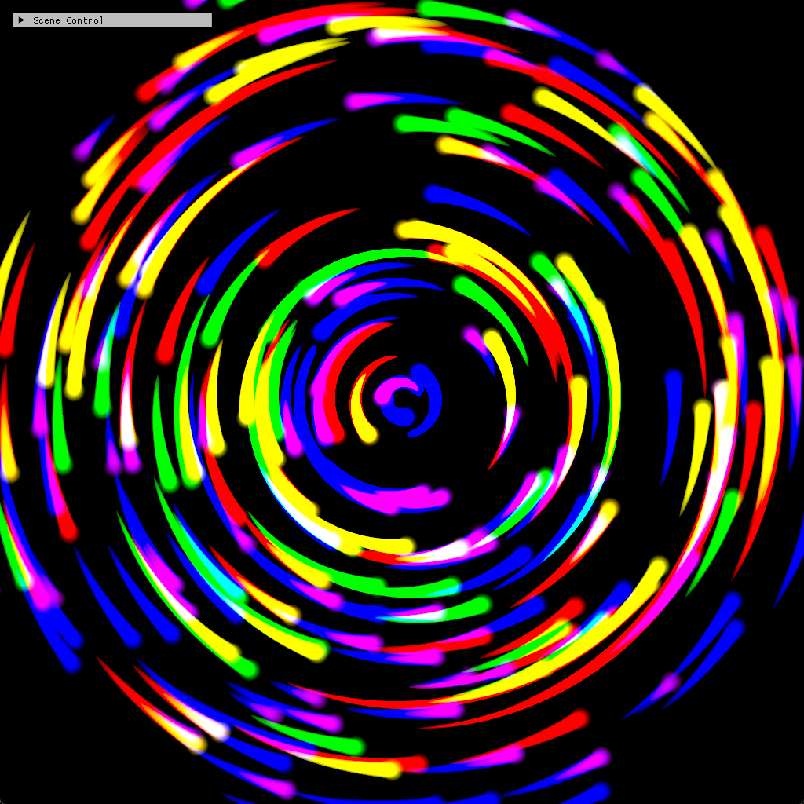

# Chapter14 Ex1406 DensityField Demo

## 목적

Compute shader particle sourcing과 density dissipation을 결합해 color trail density field를 만든다.

## 책임 범위

- `Ex1406_DensityField`의 density texture update, sprite draw와 tracked screenshot을 설명한다.
- Build/run/capture 사실은 [Verification](../../02_Verification/Part4_Chapter14-20/verification-index.md)으로 위임한다.
- public 후보 판단은 [Publication Candidate List](../../05_Publication/candidate-list.md)로 위임한다.

## 결과 미리보기

Particle sourcing과 density dissipation이 만든 colored trail을 확인한다.

## 입력과 출력

| 구분 | 내용 |
| --- | --- |
| 입력 | command argument `1406`, particle structured buffer, density texture |
| 출력 | taskbar-free 1024×1024 centered client-visible density trail screenshot |

## 구현 흐름

1. 256개 particle position과 rainbow color를 준비한다.
2. Density texture를 float texture로 초기화한다.
3. `DissipateDensity`가 density texture를 compute shader로 감쇠한다.
4. `AdvectParticles`가 particle과 density texture UAV를 함께 갱신한다.
5. Geometry shader sprite draw와 accumulate blend로 trail을 누적한다.
6. Density texture를 back buffer로 복사한다.

## 핵심 구현

- [Density resource와 shader 준비](../../../Part4_Chapter14-20/Ex1406_DensityField.cpp#L21-L78)
- [Density field render sequence](../../../Part4_Chapter14-20/Ex1406_DensityField.cpp#L84-L100)
- [Density dissipation과 particle sourcing](../../../Part4_Chapter14-20/Ex1406_DensityField.cpp#L103-L139)
- [Sprite draw와 accumulate blend](../../../Part4_Chapter14-20/Ex1406_DensityField.cpp#L142-L195)

## 시각 결과

이 Step은 Chapter14 tracked visual 중 대표 density visual이다. `Ex1407`과 visual은 유사하지만, 이 Step은 CPU가 particle count를 직접 넘기는 draw 흐름을 사용한다.

## 구현 범위와 한계

- Screenshot은 centered client-visible fixed UI 후보로 승격했다.
- Trail의 시간 변화는 video 후보지만 현재 범위에서는 static screenshot만 사용한다.
- Release 현재 재검증은 별도 범위다.

## 검증

- [Verification Index](../../02_Verification/Part4_Chapter14-20/verification-index.md)
- Debug x64 build/run 성공
- PNG RGBA non-interlaced, text metadata chunk 없음

## 관련 코드

- [ExampleDocs](../../../Part4_Chapter14-20/ExampleDocs/14_06_DensityField.md)
- [Example selection entry point](../../../Part4_Chapter14-20/main.cpp)

## 관련 문서

- [Demo Index](demo-index.md)
- [Compute Shader And Resource Flow](../../01_Topics/ComputeAndSimulation/ComputeShaderAndResourceFlow.md)
- [WorkLog WU-Part4](../../04_WorkLogs/work-units/WU-Part4.md)
