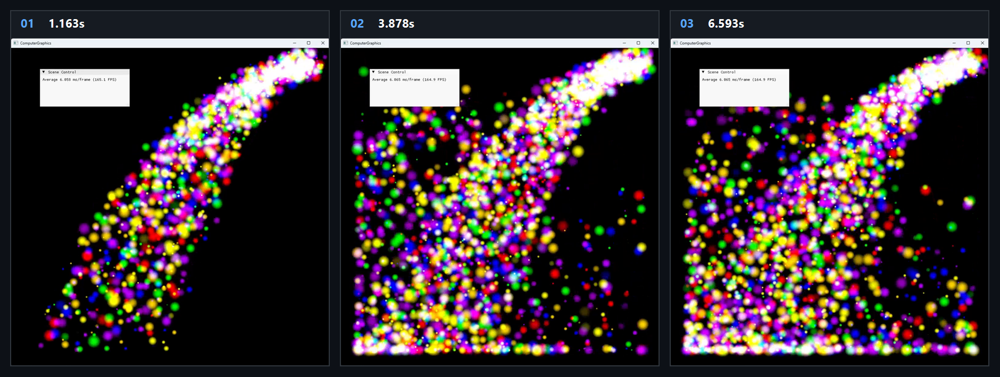

# Chapter15 Ex1501 ParticleSystem Demo

## 목적

CPU에서 particle 생명주기와 충돌을 갱신하고 structured buffer sprite draw로 colored particle stream을 표시한다.

## 책임 범위

- `Ex1501_ParticleSystem`의 particle spawn/update, structured buffer upload와 geometry shader sprite draw를 설명한다.
- Build/run/capture 사실은 [Verification](../../02_Verification/Part4_Chapter14-20/verification-index.md)으로 위임한다.
- public 후보 판단은 [Publication Candidate List](../../05_Publication/candidate-list.md)로 위임한다.

## 결과 미리보기

시연 video에서 선택한 1.163s, 3.878s, 6.593s frame을 순서대로 배치한다. 상단 `01`~`03`과 timestamp는 frame 순서와 원본 video 위치를 기록한다.

## 입력과 출력

| 구분 | 내용 |
| --- | --- |
| 입력 | command argument `1501`, CPU particle pool, structured buffer SRV/UAV |
| 출력 | 1.163s, 3.878s, 6.593s timestamp frame으로 구성한 particle stream storyboard |

## 구현 흐름

1. 최대 particle 수만큼 CPU pool을 만들고 모든 particle을 inactive 상태로 초기화한다.
2. 매 frame source 위치와 mouse input 후보에서 inactive particle을 활성화한다.
3. 활성 particle에 gravity, life 감소와 wall/ground collision을 적용한다.
4. CPU particle 배열을 staging buffer로 복사한 뒤 structured buffer에 업로드한다.
5. Vertex shader는 structured buffer SRV를 읽고 geometry shader가 point를 sprite로 확장한다.
6. Accumulate blend로 particle color를 더하며 back buffer에 그린다.

## 핵심 구현

- [Particle structured buffer 생성](../../../Part4_Chapter14-20/Ex1501_ParticleSystem.cpp#L61)
- [CPU particle spawn/update와 collision](../../../Part4_Chapter14-20/Ex1501_ParticleSystem.cpp#L88)
- [Structured buffer sprite draw](../../../Part4_Chapter14-20/Ex1501_ParticleSystem.cpp#L231)

## 시각 결과

이 예제는 Chapter15 particle baseline으로 사용한다. Storyboard는 particle source, velocity variation, gravity와 collision이 만든 stream shape의 시연 구간을 기록한다.

## 구현 범위와 한계

- Particle simulation은 GPU compute가 아니라 CPU update 후 structured buffer upload로 진행한다.
- Storyboard는 시연 video의 선택 frame만 기록하며 연속 motion 전체를 대체하지 않는다.
- Release 현재 재검증은 별도 범위다.

## 검증

- [Verification Index](../../02_Verification/Part4_Chapter14-20/verification-index.md)
- Debug x64 build/run 성공
- Storyboard PNG에 `ComputerGraphics` title과 01~03 timestamp frame을 포함하며 text metadata chunk가 없음

## 관련 코드

- [Example README](../../../Part4_Chapter14-20/README.md)
- [Example selection entry point](../../../Part4_Chapter14-20/main.cpp)

## 관련 문서

- [Demo Index](demo-index.md)
- [Compute And Simulation Topic Index](../../01_Topics/ComputeAndSimulation/topic-index.md)
- [WorkLog WU-Part4](../../04_WorkLogs/work-units/WU-Part4.md)