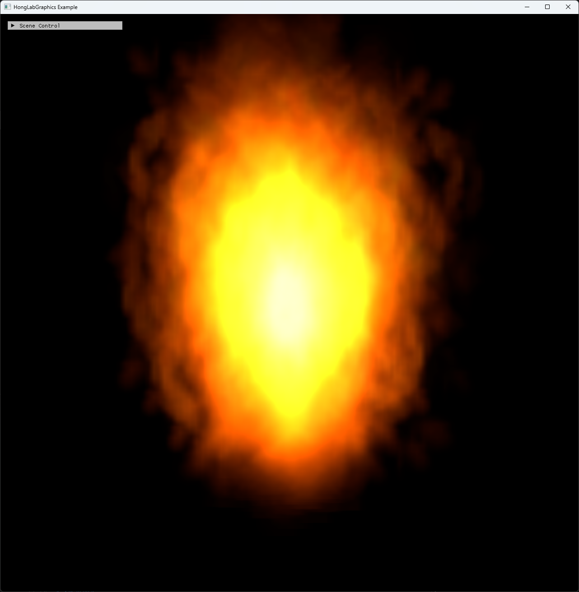

# Chapter15 Ex1502 SpriteFireEffect Demo

## 목적

Textured particle sprite와 buoyancy update를 결합해 fire-like particle effect를 표시한다.

## 책임 범위

- `Ex1502_SpriteFireEffect`의 particle spawn/update, sprite texture binding과 geometry shader sprite draw를 설명한다.
- Build/run/capture 사실은 [Verification](../../02_Verification/Part4_Chapter14-20/verification-index.md)으로 위임한다.
- public 후보 판단은 [Publication Candidate List](../../05_Publication/candidate-list.md)로 위임한다.

## 결과 미리보기

`Ex1502`는 Debug x64 run/capture smoke에서 sprite fire visual을 확인했다. 위 storyboard는 시연 video의 1.695s, 5.650s, 9.605s frame을 순서대로 배치한다. `flare0.dds` 원본은 직접 링크하지 않고 rendered evidence로만 사용한다.

## 입력과 출력

| 구분 | 내용 |
| --- | --- |
| 입력 | command argument `1502`, CPU particle pool, structured buffer SRV/UAV, `flare0.dds` sprite texture |
| 출력 | 1.695s, 5.650s, 9.605s timestamp frame으로 구성한 sprite fire storyboard |

## 구현 흐름

1. CPU particle pool을 만들고 모든 particle을 inactive 상태로 초기화한다.
2. 매 frame origin source와 mouse input 후보에서 inactive particle을 활성화한다.
3. 활성 particle에 buoyancy, velocity update와 life 감소를 적용한다.
4. CPU particle 배열을 staging buffer로 복사한 뒤 structured buffer에 업로드한다.
5. Pixel shader에 `flare0.dds` sprite texture SRV와 sampler를 바인딩한다.
6. Geometry shader sprite draw와 accumulate blend로 textured fire particles를 표시한다.

## 핵심 구현

- [Particle structured buffer 생성](../../../Part4_Chapter14-20/Ex1502_SpriteFireEffect.cpp#L44)
- [`flare0.dds` sprite texture load](../../../Part4_Chapter14-20/Ex1502_SpriteFireEffect.cpp#L66)
- [Particle spawn/update와 buoyancy](../../../Part4_Chapter14-20/Ex1502_SpriteFireEffect.cpp#L72)
- [Textured sprite draw](../../../Part4_Chapter14-20/Ex1502_SpriteFireEffect.cpp#L155)

## 시각 결과

이 예제는 Chapter15 textured particle 보조 축이다. 원본 texture 파일을 직접 링크하거나 공개 asset으로 주장하지 않고, 직접 실행한 rendered evidence로 시각 결과를 설명한다. 공개 안전한 대체 texture로 교체하거나 provenance가 확인되면 visual 유지 범위를 다시 판단한다.

## 구현 범위와 한계

- Particle simulation은 CPU update 후 structured buffer upload로 진행한다.
- `flare0.dds` 원본 asset의 권리 확보를 주장하지 않는다.
- 현재 문서는 implementation evidence와 tracked rendered storyboard를 함께 기록한다.
- 명확한 제한 근거, 삭제 요청 또는 사용 중단 요청이 확인되면 관련 visual은 교체하거나 비공개로 전환한다.
- Release 현재 재검증은 별도 범위다.

## 검증

- [Verification Index](../../02_Verification/Part4_Chapter14-20/verification-index.md)
- Debug x64 build/run/capture smoke 성공
- Storyboard PNG에 `ComputerGraphics` title과 01~03 timestamp frame을 포함하며 text metadata chunk가 없음

## 관련 코드

- [Example README](../../../Part4_Chapter14-20/README.md)
- [Example selection entry point](../../../Part4_Chapter14-20/main.cpp)

## 관련 문서

- [Demo Index](demo-index.md)
- [GPU Particle And Fluid Simulation](../../01_Topics/ComputeAndSimulation/GpuParticleAndFluidSimulation.md)
- [WorkLog WU-Part4](../../04_WorkLogs/work-units/WU-Part4.md)