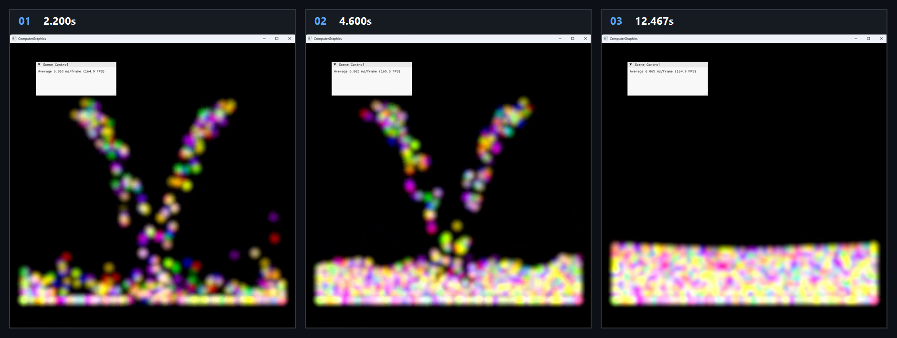

# Chapter15 Ex1503 SphWater Demo

## 목적

SPH density/pressure/viscosity 계산과 boundary collision을 결합해 particle cluster가 아래에 쌓이는 water-like motion을 표시한다.

## 책임 범위

- `Ex1503_SphWater`의 dual source spawn, SPH update, boundary 처리와 selected video storyboard를 설명한다.
- 일반 이론은 [GPU Particle And Fluid Simulation](../../01_Topics/ComputeAndSimulation/GpuParticleAndFluidSimulation.md)으로 위임한다.
- Build/run/capture 사실은 [Verification Index](../../02_Verification/Part4_Chapter14-20/verification-index.md)으로 위임한다.
- public 후보 판단은 [Publication Candidate List](../../05_Publication/candidate-list.md)로 위임한다.

## 결과 미리보기

시연 video에서 선택한 2.200s, 4.600s, 12.467s frame을 순서대로 배치한다. 상단 `01`부터 `03`까지와 timestamp는 frame 순서와 원본 video 위치를 기록한다.

## 입력과 출력

| 구분 | 내용 |
| --- | --- |
| 입력 | command argument `1503`, CPU SPH particle pool, structured buffer SRV/UAV |
| 출력 | 2.200s, 4.600s, 12.467s timestamp frame으로 구성한 SPH particle storyboard |

## 구현 흐름

1. SPH particle pool을 inactive 상태로 초기화하고 particle radius를 shared simulation parameter로 둔다.
2. 좌우 source가 매 frame inactive particle을 하나씩 활성화한다.
3. `SphSimulation::Update`가 density, pressure와 viscosity force를 계산한다.
4. Gravity와 ground/side boundary collision을 적용해 particle이 아래로 쌓이도록 만든다.
5. CPU particle 배열을 staging buffer와 structured buffer로 복사한다.
6. Geometry shader sprite draw와 accumulate blend로 SPH particle cluster를 표시한다.

## 핵심 구현

- [SPH particle structured buffer 생성](../../../Part4_Chapter14-20/Ex1503_SphWater.cpp#L56)
- [Dual source spawn과 boundary collision](../../../Part4_Chapter14-20/Ex1503_SphWater.cpp#L80)
- [SPH update 호출](../../../Part4_Chapter14-20/Ex1503_SphWater.cpp#L146)
- [Density 계산](../../../Part4_Chapter14-20/SphSimulation.cpp#L31)
- [Pressure/viscosity force 계산](../../../Part4_Chapter14-20/SphSimulation.cpp#L78)
- [Structured buffer sprite draw](../../../Part4_Chapter14-20/Ex1503_SphWater.cpp#L204)

## 시각 결과

이 예제는 Chapter15 selected simulation visual이다. Storyboard는 source particle과 하단 boundary 근처 particle accumulation이 함께 보이는 시연 구간을 기록한다.

## 구현 범위와 한계

- SPH 계산은 CPU-side particle loop로 수행하고 GPU는 structured buffer sprite rendering을 담당한다.
- Spatial acceleration 구조는 사용하지 않으므로 particle pair loop 비용이 남는다.
- Storyboard는 시연 video의 선택 frame만 기록하며 movement와 stability 전체를 대체하지 않는다.
- Release 현재 재검증은 별도 범위다.

## 검증

- Debug x64 build/run 성공
- Storyboard PNG에 `ComputerGraphics` title과 01부터 03까지 timestamp frame을 포함하며 text metadata chunk가 없음

## 관련 코드

- [ExampleDocs](../../../Part4_Chapter14-20/ExampleDocs/15_03_SphWater.md)
- [Example selection entry point](../../../Part4_Chapter14-20/main.cpp)

## 관련 문서

- [Demo Index](demo-index.md)
- [WorkLog WU-Part4](../../04_WorkLogs/work-units/WU-Part4.md)