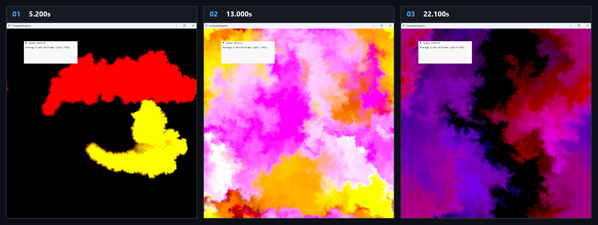

# Chapter16 Ex1601 StableFluids Demo

## 목적

Mouse source가 주입하는 velocity와 color density를 2D stable fluids compute pipeline으로 갱신하고, 결과 density texture를 back buffer에 표시한다.

## 책임 범위

- `Ex1601_StableFluids`의 mouse source, density field 갱신과 compute simulation 순서를 설명한다.
- Build/run/capture 사실은 [Verification](../../02_Verification/Part4_Chapter14-20/verification-index.md)으로 위임한다.
- public 후보 판단은 [Publication Candidate List](../../05_Publication/candidate-list.md)로 위임한다.

## 결과 미리보기

시연 video에서 선택한 5.200s, 13.000s, 22.100s frame을 순서대로 배치한다. 상단 `01`부터 `03`까지와 timestamp는 frame 순서와 local-only 원본 video 위치를 기록한다.

## 입력과 출력

| 구분 | 내용 |
| --- | --- |
| 입력 | command argument `1601`, mouse position, left-button source, velocity 및 RGBA density texture |
| 출력 | 5.200s, 13.000s, 22.100s timestamp frame으로 구성한 color density field storyboard |

## 구현 흐름

1. left button이 눌리면 mouse pixel position을 source cell로 전달하고, 새 press에는 rainbow color density를 지정한다.
2. drag 중에는 이전 NDC position과 현재 position의 차이로 source velocity를 만든다.
3. `Sourcing` compute pass가 source 주변에 smooth falloff로 velocity와 density를 더하고, density dissipation을 적용한다.
4. `Diffuse`, `Projection`, `Advection` 순서가 velocity와 density field를 갱신한다. Projection은 divergence, Jacobi pressure iteration, pressure application으로 velocity를 보정한다.
5. 갱신한 `m_density` texture를 swap chain back buffer로 복사해 2D color density field를 표시한다.

## 핵심 구현

- [Mouse source와 drag velocity](../../../Part4_Chapter14-20/Ex1601_StableFluids.cpp#L29)
- [Stable fluids resource와 update 순서](../../../Part4_Chapter14-20/StableFluids.cpp#L15)
- [Sourcing, diffusion, projection, advection 호출](../../../Part4_Chapter14-20/StableFluids.cpp#L76)
- [Source density와 velocity의 smooth falloff 주입](../../../Part4_Chapter14-20/Ex1601_SourcingCS.hlsl#L23)
- [Density texture back buffer 복사](../../../Part4_Chapter14-20/Ex1601_StableFluids.cpp#L94)

## 시각 결과

Storyboard는 source injection 뒤 color density가 주변 field로 퍼지고 이동하는 구간을 기록한다. 세 frame은 동일한 정적 화면의 반복이 아니라, source가 추가된 뒤 density distribution이 달라지는 time progression을 보여준다.

## 구현 범위와 한계

- 이 예제는 2D texture field 기반 compute simulation이며 3D volume rendering을 수행하지 않는다.
- mouse 입력이 source 위치와 velocity를 결정하므로 storyboard는 같은 초기 조건의 정량 비교가 아니다.
- Storyboard는 local-only MP4에서 선별한 frame이며 연속 interaction 전체를 대체하지 않는다.
- 원본 MP4와 raw preview는 Git에 추가하지 않는다.

## 검증

- [Verification Index](../../02_Verification/Part4_Chapter14-20/verification-index.md)
- 2026-08-07 Debug와 Release x64 build/run/capture smoke 성공
- Storyboard PNG는 `1880x710` RGBA, non-interlaced이며 full decode와 metadata chunk 부재를 확인함

## 관련 코드

- [ExampleDocs](../../../Part4_Chapter14-20/ExampleDocs/16_01_StableFluids.md)
- [Example selection entry point](../../../Part4_Chapter14-20/main.cpp)

## 관련 문서

- [Demo Index](demo-index.md)
- [GPU Particle And Fluid Simulation](../../01_Topics/ComputeAndSimulation/GpuParticleAndFluidSimulation.md)
- [WorkLog WU-Part4](../../04_WorkLogs/work-units/WU-Part4.md)