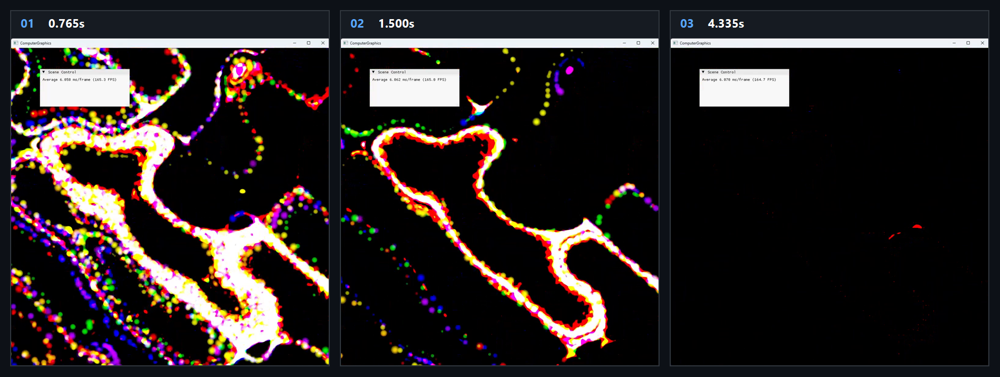

# Chapter16 Ex1602 CurlNoise Demo

## 목적

Tileable noise gradient에서 만든 2D curl velocity로 particle을 갱신하고, geometry shader sprite와 accumulate blend로 colored density trail을 표시한다.

## 책임 범위

- `Ex1602_CurlNoise`의 structured particle buffer, curl-noise compute update와 density trail render path를 설명한다.
- Build/run/capture 사실은 [Verification](../../02_Verification/Part4_Chapter14-20/verification-index.md)으로 위임한다.
- public 후보 판단은 [Publication Candidate List](../../05_Publication/candidate-list.md)로 위임한다.

## 결과 미리보기

0.765s, 1.500s, 4.335s frame은 curl field를 따라 particle sprite와 density trail이 감쇠하는 과정을 기록한다.

## 입력과 출력

| 구분 | 내용 |
| --- | --- |
| 입력 | command argument `1602`, seeded CPU particle position/color, GPU structured particle buffer와 RGBA density texture |
| 출력 | 0.765s, 1.500s, 4.335s timestamp frame으로 구성한 colored curl-noise density trail storyboard |

## 구현 흐름

1. CPU가 screen width 수만큼 particle position과 rainbow color를 seeded random 값으로 초기화하고 structured buffer SRV/UAV를 만든다.
2. 매 frame density dissipation compute pass가 기존 trail을 감쇠한다.
3. Curl-noise compute shader가 tileable noise의 central difference gradient를 구하고 이를 회전한 2D curl vector로 particle position에 더한다.
4. Vertex shader는 particle structured buffer를 읽고 geometry shader가 point를 sprite primitive로 확장한다.
5. Pixel shader와 accumulate blend가 density render target에 trail을 누적한다.
6. 완성된 density texture를 swap chain back buffer로 복사한다.

## 핵심 구현

- [Particle structured buffer와 compute/render shader 초기화](../../../Part4_Chapter14-20/Ex1602_CurlNoise.cpp#L21)
- [Density dissipation과 curl-noise dispatch](../../../Part4_Chapter14-20/Ex1602_CurlNoise.cpp#L74)
- [Curl vector 계산과 particle position update](../../../Part4_Chapter14-20/Ex1602_CurlNoiseCS.hlsl#L18)
- [Sprite draw, accumulate blend와 back buffer copy](../../../Part4_Chapter14-20/Ex1602_CurlNoise.cpp#L96)

## 시각 결과

이 예제의 visual evidence는 colored particle sprite가 누적되며 형성하는 density trail이다. Storyboard는 trail이 조밀한 상태에서 감쇠한 상태까지의 변화를 기록한다.

## 구현 범위와 한계

- Compute shader의 `dt`는 constant buffer가 아닌 shader 내부 상수 `0.005`로 고정한다.
- Particle의 x, y position을 curl field로 이동하지만 screen boundary 재진입 또는 lifetime 관리는 이 경로에 없다.
- Density trail은 accumulate blend와 dissipation의 결과이며 physical fluid pressure projection을 수행하지 않는다.
- 원본 MP4와 raw frame은 local-only로 유지한다.

## 검증

- [Verification Index](../../02_Verification/Part4_Chapter14-20/verification-index.md)
- 2026-08-07 Debug와 Release x64 build/run/capture smoke 성공
- 0.765s, 1.500s, 4.335s timestamp frame storyboard를 tracked evidence로 확인
- Release 상태는 Verification Index의 과거 확인 기록으로 유지

## 관련 코드

- [ExampleDocs](../../../Part4_Chapter14-20/ExampleDocs/16_02_CurlNoise.md)
- [Example selection entry point](../../../Part4_Chapter14-20/main.cpp)

## 관련 문서

- [Demo Index](demo-index.md)
- [GPU Particle And Fluid Simulation](../../01_Topics/ComputeAndSimulation/GpuParticleAndFluidSimulation.md)
- [WorkLog WU-Part4](../../04_WorkLogs/work-units/WU-Part4.md)