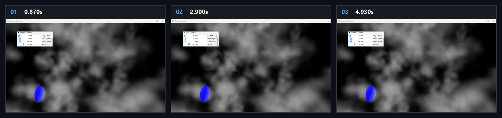

# Chapter16 Ex1603 Cloud Demo

## 목적

Procedural noise로 3D cloud density와 lighting field를 compute shader에서 생성하고, volume ray marching으로 cloud volume을 표시한다.

## 책임 범위

- `Ex1603_Cloud`의 density/lighting Texture3D 생성, texture coordinate offset과 volume render path를 설명한다.
- Build/run/capture 사실은 [Verification](../../02_Verification/Part4_Chapter14-20/verification-index.md)으로 위임한다.
- public 후보 판단은 [Publication Candidate List](../../05_Publication/candidate-list.md)로 위임한다.

## 결과 미리보기

0.870s, 2.900s, 4.930s frame은 procedural density와 lighting field를 volume ray marching으로 합성한 cloud volume을 기록한다.

## 입력과 출력

| 구분 | 내용 |
| --- | --- |
| 입력 | command argument `1603`, noise 함수, 64 cubed density Texture3D, lower-resolution lighting Texture3D와 volume constants |
| 출력 | 0.870s, 2.900s, 4.930s timestamp frame으로 구성한 procedural cloud storyboard |

## 구현 흐름

1. Box volume model에 density Texture3D와 lighting Texture3D를 만들고, volume shader와 cloud compute shader를 초기화한다.
2. `CloudDensityCS`가 Perlin-Worley 계열 noise를 결합해 density field를 만든다.
3. `CloudLightingCS`가 density field를 light direction으로 march해 Beer-Lambert visibility를 lighting field에 기록한다.
4. 매 frame `uvwOffset.z`를 증가시키고 density와 lighting compute pass를 다시 dispatch해 texture coordinate 기반 cloud motion을 만든다.
5. `volumeSmokePSO`가 box volume을 ray march해 density와 lighting field를 화면에 합성한다.

## 핵심 구현

- [Volume model, Texture3D와 initial compute dispatch](../../../Part4_Chapter14-20/Ex1603_Cloud.cpp#L19)
- [Offset update와 density/lighting 재생성](../../../Part4_Chapter14-20/Ex1603_Cloud.cpp#L91)
- [Perlin-Worley density field](../../../Part4_Chapter14-20/CloudDensityCS.hlsl#L16)
- [Density 기반 lighting ray march](../../../Part4_Chapter14-20/CloudLightingCS.hlsl#L24)
- [Volume pipeline render](../../../Part4_Chapter14-20/Ex1603_Cloud.cpp#L137)

## 시각 결과

이 예제의 visual evidence는 box volume 내부의 procedural density field와 lighting field가 만든 volumetric cloud다. Storyboard는 서로 다른 time offset에서 같은 volume render path가 density field를 합성하는 상태를 기록한다.

## 구현 범위와 한계

- Motion은 `uvwOffset`을 이동시켜 density texture를 재생성하는 방식이며 physical cloud simulation을 수행하지 않는다.
- Density와 lighting compute pass를 매 frame 재실행하므로 volume resolution과 ray-march cost의 영향을 받는다.
- 원본 MP4와 raw frame은 local-only로 유지한다.
- 외부 HDRI, texture 또는 noise source asset을 첨부하거나 직접 링크하지 않는다.

## 검증

- [Verification Index](../../02_Verification/Part4_Chapter14-20/verification-index.md)
- 2026-08-07 Debug와 Release x64 build/run/capture smoke 성공
- 0.870s, 2.900s, 4.930s timestamp frame storyboard를 tracked evidence로 확인
- Release 상태는 Verification Index의 과거 확인 기록으로 유지

## 관련 코드

- [Part4 Chapter14-20 README](../../../Part4_Chapter14-20/README.md)
- [Example selection entry point](../../../Part4_Chapter14-20/main.cpp)

## 관련 문서

- [Demo Index](demo-index.md)
- [Compute And Simulation Topic Index](../../01_Topics/ComputeAndSimulation/topic-index.md)
- [WorkLog WU-Part4](../../04_WorkLogs/work-units/WU-Part4.md)
