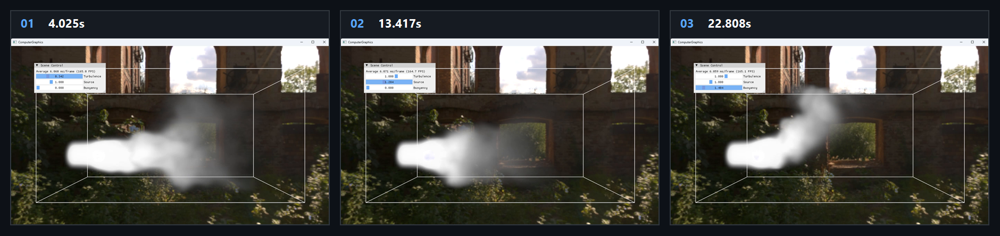

# Chapter16 Ex1604 RealtimeSmoke Demo

## 목적

3D velocity와 density field를 compute shader로 갱신하고, high-resolution density texture를 volume ray marching으로 표시한다.

## 책임 범위

- `Ex1604_RealtimeSmoke`의 smoke source, pressure projection, detail-preserving upsample, buoyancy와 volume rendering을 설명한다.
- Build/run/capture 사실은 [Verification](../../02_Verification/Part4_Chapter14-20/verification-index.md)으로 위임한다.
- public 후보 판단은 [Publication Candidate List](../../05_Publication/candidate-list.md)로 위임한다.

## 결과 미리보기

시연 video에서 선택한 5.370s, 13.420s, 21.470s frame을 순서대로 배치한다. 상단 `01`부터 `03`까지와 timestamp는 frame 순서와 local-only 원본 video 위치를 기록한다.

## 입력과 출력

| 구분 | 내용 |
| --- | --- |
| 입력 | command argument `1604`, low/high-resolution velocity 및 density Texture3D, source strength와 buoyancy parameter |
| 출력 | 5.370s, 13.420s, 21.470s timestamp frame으로 구성한 HDRI rendered smoke storyboard |

## 구현 흐름

1. low-resolution velocity, pressure, divergence, density field와 두 배 해상도의 velocity 및 density field를 준비한다.
2. `Sourcing` compute pass가 source 영역에 velocity와 density를 주입하고 boundary condition을 기록한다. density에 비례한 y-axis buoyancy를 velocity에 더한다.
3. `Projection`이 divergence와 20회 Jacobi iteration으로 pressure를 계산하고, pressure를 velocity field에 적용한다.
4. `DiffUpSample`이 projection 전후 low-resolution field의 차이를 high-resolution field에 반영한다. 이 함수는 이름과 달리 별도 physical diffusion pass가 아니라 detail-preserving difference upsample 경로다.
5. `Advection`이 high-resolution velocity와 density를 semi-Lagrangian 방식으로 이송한다.
6. `VolumeSmokePS`가 high-resolution density texture를 box volume 내부에서 ray march하고, Beer-Lambert attenuation과 Henyey-Greenstein phase function으로 color를 누적한다.

## 핵심 구현

- [3D field, HDRI cubemap과 volume model 초기화](../../../Part4_Chapter14-20/Ex1604_RealtimeSmoke.cpp#L15)
- [Substep simulation 순서](../../../Part4_Chapter14-20/Ex1604_RealtimeSmoke.cpp#L170)
- [Source, boundary condition과 buoyancy](../../../Part4_Chapter14-20/Ex1604_SourcingCS.hlsl#L31)
- [Difference upsample과 high-resolution advection](../../../Part4_Chapter14-20/Ex1604_RealtimeSmoke.cpp#L277)
- [Density volume ray marching](../../../Part4_Chapter14-20/VolumeSmokePS.hlsl#L92)
- [Volume pipeline render](../../../Part4_Chapter14-20/Ex1604_RealtimeSmoke.cpp#L333)

## 시각 결과

Storyboard는 source 영역에서 시작한 density가 확산되고, buoyancy parameter가 적용된 velocity field를 따라 이동하는 시연 구간을 기록한다. 배경은 runtime HDRI를 sampling한 rendered scene이며, storyboard는 smoke volume의 상태 변화를 보여주는 evidence다.

## 구현 범위와 한계

- `DiffUpSample`은 projection 전후 low-resolution difference를 high-resolution field에 옮기는 경로이며 독립적인 diffusion solve가 아니다.
- Volume quality는 finite ray-march step과 density absorption, light, anisotropy parameter에 의존한다.
- Storyboard는 local-only MP4에서 선별한 frame이며 연속 smoke motion 전체를 대체하지 않는다.
- HDRI 원본 asset은 첨부하거나 직접 링크하지 않는다. 이 문서는 rendered storyboard evidence만 사용한다.
- 원본 MP4와 raw preview는 Git에 추가하지 않는다.

## 검증

- [Verification Index](../../02_Verification/Part4_Chapter14-20/verification-index.md)
- 2026-08-07 Debug와 Release x64 build/run/capture smoke 성공
- Storyboard PNG는 `1880x710` RGBA, non-interlaced이며 full decode와 metadata chunk 부재를 확인함

## 관련 코드

- [Part4 Chapter14-20 README](../../../Part4_Chapter14-20/README.md)
- [Example selection entry point](../../../Part4_Chapter14-20/main.cpp)

## 관련 문서

- [Demo Index](demo-index.md)
- [Compute And Simulation Topic Index](../../01_Topics/ComputeAndSimulation/topic-index.md)
- [WorkLog WU-Part4](../../04_WorkLogs/work-units/WU-Part4.md)
