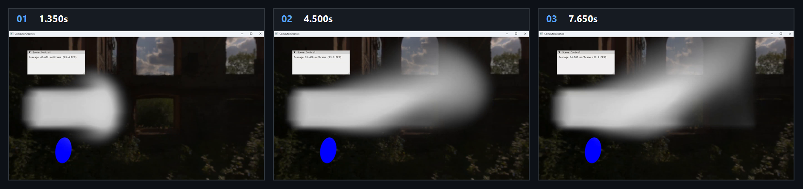

# Chapter16 Ex1605 SmokeCpu Demo

## 목적

CPU-side fluid simulation이 계산한 3D density grid를 Texture3D로 업로드하고, volume ray marching으로 smoke-like density field를 표시한다.

## 책임 범위

- `Ex1605_SmokeCpu`의 CPU fluid update, density Texture3D upload와 volume render path를 설명한다.
- Build/run/capture 사실은 [Verification](../../02_Verification/Part4_Chapter14-20/verification-index.md)으로 위임한다.
- public 후보 판단은 [Publication Candidate List](../../05_Publication/candidate-list.md)로 위임한다.

## 결과 미리보기

1.350s, 4.500s, 7.650s frame은 CPU density grid가 Texture3D로 업로드된 뒤 volume render path에서 smoke-like field로 표시되는 상태를 기록한다.

## 입력과 출력

| 구분 | 내용 |
| --- | --- |
| 입력 | command argument `1605`, CPU 32 by 32 by 32 fluid grid, source velocity/density와 volume constants |
| 출력 | 1.350s, 4.500s, 7.650s timestamp frame으로 구성한 CPU smoke storyboard |

## 구현 흐름

1. `FluidSimulationCPU`가 uniform grid와 density, velocity, pressure, temperature 배열을 CPU memory에 준비한다.
2. `Update`가 두 substep 동안 source injection, pressure projection, advection 순서를 실행한다.
3. Source pass는 density dissipation, density-proportional buoyancy, spherical source velocity와 boundary cell type을 적용한다.
4. Example update가 CPU density array를 staging Texture3D를 거쳐 GPU density texture로 업로드한다.
5. `volumeSmokePSO`가 업로드된 density texture를 box volume에서 ray march하고 bounding box를 함께 그린다.

## 핵심 구현

- [CPU fluid grid와 volume Texture3D 초기화](../../../Part4_Chapter14-20/Ex1605_SmokeCpu.cpp#L15)
- [CPU update와 density Texture3D upload](../../../Part4_Chapter14-20/Ex1605_SmokeCpu.cpp#L48)
- [CPU substep simulation 순서](../../../Part4_Chapter14-20/FluidSimulationCPU.h#L42)
- [Source, buoyancy와 boundary condition](../../../Part4_Chapter14-20/FluidSimulationCPU.h#L151)
- [Staging Texture3D upload](../../../Part4_Chapter14-20/Texture3D.h#L75)
- [Volume pipeline render](../../../Part4_Chapter14-20/Ex1605_SmokeCpu.cpp#L61)

## 시각 결과

이 예제의 visual evidence는 CPU simulation density grid가 GPU Texture3D로 업로드된 뒤 volume rendering으로 표시되는 smoke-like field다. Storyboard는 source density의 위치와 확산 상태를 기록한다.

## 구현 범위와 한계

- Fluid update는 GPU compute simulation이 아니라 CPU array와 sparse linear solver 경로를 사용한다.
- 매 frame density 전체를 staging texture로 복사하므로 grid resolution이 커지면 CPU simulation과 upload 비용이 함께 증가한다.
- Storyboard는 HDRI runtime asset을 포함하지만, HDRI 원본 asset을 첨부하거나 직접 링크하지 않는다.
- 원본 MP4와 raw frame은 local-only로 유지한다.

## 검증

- [Verification Index](../../02_Verification/Part4_Chapter14-20/verification-index.md)
- 2026-08-07 Debug와 Release x64 build/run/capture smoke 성공
- 1.350s, 4.500s, 7.650s timestamp frame storyboard를 tracked evidence로 확인
- Release 상태는 Verification Index의 과거 확인 기록으로 유지

## 관련 코드

- [Part4 Chapter14-20 README](../../../Part4_Chapter14-20/README.md)
- [Example selection entry point](../../../Part4_Chapter14-20/main.cpp)

## 관련 문서

- [Demo Index](demo-index.md)
- [GPU Particle And Fluid Simulation](../../01_Topics/ComputeAndSimulation/GpuParticleAndFluidSimulation.md)
- [WorkLog WU-Part4](../../04_WorkLogs/work-units/WU-Part4.md)
