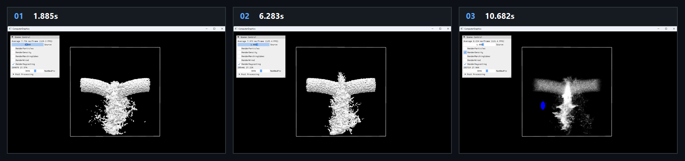

# Chapter16 Ex1606 HybridWater Demo

## 목적

Particle simulation과 grid velocity projection을 결합하고, particle-to-grid density field를 volume rendering 또는 signed-distance raycasting으로 표시한다.

## 책임 범위

- `Ex1606_HybridWater`의 grid projection, particle update, particle-to-grid conversion과 rendering branch를 설명한다.
- Build/run/capture 사실은 [Verification Index](../../02_Verification/Part4_Chapter14-20/verification-index.md)으로 위임한다.
- public 후보 판단은 [Publication Candidate List](../../05_Publication/candidate-list.md)로 위임한다.

## 결과 미리보기

시연 video에서 선택한 1.885s, 6.283s, 10.682s frame을 순서대로 배치한다. 상단 `01`부터 `03`까지와 timestamp는 frame 순서와 local-only 원본 video 위치를 기록한다.

## 입력과 출력

| 구분 | 내용 |
| --- | --- |
| 입력 | command argument `1606`, structured particle buffer, grid velocity/pressure/density/SDF Texture3D, source strength와 rendering checkbox |
| 출력 | 1.885s, 6.283s, 10.682s timestamp frame으로 구성한 raycasting surface와 density volume display storyboard |

## 구현 흐름

1. `Projection`이 grid velocity에서 divergence와 pressure를 구하고 pressure application으로 grid velocity를 보정한다.
2. `ParticleStep`이 보정 전후 grid velocity를 particle에 적용하고, noise source에서 새 particle을 활성화해 position과 velocity를 갱신한다.
3. GPU bitonic sort와 `FirstIndex` pass가 grid cell별 인접 particle 탐색에 사용할 index를 만든다.
4. `ParticleToGrid` compute pass가 인접 particle의 cubic-spline weight를 누적해 grid density와 velocity를 만들고, weighted position으로 signed-distance field를 갱신한다.
5. `RenderDensity`가 선택되면 `m_density`를 `volumeSmokePSO`에 연결해 density field volume rendering을 수행한다.
6. `RenderRaycasting`이 선택되면 signed-distance texture를 `Ex1606_SignedDistancePS`에서 ray march해 surface를 표시한다.

## 핵심 구현

- [Particle, grid texture와 rendering state 초기화](../../../Part4_Chapter14-20/Ex1606_HybridWater.cpp#L17)
- [Grid projection과 particle step 호출](../../../Part4_Chapter14-20/Ex1606_HybridWater.cpp#L199)
- [Particle sort, first index와 particle-to-grid dispatch](../../../Part4_Chapter14-20/Ex1606_HybridWater.cpp#L334)
- [Cubic-spline density와 velocity accumulation](../../../Part4_Chapter14-20/Ex1606_ParticleToGridCS.hlsl#L27)
- [Density volume rendering과 SDF raycasting 분기](../../../Part4_Chapter14-20/Ex1606_HybridWater.cpp#L375)
- [Signed-distance raycasting pixel shader](../../../Part4_Chapter14-20/Ex1606_SignedDistancePS.hlsl#L43)

## 시각 결과

Storyboard는 raycasting surface 표시와 `RenderDensity` density volume 표시가 구분되는 시연 상태를 기록한다. Density frame은 particle-to-grid conversion으로 만든 grid density field의 volume rendering 결과이며, 물성이나 simulation mode가 전환된 결과가 아니다.

## 구현 범위와 한계

- `RenderDensity`는 `m_density` Texture3D를 표시하는 rendering toggle이다. particle physics 또는 material state를 바꾸지 않는다.
- 기본 rendering path는 signed-distance raycasting이며, `RenderParticles`와 Marching Cubes는 별도 diagnostic 또는 surface path다.
- `m_upScale`은 `1`로 설정되어 있어 이름에 `Up`이 있는 resource도 별도 upsampling 구현을 의미하지 않는다.
- Storyboard는 local-only MP4에서 선별한 frame이며 연속 particle motion 전체를 대체하지 않는다.
- 원본 MP4와 raw preview는 Git에 추가하지 않는다.

## 검증

- 2026-08-07 Debug와 Release x64 build/run/capture smoke 성공
- Storyboard PNG는 `1880x444` RGBA, non-interlaced이며 full decode와 metadata chunk 부재를 확인함

## 관련 코드

- [ExampleDocs](../../../Part4_Chapter14-20/ExampleDocs/16_06_HybridWater.md)
- [Example selection entry point](../../../Part4_Chapter14-20/main.cpp)

## 관련 문서

- [Demo Index](demo-index.md)
- [GPU Particle And Fluid Simulation](../../01_Topics/ComputeAndSimulation/GpuParticleAndFluidSimulation.md)
- [WorkLog WU-Part4](../../04_WorkLogs/work-units/WU-Part4.md)