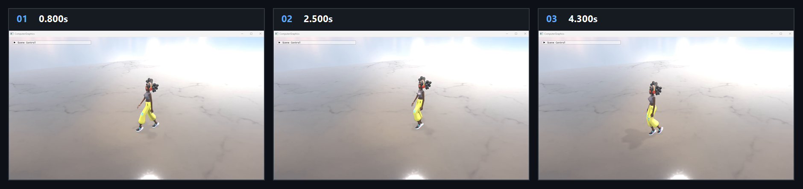

# Chapter17 Ex1701 SkeletalAnimation Demo

## 목적

Character mesh와 animation clip을 분리해 읽고, frame별 bone transform을 GPU structured buffer로 전달해 skinned mesh pose를 표시한다.

## 책임 범위

- `Ex1701_SkeletalAnimation`의 animation clip 구성, bone hierarchy 갱신과 skinned render path를 설명한다.
- Build/run/capture 사실은 [Verification](../../02_Verification/Part4_Chapter14-20/verification-index.md)으로 위임한다.
- public 후보 판단은 [Publication Candidate List](../../05_Publication/candidate-list.md)로 위임한다.

## 결과 미리보기

시연 video에서 선택한 0.800s, 2.500s, 4.300s frame을 순서대로 배치한다. 상단 `01`부터 `03`까지와 timestamp는 frame 순서와 local-only 원본 video 위치를 기록한다.

## 입력과 출력

| 구분 | 내용 |
| --- | --- |
| 입력 | command argument `1701`, character mesh, FBX animation clip, bone hierarchy와 frame index |
| 출력 | 0.800s, 2.500s, 4.300s timestamp frame으로 구성한 skeletal pose storyboard |

## 구현 흐름

1. character mesh와 여러 FBX clip을 별도로 읽어 하나의 `AnimationData` clip 목록으로 구성한다.
2. loader는 vertex deformation에 참여하는 bone을 root부터 child 순서로 index화하고, clip channel의 position, rotation, scale key를 bone index별 배열에 저장한다.
3. `Ex1701_SkeletalAnimation::Update`가 현재 clip과 frame count를 `SkinnedMeshModel::UpdateAnimation`에 전달한다.
4. `AnimationData::Update`는 parent transform을 반영해 bone hierarchy를 갱신하고, root motion은 accumulated root transform으로 분리한다.
5. `SkinnedMeshModel`은 bone transform을 transpose해 structured buffer에 업로드하고, render 시 vertex shader resource slot `9`에 연결한다.
6. skinned pipeline이 vertex별 bone weight와 업로드된 transform을 사용해 현재 pose의 mesh를 렌더링한다.

## 핵심 구현

- [Character mesh와 animation clip 구성](../../../Part4_Chapter14-20/Ex1701_SkeletalAnimation.cpp#L78)
- [Frame count 기반 animation update](../../../Part4_Chapter14-20/Ex1701_SkeletalAnimation.cpp#L225)
- [Animation clip key 추출](../../../Part4_Chapter14-20/ModelLoader.cpp#L72)
- [Bone hierarchy와 root motion 갱신](../../../Part4_Chapter14-20/AnimationClip.h#L117)
- [Bone transform upload와 skinned render resource binding](../../../Part4_Chapter14-20/SkinnedMeshModel.h#L88)

## 시각 결과

Storyboard는 동일 character mesh가 frame별 bone transform에 따라 다른 pose를 보이는 구간을 기록한다. 세 frame의 차이는 camera 또는 material 변경이 아니라 animation clip key와 hierarchy transform 갱신이 skinned vertex에 반영된 결과다.

## 구현 범위와 한계

- 현재 예제는 `state = 2`를 사용해 한 animation state를 frame count로 반복 재생한다. 주석 처리된 motion graph 전환은 실행 경로가 아니다.
- Frame count는 frame-rate independent time sampling이 아니며, clip key index 기반으로 순환한다.
- Storyboard는 local-only MP4에서 선별한 pose frame이며 연속 animation과 input transition 전체를 대체하지 않는다.
- Character mesh, animation FBX, texture와 HDRI 원본 asset은 첨부하거나 직접 링크하지 않는다. 이 문서는 rendered storyboard evidence만 사용한다.
- 원본 MP4와 raw preview는 Git에 추가하지 않는다.

## 검증

- [Verification Index](../../02_Verification/Part4_Chapter14-20/verification-index.md)
- 2026-08-07 Debug와 Release x64 build/run/capture smoke 성공
- Storyboard PNG는 `1880x444` RGBA, non-interlaced이며 full decode와 metadata chunk 부재를 확인함

## 관련 코드

- [Part4 Chapter14-20 README](../../../Part4_Chapter14-20/README.md)
- [Example selection entry point](../../../Part4_Chapter14-20/main.cpp)

## 관련 문서

- [Demo Index](demo-index.md)
- [WorkLog WU-Part4](../../04_WorkLogs/work-units/WU-Part4.md)