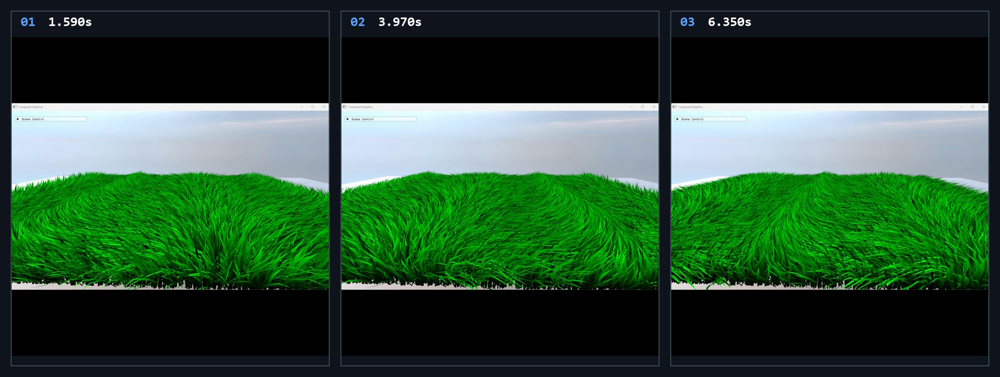

# Chapter18 Ex1802 Grass Demo

## 목적

Grass blade mesh와 instance transform을 분리하고, per-instance wind strength와 shader time deformation으로 넓은 grass field의 wind phase를 표시한다.

## 책임 범위

- `Ex1802_Grass`의 grass instance 생성, per-frame wind update와 instanced render path를 설명한다.
- Build/run/capture 사실은 [Verification](../../02_Verification/Part4_Chapter14-20/verification-index.md)으로 위임한다.
- public 후보 판단은 [Publication Candidate List](../../05_Publication/candidate-list.md)로 위임한다.

## 결과 미리보기

시연 video에서 선택한 1.590s, 3.970s, 6.350s frame을 순서대로 배치한다. 상단 `01`부터 `03`까지와 timestamp는 frame 순서와 local-only 원본 video 위치를 기록한다.

## 입력과 출력

| 구분 | 내용 |
| --- | --- |
| 입력 | command argument `1802`, grass blade vertex/index buffer, 100,000개 instance transform과 wind strength |
| 출력 | 1.590s, 3.970s, 6.350s timestamp frame으로 구성한 wind phase grass field storyboard |

## 구현 흐름

1. CPU가 seeded random distribution으로 위치, rotation, scale을 달리하는 100,000개 `GrassInstance`를 생성한다.
2. 각 instance는 transform과 `windStrength`를 가지며, 초기 데이터는 instance buffer로 업로드한다.
3. 매 frame `Ex1802_Grass::Update`가 UI wind value를 모든 instance의 `windStrength`에 반영하고 instance buffer를 갱신한다.
4. `GrassModel::Render`가 blade vertex buffer와 instance buffer를 함께 input assembler에 연결하고 `DrawIndexedInstanced`를 호출한다.
5. Grass vertex shader가 instance transform으로 blade를 world space에 배치한 뒤 `globalTime`과 wind strength로 tip 쪽 변형이 커지는 rotation을 계산한다.
6. Pixel shader가 변형된 normal과 directional light를 사용해 grass color를 출력한다.

## 핵심 구현

- [100,000개 grass instance 생성](../../../Part4_Chapter14-20/Ex1802_Grass.cpp#L54)
- [Per-frame wind strength buffer update](../../../Part4_Chapter14-20/Ex1802_Grass.cpp#L109)
- [Instance buffer binding과 DrawIndexedInstanced](../../../Part4_Chapter14-20/GrassModel.h#L54)
- [Time-based wind deformation](../../../Part4_Chapter14-20/Ex1802_GrassVS.hlsl#L101)
- [Grass directional lighting](../../../Part4_Chapter14-20/Ex1802_GrassPS.hlsl#L12)

## 시각 결과

Storyboard는 같은 grass field가 `globalTime`에 따른 wave phase와 instance wind strength로 서로 다른 blade orientation을 보이는 구간을 기록한다. 세 frame은 quality hold가 아니라 instanced grass가 time-varying wind deformation으로 변화하는 evidence다.

## 구현 범위와 한계

- wind strength는 모든 instance에 공통 값으로 업로드한다. instance별 phase offset이나 spatial wind field는 구현하지 않는다.
- blade 변형은 vertex shader의 procedural rotation이며 물리 simulation이나 collision을 계산하지 않는다.
- Storyboard는 local-only MP4에서 선별한 frame이며 연속 wind motion 전체를 대체하지 않는다.
- Foliage, PBR texture와 HDRI 원본 asset은 첨부하거나 직접 링크하지 않는다. 이 문서는 rendered storyboard evidence만 사용한다.
- 원본 MP4와 raw preview는 Git에 추가하지 않는다.

## 검증

- [Verification Index](../../02_Verification/Part4_Chapter14-20/verification-index.md)
- 2026-08-07 Debug와 Release x64 build/run/capture smoke 성공
- Storyboard PNG는 `1880x710` RGBA, non-interlaced이며 full decode와 metadata chunk 부재를 확인함

## 관련 코드

- [Part4 Chapter14-20 README](../../../Part4_Chapter14-20/README.md)
- [Example selection entry point](../../../Part4_Chapter14-20/main.cpp)

## 관련 문서

- [Demo Index](demo-index.md)
- [WorkLog WU-Part4](../../04_WorkLogs/work-units/WU-Part4.md)
