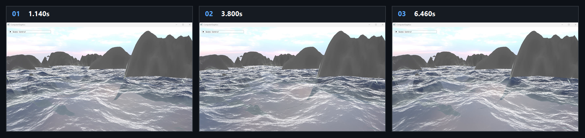

# Chapter18 Ex1803 Landscape Demo

## 목적

Raw heightmap에서 terrain mesh와 normal을 생성하고, procedural ocean shader를 같은 scene에 렌더링해 terrain과 animated ocean surface를 표시한다.

## 책임 범위

- `Ex1803_Landscape`의 heightmap terrain 생성, ocean surface path와 `OceanHeight` control을 설명한다.
- 일반 이론은 [Foliage Terrain And Ocean Rendering](../../01_Topics/FoliageAndLandscape/FoliageTerrainAndOceanRendering.md)으로 위임한다.
- Build/run/capture 사실은 [Verification Index](../../02_Verification/Part4_Chapter14-20/verification-index.md)으로 위임한다.
- public 후보 판단은 [Publication Candidate List](../../05_Publication/candidate-list.md)로 위임한다.

## 결과 미리보기

시연 video에서 선택한 1.140s, 3.800s, 6.460s frame을 순서대로 배치한다. 상단 `01`부터 `03`까지와 timestamp는 frame 순서와 local-only 원본 video 위치를 기록한다.

## 입력과 출력

| 구분 | 내용 |
| --- | --- |
| 입력 | command argument `1803`, `terrain.raw` heightmap, terrain material, ocean square mesh와 `globalTime` |
| 출력 | 1.140s, 3.800s, 6.460s timestamp frame으로 구성한 terrain/ocean storyboard |

## 구현 흐름

1. `MakeTerrainFromRaw`가 `terrain.raw`의 2049 squared sample을 읽고 256 by 256 grid로 downsample한다.
2. 각 grid vertex는 sampled height, 이웃 height 차에서 만든 normal, tiled UV를 가지며 cell마다 두 triangle index를 생성한다.
3. terrain model은 translated static mesh로 scene list에 등록한다.
4. ocean은 square mesh를 `OceanModel`로 만들고 `oceanPSO`로 렌더링한다. `OceanHeight` UI control은 ocean world transform의 y position을 갱신한다.
5. Ocean pixel shader는 `globalTime`으로 wave octave를 합산하고, water slab ray march로 hit position과 normal을 계산한다.
6. Fresnel reflection과 atmosphere, scattering color를 조합해 animated ocean surface를 출력한다.

## 핵심 구현

- [Heightmap sample, terrain vertex와 index 생성](../../../Part4_Chapter14-20/Ex1803_Landscape.cpp#L23)
- [Terrain 및 ocean model scene 구성](../../../Part4_Chapter14-20/Ex1803_Landscape.cpp#L121)
- [OceanHeight world transform update](../../../Part4_Chapter14-20/Ex1803_Landscape.cpp#L160)
- [Ocean pipeline state 선택](../../../Part4_Chapter14-20/OceanModel.h#L12)
- [Time-varying wave octave](../../../Part4_Chapter14-20/Ex1803_OceanPS.hlsl#L25)
- [Water ray march와 Fresnel composition](../../../Part4_Chapter14-20/Ex1803_OceanPS.hlsl#L109)

## 시각 결과

Storyboard는 heightmap terrain 위에 표시된 ocean surface가 `globalTime` wave phase에 따라 달라지는 구간을 기록한다. 세 frame은 quality hold가 아니라 static terrain과 time-varying ocean surface가 함께 보이는 rendered evidence다.

## 구현 범위와 한계

- Terrain은 raw heightmap을 fixed resolution grid로 재구성하며 runtime terrain streaming이나 LOD를 구현하지 않는다.
- Ocean은 procedural pixel shader ray march이며 physical fluid simulation이나 terrain-water interaction을 계산하지 않는다.
- `OceanHeight`는 ocean model의 vertical placement를 바꾸는 UI control이며 wave model parameter를 바꾸지 않는다.
- Storyboard는 local-only MP4에서 선별한 frame이며 연속 ocean motion 전체를 대체하지 않는다.
- Terrain raw data, material texture와 HDRI 원본 asset은 첨부하거나 직접 링크하지 않는다. 이 문서는 rendered storyboard evidence만 사용한다.
- 원본 MP4와 raw preview는 Git에 추가하지 않는다.

## 검증

- 2026-08-07 Debug와 Release x64 build/run/capture smoke 성공
- Storyboard PNG는 `1880x444` RGBA, non-interlaced이며 full decode와 metadata chunk 부재를 확인함

## 관련 코드

- [ExampleDocs](../../../Part4_Chapter14-20/ExampleDocs/18_03_Landscape.md)
- [Example selection entry point](../../../Part4_Chapter14-20/main.cpp)

## 관련 문서

- [Demo Index](demo-index.md)
- [WorkLog WU-Part4](../../04_WorkLogs/work-units/WU-Part4.md)