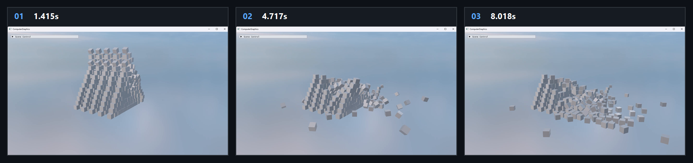

# Chapter19 Ex1901 PhysX Demo

## 목적

PhysX rigid-body scene을 fixed time step으로 갱신하고, actor shape pose를 render model world transform에 반영해 block wall collapse를 표시한다.

## 책임 범위

- `Ex1901_PhysX`의 PhysX scene 초기화, fixed-step simulation과 render transform synchronization을 설명한다.
- Build/run/capture 사실은 [Verification Index](../../02_Verification/Part4_Chapter14-20/verification-index.md)으로 위임한다.
- public 후보 판단은 [Publication Candidate List](../../05_Publication/candidate-list.md)로 위임한다.

## 결과 미리보기

시연 video에서 선택한 1.415s, 4.717s, 8.018s frame을 순서대로 배치한다. 상단 `01`부터 `03`까지와 timestamp는 block wall collapse의 frame 순서를 기록한다.

## 입력과 출력

| 구분 | 내용 |
| --- | --- |
| 입력 | command argument `1901`, PhysX gravity scene, static ground plane, rigid dynamic block stack |
| 출력 | 1.415s, 4.717s, 8.018s timestamp frame으로 구성한 block wall collapse storyboard |

## 구현 흐름

1. `InitPhysics`가 foundation, physics instance, dispatcher와 gravity scene을 만들고 default simulation filter를 설정한다.
2. scene에 static ground plane을 추가하고 `createStack`으로 rigid dynamic block wall을 배치한다.
3. frame update가 `simulate(1.0f / 60.0f)`와 `fetchResults(true)`로 fixed time step 결과를 확보한다.
4. scene actor와 shape를 순회해 dynamic actor의 global pose를 읽는다.
5. 각 pose를 render model의 world matrix로 반영하고 constant buffer를 갱신한다.
6. `AppBase::Render`와 post render path가 갱신된 model transform을 scene으로 출력한다.

## 핵심 구현

- [PhysX foundation, gravity scene과 material 초기화](../../../Part4_Chapter14-20/Ex1901_Physx.cpp#L13)
- [Ground plane과 rigid dynamic stack 구성](../../../Part4_Chapter14-20/Ex1901_Physx.cpp#L57)
- [Fixed-step simulation과 result fetch](../../../Part4_Chapter14-20/Ex1901_Physx.cpp#L85)
- [Actor shape pose를 render world transform으로 동기화](../../../Part4_Chapter14-20/Ex1901_Physx.cpp#L99)

## 시각 결과

Storyboard는 static ground와 block stack이 gravity와 collision에 따라 collapse하는 단계를 기록한다. 세 frame의 차이는 camera 이동이나 manual model transform이 아니라 PhysX actor pose를 render model에 반영한 결과다.

## 구현 범위와 한계

- simulation step은 `1.0f / 60.0f` fixed value이며 frame time과 동기화하는 accumulator를 구현하지 않는다.
- actor pose와 render transform은 같은 scale을 사용하므로 별도 unit conversion을 적용하지 않는다.
- collision event callback과 contact impulse 분석은 실행 경로가 아니다.
- Storyboard는 선택한 collapse frame이며 연속 collision dynamics 전체를 대체하지 않는다.
- 원본 MP4와 raw preview는 Git에 추가하지 않는다.

## 검증

- 2026-08-07 Debug와 Release x64 build/run/capture smoke 성공
- Storyboard PNG는 `1880x444` RGBA, non-interlaced이며 full decode와 metadata chunk 부재를 확인함

## 관련 코드

- [ExampleDocs](../../../Part4_Chapter14-20/ExampleDocs/19_01_PhysX.md)
- [Example selection entry point](../../../Part4_Chapter14-20/main.cpp)

## 관련 문서

- [Demo Index](demo-index.md)
- [Animation Physics And Gameplay Integration](../../01_Topics/AnimationAndPhysics/AnimationPhysicsAndGameplayIntegration.md)
- [WorkLog WU-Part4](../../04_WorkLogs/work-units/WU-Part4.md)