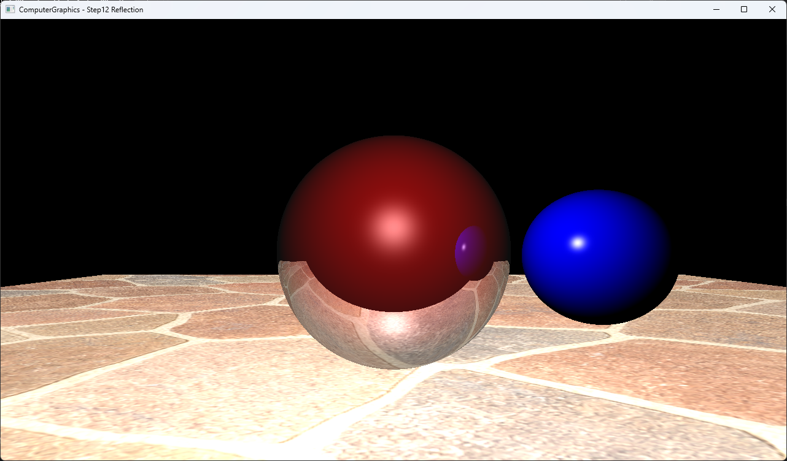

# Step12 Reflection

## Overview

이 예제는 closest hit의 local Phong color와 secondary reflection ray가 반환한 color를 material weight로 합성한다. 반사 sphere는 local shading과 reflected scene color를 각각 50% 사용하며, 고정 depth의 recursive trace로 sphere와 textured ground 사이의 반사를 계산한다.

일반적인 반사 벡터와 recursive ray의 종료 원리는 [Recursive Reflection](../../Docs/01_Topics/RayTracing/RecursiveReflection.md)으로 위임한다. 이 문서는 Step12 코드와 실행 진입점을 설명한다.

## 실행 진입점

- Solution: `03_Raytracing_Step12_Reflection.sln`
- Application entry: `main.cpp`
- Scene, Phong shading과 recursive reflection: `Raytracer.h`
- Material weight: `Object.h`
- Image load와 sampling: `Texture.cpp`, `Texture.h`
- DirectX11 upload/render: `Example.h`
- Shader: `VS.hlsl`, `PS.hlsl`

## Code Map

| 파일 | 역할 |
| --- | --- |
| `main.cpp` | Win32 window와 DirectX11 실행 loop |
| `Raytracer.h` | Scene, closest hit, local Phong shading과 recursive reflection |
| `Object.h` | Reflection과 transparency material weight |
| `Sphere.h`, `Square.h`, `Triangle.h` | Primitive intersection과 UV 계산 |
| `Texture.cpp`, `Texture.h` | 석재 PNG load와 bilinear sampling |
| `Example.h` | CPU RGBA32F buffer, dynamic texture upload와 full-screen draw |
| `VS.hlsl`, `PS.hlsl` | CPU 결과 canvas texture 표시 |

## 구현 요약

`traceRay`는 closest positive hit를 찾고 local Phong color에 `1 - reflection - transparency` weight를 적용한다. Reflection weight가 양수이면 incoming ray의 진행 방향을 surface normal에 대해 반사하고, hit point에서 반사 방향으로 `1e-4` 이동한 secondary ray를 재귀 추적한다. 반사 sphere는 local color와 reflected color를 각각 0.5 weight로 합성한다.

재귀는 depth 5에서 시작해 `depth < 0`에서 black을 반환한다. Miss도 black이며 environment map은 사용하지 않는다. 세부 구현과 시각 결과는 [Step12 상세 Demo](../../Docs/03_Demos/Part1_Chapter03/03_12_Reflection.md)에서 확인한다.

## Build And Run

| 항목 | 결과 | 비고 |
| --- | --- | --- |
| Solution | 존재 | `03_Raytracing_Step12_Reflection.sln` |
| Debug x64 build/run | 성공 | project 폴더를 working directory로 사용 |
| Release x64 build/run | 성공 | project 폴더를 working directory로 사용 |
| Input texture | 포함 | `part1_chapter03_stone_mosaic.png`, Step10·11 검증 asset과 동일 SHA-256 |
| Capture/Result | 확보 | 반사 sphere의 ground와 blue sphere reflection 확인 |

## Capture/Result

Red sphere의 아래쪽에는 석재 ground가 반사되고 오른쪽에는 blue sphere의 작은 reflection이 나타난다. Ground와 blue sphere는 reflection weight가 0이므로 local Phong shading만 사용한다.

## Limitations

- Reflection depth는 5로 고정되며 runtime parameter UI가 없다.
- Miss ray와 depth 종료 결과는 black이며 environment reflection은 포함하지 않는다.
- Reflection origin은 normal이 아니라 reflected direction으로 `1e-4` 이동하므로 모든 grazing-angle 수치 문제를 해결하는 일반형 bias는 아니다.
- Fresnel, rough reflection, stochastic sampling과 physically based energy model은 포함하지 않는다.
- Step11 대비 scene, output resolution과 sampling 방식도 달라 두 capture는 reflection만 바꾼 통제 비교가 아니다.
- Texture와 shader runtime load는 project working directory에 의존한다.
- CPU 결과는 최초 frame에 한 번 계산한다.
- Dynamic texture upload는 mapped `RowPitch`를 별도로 처리하지 않는다.

## Related Docs

- [Recursive Reflection Topic](../../Docs/01_Topics/RayTracing/RecursiveReflection.md)
- [Phong Shading Topic](../../Docs/01_Topics/LightingAndShading/PhongShading.md)
- [Texture Sampling Topic](../../Docs/01_Topics/TexturingAndMapping/TextureSampling.md)
- [Verification](../../Docs/02_Verification/Part1_Chapter03/verification-index.md)
- [Step12 상세 Demo](../../Docs/03_Demos/Part1_Chapter03/03_12_Reflection.md)
- [Demo Index](../../Docs/03_Demos/Part1_Chapter03/demo-index.md)
