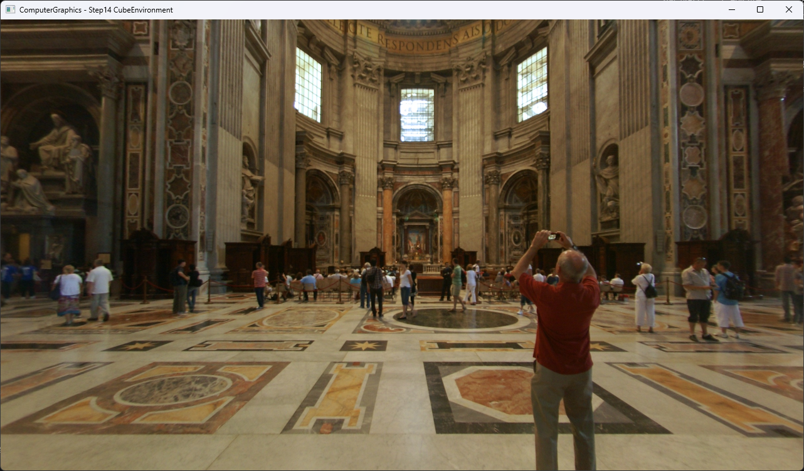

# Step14 CubeEnvironment

## Overview

이 예제는 camera ray 방향을 cubemap의 여섯 face 중 하나와 2D UV로 변환하고, CPU에서 bilinear sampling한 environment color를 화면에 표시한다. Step13의 geometry trace를 확장한 장면이 아니라 direction-based environment lookup을 분리해 보여주는 독립 예제다.

일반적인 cubemap과 environment mapping 개념은 [Cubemap And Environment Mapping](../../Docs/01_Topics/TexturingAndMapping/CubemapAndEnvironmentMapping.md)으로 위임한다. 이 문서는 Step14 코드와 실행 진입점을 설명한다.

## 실행 진입점

- Solution: `03_Raytracing_Step14_CubeEnvironment.sln`
- Application entry: `main.cpp`
- Camera ray와 cubemap face/UV 선택: `Raytracer.h`
- JPEG load와 bilinear sampling: `Texture.cpp`, `Texture.h`
- DirectX11 upload/render: `Example.h`
- Shader: `VS.hlsl`, `PS.hlsl`
- Runtime asset: `SaintPetersBasilica/posx.jpg` 등 cubemap 6면

## Code Map

| 파일 | 역할 |
| --- | --- |
| `main.cpp` | Win32 window와 DirectX11 실행 loop |
| `Raytracer.h` | Screen ray 생성, dominant axis 기반 face 선택과 UV 변환 |
| `Texture.cpp`, `Texture.h` | JPEG load와 face-local bilinear sampling |
| `Example.h` | CPU RGBA32F buffer, RowPitch 기반 dynamic texture upload와 full-screen draw |
| `VS.hlsl`, `PS.hlsl` | CPU 결과 canvas texture 표시 |
| `SaintPetersBasilica/readme.txt` | Environment asset 저자와 CC BY 3.0 attribution |

## 구현 요약

`Render`는 1280×720 screen point를 z=0 plane으로 옮기고 `(0, 0, -1.5)` eye에서 향하는 normalized ray를 만든다. `SampleEnvironment`는 ray direction의 절댓값이 가장 큰 axis로 cubemap face를 선택하고, 나머지 두 성분을 face UV로 변환한다.

선택한 face는 CPU에서 bilinear sampling한다. 결과는 RGBA32F dynamic texture에 row별로 복사하고 full-screen quad로 표시한다. 세부 구현과 시각 결과는 [Step14 상세 Demo](../../Docs/03_Demos/Part1_Chapter03/14_CubeEnvironment.md)에서 확인한다.

## Build And Run

| 항목 | 결과 | 비고 |
| --- | --- | --- |
| Solution | 존재 | `03_Raytracing_Step14_CubeEnvironment.sln` |
| Debug x64 build/run | 성공 | project 폴더 working directory에서 확인 |
| Release x64 build/run | 성공 | repository root working directory에서 fallback 확인 |
| Environment asset | 포함 | `SaintPetersBasilica` 2048×2048 RGB JPEG 6면 |
| Capture/Result | 확보 | PosZ 중심 view와 PosX·NegX 경계 확인 |

## Capture/Result

정면의 Saint Peter’s Basilica interior가 PosZ face 중심에 나타나고 좌우 가장자리에서 인접 X face로 이어진다. 정적 camera view이므로 PosY, NegY와 NegZ 방향은 이 한 장에서 직접 검증하지 않는다.

## Asset Attribution

- 저자: Emil Persson, aka Humus
- 원문: [SaintPetersBasilica/readme.txt](SaintPetersBasilica/readme.txt)
- 라이선스: [Creative Commons Attribution 3.0 Unported](https://creativecommons.org/licenses/by/3.0/)
- 실행 subset: `posx.jpg`, `negx.jpg`, `posy.jpg`, `negy.jpg`, `posz.jpg`, `negz.jpg`

Runtime에서 참조하지 않는 blurred face와 별도 `skybox` asset 묶음은 제거했다. 실행용 6면과 같은 폴더의 attribution 원문은 유지한다.

## Limitations

- Camera rotation과 cubemap face debug UI를 제공하지 않는다.
- 현재 capture는 PosZ 중심과 X face 경계만 보여주며 6면 전체 orientation 검증이 아니다.
- Face 경계에서 인접 face를 함께 filtering하지 않고 각 face 내부 좌표를 clamp한다.
- Mipmap, HDR, gamma correction, tone mapping과 importance sampling을 포함하지 않는다.
- Geometry, lighting, reflection과 image-based lighting을 포함하지 않는다.
- `#pragma omp parallel for`가 있지만 project에서 OpenMP를 활성화하지 않는다.
- Runtime fallback은 project 폴더와 repository root 기준이며 임의 working directory를 지원하지 않는다.

## Related Docs

- [Cubemap And Environment Mapping](../../Docs/01_Topics/TexturingAndMapping/CubemapAndEnvironmentMapping.md)
- [Texture Sampling](../../Docs/01_Topics/TexturingAndMapping/TextureSampling.md)
- [Verification](../../Docs/02_Verification/Part1_Chapter03/verification-index.md)
- [Step14 상세 Demo](../../Docs/03_Demos/Part1_Chapter03/14_CubeEnvironment.md)
- [Demo Index](../../Docs/03_Demos/Part1_Chapter03/demo-index.md)
