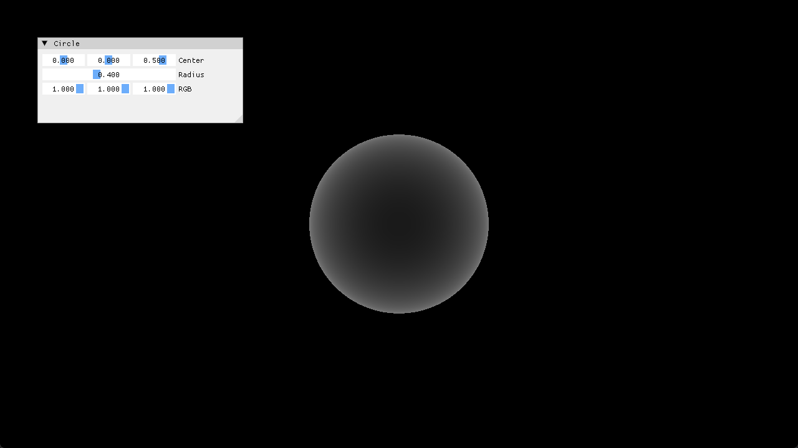

# Step4 DrawingSphere

## Overview

이 예제는 화면의 각 pixel에서 고정된 `+Z` 방향의 primary ray를 만들고 하나의
sphere와 교차시켜 CPU pixel buffer에 결과를 기록한다. 계산한 RGBA32F buffer는
DirectX11 dynamic texture로 업로드하고 full-screen quad로 표시한다.

표면 색은 lighting 결과가 아니라 sphere intersection과 hit distance를 확인하기
위한 diagnostic visualization이다. 일반적인 ray와 교차 이론은 Topic에 위임하고
구현 선택과 결과 해석은 상세 Demo에 연결한다.

## 실행 진입점

- Solution: `03_Raytracing_Step4_DrawingSphere.sln`
- Application entry: `main.cpp`
- CPU ray tracing: `Raytracer.h`, `Sphere.h`
- DirectX11 upload/render: `Example.h`
- Shader: `VS.hlsl`, `PS.hlsl`

## Code Map

| 파일 | 역할 |
| --- | --- |
| `main.cpp` | Win32 window, DirectX11와 ImGui 초기화, frame loop와 sphere UI |
| `Raytracer.h` | 화면 좌표 변환, primary ray 생성, hit 결과를 pixel color로 변환 |
| `Ray.h` | ray origin과 direction 데이터 |
| `Sphere.h` | quadratic equation 기반 ray-sphere intersection |
| `Hit.h` | hit distance, point, normal과 diagnostic flag |
| `Example.h` | CPU buffer 생성, dynamic texture upload, full-screen draw |
| `VS.hlsl` | full-screen quad position과 UV 전달 |
| `PS.hlsl` | CPU 결과 texture sampling |

## 구현 요약

`Raytracer::Render()`는 1280×720 pixel을 camera plane 좌표로 변환하고
`(0, 0, 1)` 방향의 orthographic ray를 만든다. `Sphere::CheckRayCollision()`은
quadratic discriminant와 두 root를 계산해 가장 가까운 양수 hit를 선택한다.

CPU에서 만든 결과는 `D3D11_USAGE_DYNAMIC` texture에 매 frame 복사한다. HLSL은
ray tracing을 수행하지 않고 업로드된 texture를 화면에 표시한다. 처리 단계와
의사코드는 [Step4 상세 Demo](../../Docs/03_Demos/Part1_Chapter03/04_DrawingSphere.md)에서
확인한다.

## Build And Run

| 항목 | 결과 | 비고 |
| --- | --- | --- |
| Solution | 존재 | `03_Raytracing_Step4_DrawingSphere.sln` |
| Debug x64 build/run | 성공 | project 폴더를 working directory로 사용 |
| Release x64 build/run | 성공 | project 폴더를 working directory로 사용 |
| Capture/Result | 확보 | diagnostic sphere와 조절 UI 확인 |

## Capture/Result

화면에는 검은 배경과 hit distance 기반으로 밝기가 달라지는 sphere가 나타난다.
ImGui에서 center, radius와 RGB 값을 바꾸면 다음 CPU render 결과에 반영된다.

## Limitations

- 고정된 `+Z` 방향의 orthographic primary ray만 사용한다.
- 하나의 sphere와 diagnostic color만 다루며 lighting은 포함하지 않는다.
- CPU pixel buffer 전체를 매 frame 다시 계산한다.
- shader는 project working directory의 `VS.hlsl`, `PS.hlsl`에 의존한다.
- 현재 dynamic texture upload는 mapped `RowPitch`를 별도로 처리하지 않는다.

## Related Docs

- [Ray Topic](../../Docs/01_Topics/RayTracing/Ray.md)
- [Intersection Topic](../../Docs/01_Topics/RayTracing/Intersection.md)
- [Verification](../../Docs/02_Verification/Part1_Chapter03/verification-index.md)
- [Detailed Demo](../../Docs/03_Demos/Part1_Chapter03/04_DrawingSphere.md)
- [Demo Index](../../Docs/03_Demos/Part1_Chapter03/demo-index.md)
