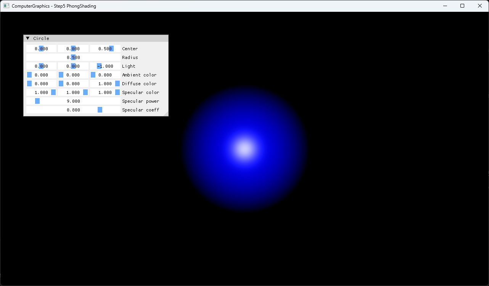

# Step5 PhongShading

## Overview

이 예제는 Step4의 ray-sphere intersection 결과에 ambient, diffuse와 specular 항을 적용해 sphere surface lighting을 계산한다. CPU가 교차와 Phong shading을 수행하고, DirectX11은 계산된 RGBA32F texture를 full-screen quad로 표시한다.

일반적인 Phong shading 이론은 [Phong Shading](../../Docs/01_Topics/LightingAndShading/PhongShading.md)으로 위임한다. 이 문서는 Step5 코드와 실행 진입점을 설명한다.

## 실행 진입점

- Solution: `03_Raytracing_Step5_PhongShading.sln`
- Application entry: `main.cpp`
- CPU ray tracing과 shading: `Raytracer.h`, `Sphere.h`
- Light data: `Light.h`
- DirectX11 upload/render: `Example.h`
- Shader: `VS.hlsl`, `PS.hlsl`

## Code Map

| 파일 | 역할 |
| --- | --- |
| `main.cpp` | Win32 window, DirectX11·ImGui 초기화와 lighting parameter UI |
| `Raytracer.h` | orthographic primary ray, sphere hit와 Phong lighting 계산 |
| `Sphere.h` | sphere material field와 ray-sphere intersection |
| `Hit.h` | hit distance, point와 surface normal |
| `Light.h` | point light position |
| `Example.h` | CPU buffer 생성, dynamic texture upload와 full-screen draw |
| `VS.hlsl` | full-screen quad position과 UV 전달 |
| `PS.hlsl` | CPU 결과 texture sampling |

## 구현 요약

Step4의 고정 `+Z` orthographic primary ray와 sphere intersection을 유지한다. Hit가 있으면 point에서 light까지의 방향과 surface normal로 diffuse 항을 계산하고, reflection vector와 view direction으로 specular 항을 계산한다. Ambient와 두 조명 항을 더한 결과는 `0~1` 범위로 clamp해 pixel buffer에 기록한다.

HLSL은 ray tracing이나 lighting을 수행하지 않는다. CPU가 만든 결과를 dynamic texture로 전달받아 화면에 표시한다. 상세 처리 흐름과 의사코드는 [Step5 상세 Demo](../../Docs/03_Demos/Part1_Chapter03/03_05_PhongShading.md)에서 확인한다.

## Build And Run

| 항목 | 결과 | 비고 |
| --- | --- | --- |
| Solution | 존재 | `03_Raytracing_Step5_PhongShading.sln` |
| Debug x64 build/run | 성공 | project 폴더를 working directory로 사용 |
| Release x64 build/run | 성공 | project 폴더를 working directory로 사용 |
| Capture/Result | 확보 | sphere lighting과 parameter UI 확인 |

## Capture/Result

기본값에서는 blue diffuse color 위에 white specular highlight가 나타난다. Light, ambient/diffuse/specular color, specular power와 coefficient를 ImGui에서 조정하면 다음 CPU render 결과에 반영된다.

## Limitations

- 고정 `+Z` orthographic primary ray와 sphere 하나만 사용한다.
- Ambient는 light intensity와 무관한 상수이며 distance attenuation이 없다.
- Shadow, multiple light, gamma correction과 tone mapping을 포함하지 않는다.
- Sphere가 camera plane에 닿고 교차 검사가 `t > 0`만 허용하므로 중심 ray가 exit surface를 선택할 수 있다.
- 합산 결과를 `0~1`로 clamp하므로 밝은 highlight detail이 포화될 수 있다.
- Shader는 project working directory의 `VS.hlsl`, `PS.hlsl`에 의존한다.
- Dynamic texture upload는 mapped `RowPitch`를 별도로 처리하지 않는다.

## Related Docs

- [Phong Shading Topic](../../Docs/01_Topics/LightingAndShading/PhongShading.md)
- [Ray Topic](../../Docs/01_Topics/RayTracing/Ray.md)
- [Intersection Topic](../../Docs/01_Topics/RayTracing/Intersection.md)
- [Verification](../../Docs/02_Verification/Part1_Chapter03/verification-index.md)
- [Detailed Demo](../../Docs/03_Demos/Part1_Chapter03/03_05_PhongShading.md)
- [Demo Index](../../Docs/03_Demos/Part1_Chapter03/demo-index.md)
