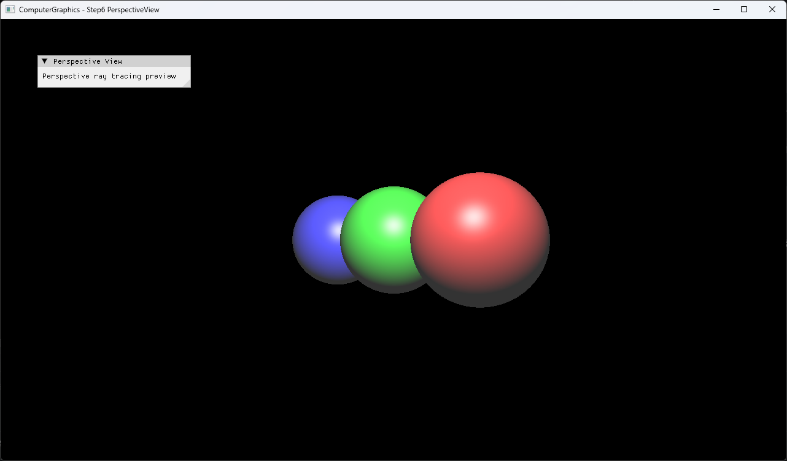

# Step6 PerspectiveView

## Overview

이 예제는 Step5의 orthographic primary ray를 perspective 방향으로 바꾸고 깊이가 다른 sphere 세 개 중 가장 가까운 교차를 선택한다. CPU가 primary ray, closest-hit와 Phong shading을 계산하고, DirectX11은 계산된 RGBA32F texture를 full-screen quad로 표시한다.

일반적인 ray와 camera model은 [Ray](../../Docs/01_Topics/RayTracing/Ray.md)으로 위임한다. 이 문서는 Step6 코드와 실행 진입점을 설명한다.

## 실행 진입점

- Solution: `03_Raytracing_Step6_PerspectiveView.sln`
- Application entry: `main.cpp`
- CPU ray tracing과 shading: `Raytracer.h`, `Object.h`, `Sphere.h`
- Hit와 Light data: `Hit.h`, `Light.h`
- DirectX11 upload/render: `Example.h`
- Shader: `VS.hlsl`, `PS.hlsl`

## Code Map

| 파일 | 역할 |
| --- | --- |
| `main.cpp` | Win32 window, DirectX11·ImGui 초기화와 실행 상태 표시 |
| `Raytracer.h` | perspective direction, scene object 목록, closest-hit와 Phong lighting 계산 |
| `Object.h` | material field와 polymorphic intersection interface |
| `Sphere.h` | ray-sphere intersection과 hit point·normal 계산 |
| `Hit.h` | hit distance, point, normal과 hit object |
| `Light.h` | point light position |
| `Example.h` | CPU buffer 생성, dynamic texture upload와 full-screen draw |
| `VS.hlsl` | full-screen quad position과 UV 전달 |
| `PS.hlsl` | CPU 결과 texture sampling |

## 구현 요약

Step6는 z=0 image plane과 `(0, 0, -1.5)` eye 위치를 사용한다. 각 pixel을 image-plane position으로 변환하고 eye에서 그 위치로 향하는 direction을 normalize한다. 실제 primary ray origin은 eye가 아니라 image-plane position이므로 z=0 앞쪽 구간부터 교차를 검사한다.

Scene은 깊이와 위치가 다른 red, green, blue sphere 세 개로 구성한다. 모든 object의 양수 hit를 검사해 가장 작은 거리를 선택하고, 선택한 object의 material로 Step5의 ambient, diffuse와 specular shading을 계산한다. 상세 처리 흐름과 의사코드는 [Step6 상세 Demo](../../Docs/03_Demos/Part1_Chapter03/06_PerspectiveView.md)에서 확인한다.

## Build And Run

| 항목 | 결과 | 비고 |
| --- | --- | --- |
| Solution | 존재 | `03_Raytracing_Step6_PerspectiveView.sln` |
| Debug x64 build/run | 성공 | project 폴더를 working directory로 사용 |
| Release x64 build/run | 성공 | project 폴더를 working directory로 사용 |
| Capture/Result | 확보 | perspective 크기 변화와 sphere overlap 확인 |

## Capture/Result

가까운 red sphere가 가장 크게 보이고 green, blue sphere 순서로 작아진다. Sphere가 겹치는 영역에서는 closest positive hit를 선택해 앞쪽 object가 뒤쪽 object를 가린다.

## Limitations

- Perspective direction은 eye에서 image-plane sample로 계산하지만 실제 ray origin은 image plane에 둔다.
- Pixel center offset을 적용하지 않고 integer pixel coordinate를 sample한다.
- Sphere 세 개와 point light 하나만 사용한다.
- Shadow, reflection, refraction, gamma correction과 tone mapping을 포함하지 않는다.
- CPU 결과는 최초 frame에 한 번만 계산하고 업로드한다.
- Shader는 project working directory의 `VS.hlsl`, `PS.hlsl`에 의존한다.
- Dynamic texture upload는 mapped `RowPitch`를 별도로 처리하지 않는다.

## Related Docs

- [Ray Topic](../../Docs/01_Topics/RayTracing/Ray.md)
- [Intersection Topic](../../Docs/01_Topics/RayTracing/Intersection.md)
- [Phong Shading Topic](../../Docs/01_Topics/LightingAndShading/PhongShading.md)
- [Verification](../../Docs/02_Verification/Part1_Chapter03/verification-index.md)
- [Detailed Demo](../../Docs/03_Demos/Part1_Chapter03/06_PerspectiveView.md)
- [Demo Index](../../Docs/03_Demos/Part1_Chapter03/demo-index.md)
