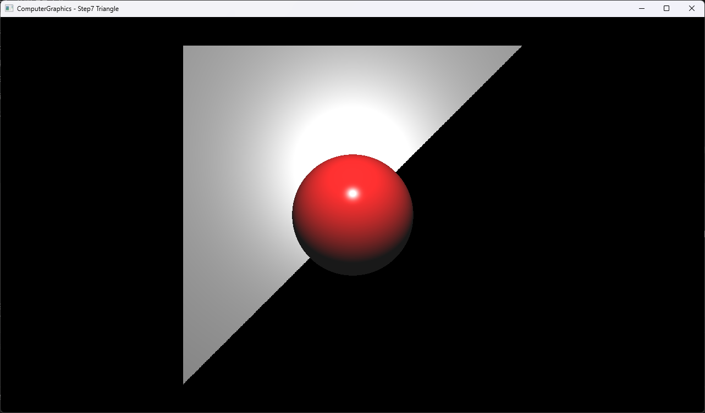

# Step7 Triangle

## Overview

이 예제는 Step6의 perspective primary ray, polymorphic closest-hit와 Phong shading 흐름에 triangle primitive를 추가한다. CPU는 sphere와 triangle의 교차를 함께 검사하고 가장 가까운 표면을 shading하며, DirectX11은 계산된 RGBA32F texture를 full-screen quad로 표시한다.

일반적인 ray와 primitive intersection은 [Ray](../../Docs/01_Topics/RayTracing/Ray.md)와 [Intersection](../../Docs/01_Topics/RayTracing/Intersection.md)으로 위임한다. 이 문서는 Step7 코드와 실행 진입점을 설명한다.

## 실행 진입점

- Solution: `03_Raytracing_Step7_Triangle.sln`
- Application entry: `main.cpp`
- CPU ray tracing과 shading: `Raytracer.h`, `Object.h`, `Sphere.h`, `Triangle.h`
- Hit와 Light data: `Hit.h`, `Light.h`
- DirectX11 upload/render: `Example.h`
- Shader: `VS.hlsl`, `PS.hlsl`

## Code Map

| 파일 | 역할 |
| --- | --- |
| `main.cpp` | Win32 window, DirectX11·ImGui 초기화와 실행 loop |
| `Raytracer.h` | sphere와 triangle scene, closest-hit와 Phong lighting 계산 |
| `Object.h` | material field와 polymorphic intersection interface |
| `Sphere.h` | ray-sphere intersection과 곡면 normal 계산 |
| `Triangle.h` | back-face 판정, ray-plane intersection과 edge half-space 내부 판정 |
| `Hit.h` | hit distance, point, normal과 hit object |
| `Light.h` | point light position |
| `Example.h` | CPU buffer 생성, dynamic texture upload와 full-screen draw |
| `VS.hlsl` | full-screen quad position과 UV 전달 |
| `PS.hlsl` | CPU 결과 texture sampling |

## 구현 요약

Step7은 Step6의 perspective primary ray와 closest-hit 탐색을 유지하면서 red sphere 하나와 gray triangle 하나를 같은 object 목록에 둔다. Triangle은 vertex winding으로 face normal을 만들고 back face를 제거한 뒤 ray-plane 교차점이 세 directed edge의 안쪽에 있는지 검사한다.

현재 triangle의 vertex 순서는 camera를 향하는 `-Z` normal을 만든다. Triangle은 전체 면에서 하나의 normal을 사용하고 sphere는 hit 위치별 radial normal을 사용하므로 같은 Phong 계산에서도 서로 다른 shading 형태가 나타난다. 실제 장면 구성과 교차 단계는 [Step7 상세 Demo](../../Docs/03_Demos/Part1_Chapter03/07_Triangle.md)에서 확인한다.

## Build And Run

| 항목 | 결과 | 비고 |
| --- | --- | --- |
| Solution | 존재 | `03_Raytracing_Step7_Triangle.sln` |
| Debug x64 build/run | 성공 | project 폴더를 working directory로 사용 |
| Release x64 build/run | 성공 | project 폴더를 working directory로 사용 |
| Capture/Result | 확보 | triangle 경계, flat normal shading과 sphere closest-hit 확인 |

## Capture/Result

화면 왼쪽의 triangle은 directed edge 내부 판정으로 직선 경계를 만들고 단일 face normal로 shading된다. 중앙의 sphere는 radial normal로 곡면 highlight를 만들며, 두 object가 겹치는 부분에서는 ray 진행 방향에서 더 가까운 sphere가 triangle을 가린다.

## Limitations

- Triangle은 단일 face normal만 사용하고 vertex normal interpolation을 포함하지 않는다.
- Back-face culling 때문에 vertex winding을 뒤집으면 현재 camera에서 triangle이 보이지 않는다.
- 내부 판정은 edge cross product를 normalize하므로 degenerate triangle과 정확한 edge에서 robust하지 않다.
- Plane parallel 판정은 고정 epsilon `1e-2`를 사용한다.
- `u`, `v` output은 계산하지 않고 `0`으로 유지한다.
- Shadow, reflection, refraction, gamma correction과 tone mapping을 포함하지 않는다.
- CPU 결과는 최초 frame에 한 번만 계산하고 업로드한다.
- Shader는 project working directory의 `VS.hlsl`, `PS.hlsl`에 의존한다.
- Dynamic texture upload는 mapped `RowPitch`를 별도로 처리하지 않는다.

## Related Docs

- [Ray Topic](../../Docs/01_Topics/RayTracing/Ray.md)
- [Intersection Topic](../../Docs/01_Topics/RayTracing/Intersection.md)
- [Phong Shading Topic](../../Docs/01_Topics/LightingAndShading/PhongShading.md)
- [Verification](../../Docs/02_Verification/Part1_Chapter03/verification-index.md)
- [Detailed Demo](../../Docs/03_Demos/Part1_Chapter03/07_Triangle.md)
- [Demo Index](../../Docs/03_Demos/Part1_Chapter03/demo-index.md)
