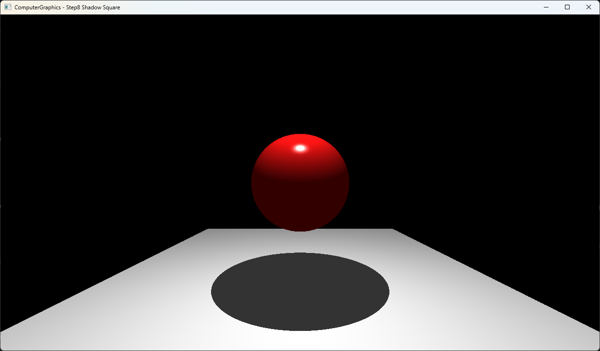

# Step8 Shadow Square

## Overview

이 예제는 두 triangle을 하나의 `Square : Object`로 캡슐화하고 composite primitive가 scene closest-hit와 shadow 판정에 참여하는 구조를 보여준다. Square는 내부 triangle hit 중 가까운 결과를 반환하고, scene query는 선택한 hit에 parent Square를 연결하여 Square material로 shading한다.

일반적인 shadow visibility는 [Shadow Ray](../../Docs/01_Topics/Shadows/ShadowRay.md), ray와 triangle 교차는 [Intersection](../../Docs/01_Topics/RayTracing/Intersection.md)으로 위임한다. 이 문서는 Shadow_Square의 object composition과 실행 진입점을 설명한다.

## 실행 진입점

- Solution: `03_Raytracing_Step8_Shadow.sln`
- Application entry: `main.cpp`
- CPU ray tracing과 scene closest-hit: `Raytracer.h`
- Composite square intersection: `Square.h`
- Child primitive intersection: `Triangle.h`
- Sphere intersection: `Sphere.h`
- Hit와 Light data: `Hit.h`, `Light.h`
- DirectX11 upload/render: `Example.h`
- Shader: `VS.hlsl`, `PS.hlsl`

## Code Map

| 파일 | 역할 |
| --- | --- |
| `main.cpp` | Win32 window, DirectX11·ImGui 초기화와 실행 loop |
| `Raytracer.h` | sphere와 Square scene, parent object closest-hit, shadow와 Phong lighting 계산 |
| `Square.h` | 두 child triangle 구성과 내부 closest-hit 선택 |
| `Triangle.h` | ray-plane intersection, winding 기반 normal과 edge 내부 판정 |
| `Object.h` | material field와 polymorphic intersection interface |
| `Hit.h` | hit distance, point, normal과 scene object |
| `Example.h` | CPU buffer 생성, dynamic texture upload와 full-screen draw |
| `VS.hlsl` | full-screen quad position과 UV 전달 |
| `PS.hlsl` | CPU 결과 texture sampling |

## 구현 요약

Square는 네 vertex를 공유 대각선 기준의 triangle 두 개로 나눈다. 각 child triangle의 교차 결과를 검사한 뒤 둘 다 유효하면 가까운 hit를, 하나만 유효하면 해당 hit를 반환한다. 두 triangle은 같은 `+Y` normal을 만들어 바닥이 하나의 연속된 surface로 보인다.

Child hit는 distance, point와 normal을 제공하고, scene의 `FindClosestCollision()`은 선택한 parent `Square`를 `hit.obj`에 저장한다. 따라서 lighting은 child triangle의 기본 material이 아니라 Square에 설정한 ambient, diffuse, specular와 alpha를 사용한다. 실제 object identity와 material 전달은 [Shadow Square 상세 Demo](../../Docs/03_Demos/Part1_Chapter03/08_ShadowSquare.md)에서 확인한다.

## Build And Run

| 항목 | 결과 | 비고 |
| --- | --- | --- |
| Solution | 존재 | `03_Raytracing_Step8_Shadow.sln` |
| Debug x64 build/run | 성공 | project 폴더를 working directory로 사용 |
| Release x64 build/run | 성공 | project 폴더를 working directory로 사용 |
| Capture/Result | 확보 | Square 바닥의 연속 면과 sphere cast shadow 확인 |

## Capture/Result

화면의 바닥은 두 child triangle으로 구성되지만 하나의 Square surface처럼 이어진다. 공유 대각선에는 seam이나 material 차이가 보이지 않으며, red sphere 아래에는 연속된 바닥 위로 타원형 cast shadow가 나타난다.

## Limitations

- Square는 planar convex quad를 두 triangle으로 고정 분할하며 임의 polygon을 지원하지 않는다.
- Child triangle은 독립 scene object가 아니며 parent Square가 material과 object identity를 소유한다.
- Triangle의 parallel 판정은 고정 epsilon `1e-2`를 사용한다.
- Edge와 vertex에서 zero-length cross product를 normalize할 가능성이 있다.
- Shadow ray origin offset은 scene scale에 고정된 `1e-4`를 사용한다.
- CPU 결과는 최초 frame에 한 번만 계산하므로 configuration에 따라 최종 표시까지 시간이 걸린다.
- Solution, project와 executable 이름은 `03_Raytracing_Step8_Shadow`를 유지한다.
- Shader는 project working directory의 `VS.hlsl`, `PS.hlsl`에 의존한다.
- Dynamic texture upload는 mapped `RowPitch`를 별도로 처리하지 않는다.

## Related Docs

- [Shadow Ray Topic](../../Docs/01_Topics/Shadows/ShadowRay.md)
- [Intersection Topic](../../Docs/01_Topics/RayTracing/Intersection.md)
- [Phong Shading Topic](../../Docs/01_Topics/LightingAndShading/PhongShading.md)
- [Verification](../../Docs/02_Verification/Part1_Chapter03/verification-index.md)
- [Detailed Demo](../../Docs/03_Demos/Part1_Chapter03/08_ShadowSquare.md)
- [Demo Index](../../Docs/03_Demos/Part1_Chapter03/demo-index.md)
