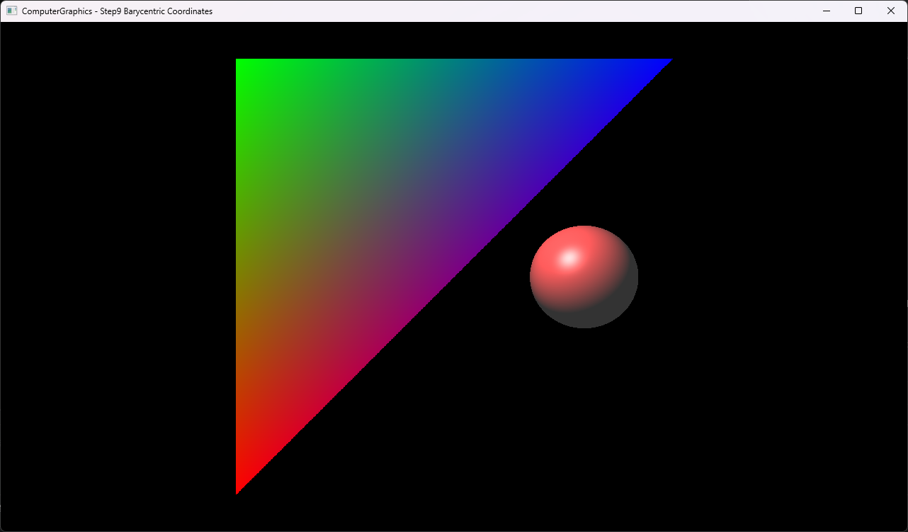

# Step9 Barycentric Coordinates

## Overview

이 예제는 triangle hit point의 barycentric coordinate로 세 vertex color를 보간한다. CPU ray tracer가 red, green, blue vertex 사이의 연속 색을 계산하고 DirectX11은 RGBA32F texture를 화면에 표시한다.

일반적인 barycentric coordinate와 attribute interpolation은 [Barycentric Coordinates](../../Docs/01_Topics/RayTracing/BarycentricCoordinates.md)로 위임한다. 이 문서는 Step9 코드와 실행 진입점을 설명한다.

## 실행 진입점

- Solution: `03_Raytracing_Step9_BarycentricCordinates.sln`
- Application entry: `main.cpp`
- CPU ray tracing과 color interpolation: `Raytracer.h`
- Triangle intersection과 barycentric 계산: `Triangle.h`
- Hit data: `Hit.h`
- DirectX11 upload/render: `Example.h`
- Shader: `VS.hlsl`, `PS.hlsl`

## Code Map

| 파일 | 역할 |
| --- | --- |
| `main.cpp` | Win32 window, DirectX11·ImGui 초기화와 실행 loop |
| `Raytracer.h` | scene closest-hit, RGB vertex color 보간과 Phong lighting |
| `Triangle.h` | ray-triangle intersection, 내부 판정과 barycentric weight |
| `Hit.h` | distance, point, normal, barycentric과 hit object |
| `Object.h` | material field와 polymorphic intersection interface |
| `Sphere.h` | ray-sphere intersection과 곡면 normal |
| `Example.h` | CPU buffer 생성, dynamic texture upload와 full-screen draw |
| `VS.hlsl` | full-screen quad position과 UV 전달 |
| `PS.hlsl` | CPU 결과 texture sampling |

## 구현 요약

Triangle은 plane 교차와 edge half-space test를 통과한 hit point에 대해 세 sub-triangle의 면적 비율을 계산한다. `w0`, `w1`, `w2`는 각각 `v0`, `v1`, `v2`의 weight이며 합은 1이다.

Raytracer는 hit object가 vertex-color triangle일 때 red, green, blue를 weight로 합성한다. Sphere는 기존 material과 Phong lighting을 유지한다. HLSL은 ray tracing을 수행하지 않고 CPU 결과 texture를 표시한다. 세부 계산과 시각 결과는 [Step9 상세 Demo](../../Docs/03_Demos/Part1_Chapter03/09_BarycentricCoordinates.md)에서 확인한다.

## Build And Run

| 항목 | 결과 | 비고 |
| --- | --- | --- |
| Solution | 존재 | `03_Raytracing_Step9_BarycentricCordinates.sln` |
| Debug x64 build/run | 성공 | project 폴더를 working directory로 사용 |
| Release x64 build/run | 성공 | project 폴더를 working directory로 사용 |
| Capture/Result | 확보 | RGB vertex color의 연속 보간과 sphere 확인 |

## Capture/Result

Triangle의 세 꼭짓점은 red, green, blue에 대응하고 내부는 barycentric weight에 따라 연속적으로 혼합된다. 오른쪽 sphere는 별도 material과 Phong lighting 경로가 유지됨을 보여준다.

## Limitations

- Degenerate triangle의 `totalArea == 0`을 별도로 방어하지 않는다.
- Back-face culling과 고정 parallel epsilon `1e-2`를 사용한다.
- UV field는 다음 Texturing 단계 준비 구조이며 Step9에서는 사용하지 않는다.
- CPU 결과는 최초 frame에 한 번 계산한다.
- Shader runtime compile은 project working directory에 의존한다.
- Dynamic texture upload는 mapped `RowPitch`를 별도로 처리하지 않는다.

## Related Docs

- [Barycentric Coordinates Topic](../../Docs/01_Topics/RayTracing/BarycentricCoordinates.md)
- [Intersection Topic](../../Docs/01_Topics/RayTracing/Intersection.md)
- [Ray Topic](../../Docs/01_Topics/RayTracing/Ray.md)
- [Phong Shading Topic](../../Docs/01_Topics/LightingAndShading/PhongShading.md)
- [Verification](../../Docs/02_Verification/Part1_Chapter03/verification-index.md)
- [Detailed Demo](../../Docs/03_Demos/Part1_Chapter03/09_BarycentricCoordinates.md)
- [Demo Index](../../Docs/03_Demos/Part1_Chapter03/demo-index.md)
