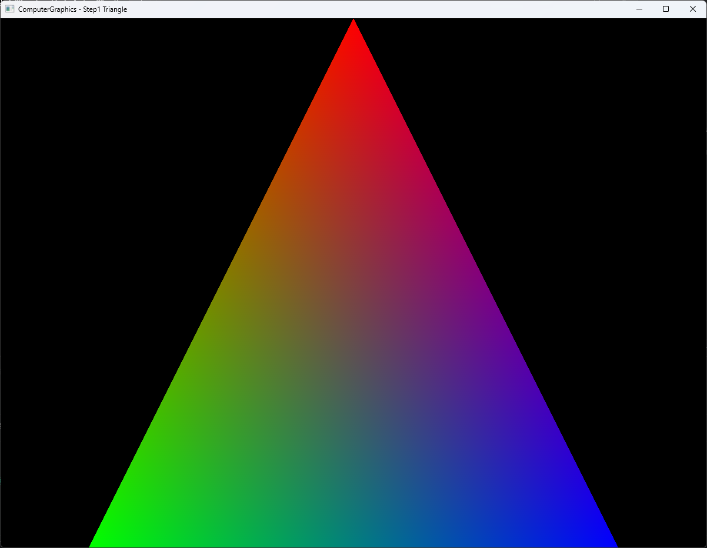

# Step1 Triangle

## Overview

이 예제는 세 vertex를 raster 좌표로 변환하고 CPU에서 triangle coverage와 barycentric RGB interpolation을 계산하는 software rasterization의 최소 기반이다. 계산한 RGBA32F pixel buffer는 DirectX11 dynamic texture를 거쳐 full-screen quad에 표시한다.

## 실행 진입점

- Solution: `04_Rasterization_Step1_Triangle.sln`
- Application entry: `main.cpp`
- 주요 source: `Rasterization.cpp`, `Example.cpp`
- Shader: `VertexShader.hlsl`, `PixelShader.hlsl`
- Working directory: 현재 example 폴더
- Application title: `ComputerGraphics - Step1 Triangle`

## Code Map

| 파일 | 역할 |
| --- | --- |
| `Rasterization.cpp` | triangle 구성, raster 좌표 변환, edge test와 RGB 보간 |
| `Rasterization.h` | vertex와 triangle 자료 구조, CPU rasterizer interface |
| `Example.cpp` | CPU buffer 초기화, dynamic texture update와 full-screen draw |
| `VertexShader.hlsl` | full-screen quad position과 UV 전달 |
| `PixelShader.hlsl` | CPU 결과 texture sampling |
| `main.cpp` | Win32 application과 render loop 진입점 |

## 구현 요약

세 vertex의 NDC 위치와 RGB color를 정의한 뒤 aspect ratio와 pixel-center offset을 반영해 raster 좌표로 변환한다. Raster-space bounding box만 순회하면서 세 edge function을 전체 signed area로 정규화하고, 모든 barycentric weight가 0 이상인 pixel에서 vertex color를 보간한다.

CPU에서 만든 결과는 `D3D11_USAGE_DYNAMIC` texture로 복사한다. HLSL은 triangle coverage를 계산하지 않고 CPU texture를 화면에 표시하는 presentation만 담당한다. 처리 순서와 의사코드는 [Step1 상세 Demo](../../Docs/03_Demos/Part2_Chapter04/01_Triangle.md)에서 확인한다.

## Capture/Result

검은 framebuffer 위 triangle 내부에는 red, green과 blue vertex color가 barycentric weight에 따라 연속적으로 섞인다. Bounding box는 순회 범위만 제한하며 coverage를 통과하지 않은 pixel은 기존 배경을 유지한다.

## Verification

| 항목 | 결과 | 비고 |
| --- | --- | --- |
| Debug x64 build/run | 성공 | example 폴더를 working directory로 사용 |
| Release x64 build/run | 성공 | example 폴더를 working directory로 사용 |
| Capture/Result | 확보 | 사용자 확인을 마친 전체 application window screenshot |

## Limitations

- Triangle 하나와 orthographic raster 좌표 변환만 다룬다.
- Shared edge의 top-left rule, clipping, depth test와 multisampling을 포함하지 않는다.
- Dynamic texture upload는 mapped `RowPitch`를 별도로 처리하지 않는다.
- Shader와 runtime file 탐색은 example working directory에 의존한다.

## Related Docs

- [Triangle Rasterization Topic](../../Docs/01_Topics/Rasterization/TriangleRasterization.md)
- [Verification](../../Docs/02_Verification/Part2_Chapter04/verification-index.md)
- [Detailed Demo](../../Docs/03_Demos/Part2_Chapter04/01_Triangle.md)
- [Demo Index](../../Docs/03_Demos/Part2_Chapter04/demo-index.md)
