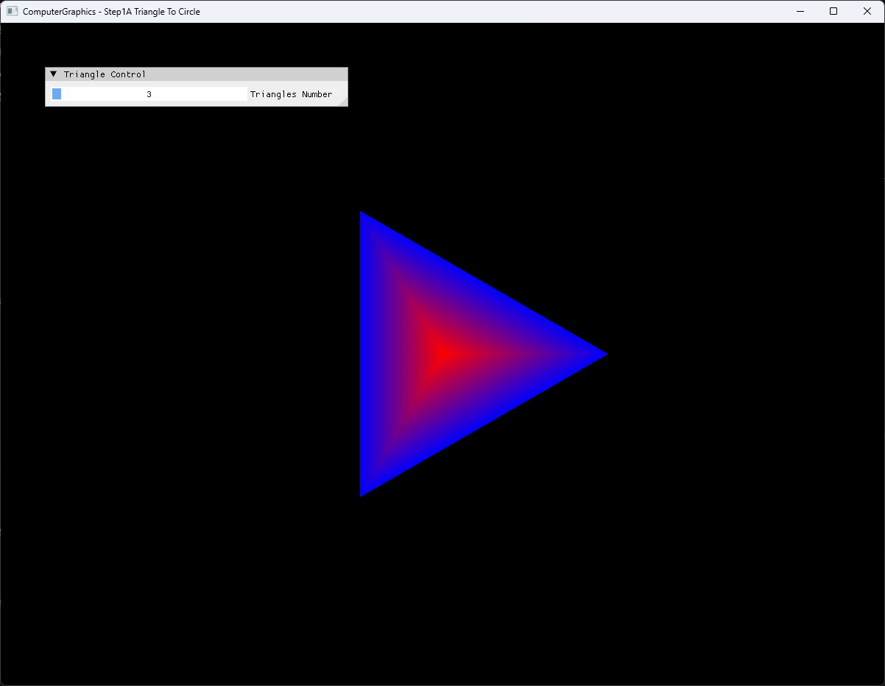
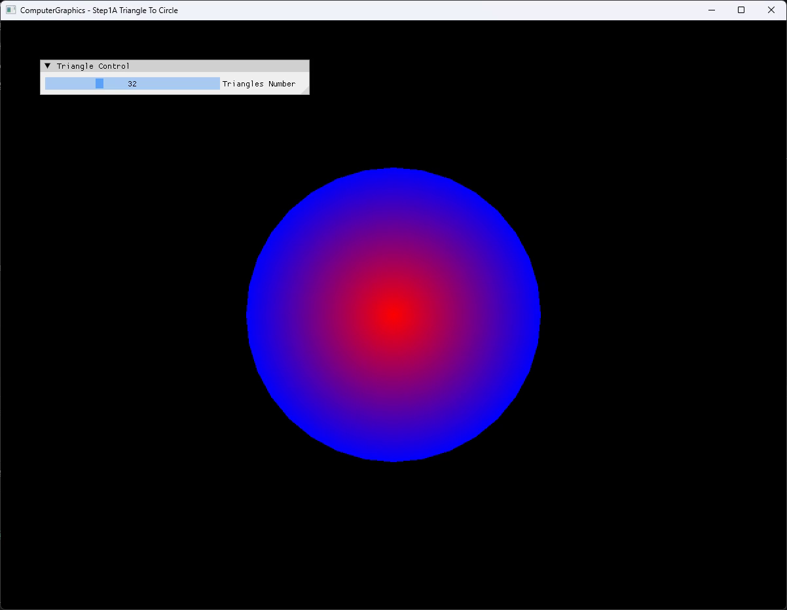

# Step1A Triangle To Circle

## Overview

Step1A는 Step1의 단일 triangle rasterization을 여러 triangle로 구성한 fan으로 확장해 polygon이 circle에 가까워지는 과정을 보여주는 Personal Extension이다. 강의 단계인 Step2 Circle과 달리 각 segment를 독립 `MyTriangle`로 저장하고 ImGui slider 변경 시 fan 전체를 다시 생성한다.

기본 segment 수는 32다. 15는 경계 각이 뚜렷하고 24는 원에 가깝지만 facet이 남으며, 32는 현재 출력 크기에서 원으로 안정적으로 읽힌다는 실행 비교를 기준으로 선택한다.

## 실행 진입점

- Solution: `04_Rasterization_Step1_TriangleToCircle.sln`
- Application title: `ComputerGraphics - Step1A Triangle To Circle`
- Runtime working directory: project 폴더
- UI: `Triangles Number`, 3~100
- 기본값: 32

## Code Map

- [`main.cpp`](main.cpp): application window와 triangle-count slider
- [`Rasterization.h`](Rasterization.h): `MyCircle`, triangle 목록과 count 상태
- [`Rasterization.cpp`](Rasterization.cpp): triangle fan 생성, per-triangle coverage와 slider 변경 반영
- [`Example.cpp`](Example.cpp): CPU pixel buffer 초기화, dynamic texture upload와 full-screen presentation
- [`VertexShader.hlsl`](VertexShader.hlsl), [`PixelShader.hlsl`](PixelShader.hlsl): CPU 결과 texture 표시

## Capture/Result

3개 segment는 triangle 형태를 그대로 드러내며 32개 segment는 같은 fan 생성 규칙으로 원에 가까운 silhouette를 만든다. Slider를 3에서 32로 변경한 local video 후보에서도 fan 재생성과 경계 변화가 연속적으로 확인된다.

## Verification

| 항목 | 결과 | 비고 |
| --- | --- | --- |
| Debug x64 build/run | 성공 | project 폴더 CWD, title과 기본값 32 확인 |
| Release x64 build/run | 성공 | project 폴더 CWD, 3·32 비교 capture 확인 |
| Capture | 확보 | 전체 application window 2장, 사용자 확인 완료 |
| Video | local 후보 | H.264, yuv420p, CFR 30fps, 3→32 slider 변화 |

상세 상태는 [Part2 Chapter04 Verification](../../Docs/02_Verification/Part2_Chapter04/verification-index.md)에 기록한다.

## Limitations

- Segment마다 center와 boundary vertex를 복제하는 구조이므로 Step2의 shared vertex/index 방식과 메모리 구성이 다르다.
- Circle boundary는 polygonal approximation이며 segment 수에 따라 facet과 처리량이 함께 증가한다.
- Clipping, top-left fill rule, depth buffer와 perspective-correct interpolation을 포함하지 않는다.
- Dynamic texture upload의 mapped `RowPitch` 처리는 별도 portability 작업으로 남긴다.
- Selected video는 `local/`에 유지하며 향후 Demo Issue attachment 게시 전까지 tracked Demo asset으로 사용하지 않는다.

## Related Docs

- [Triangle Rasterization Topic](../../Docs/01_Topics/Rasterization/TriangleRasterization.md)
- [Detailed Demo](../../Docs/03_Demos/Part2_Chapter04/01_TriangleToCircle.md)
- [Verification Index](../../Docs/02_Verification/Part2_Chapter04/verification-index.md)
- [Chapter README](../README.md)
