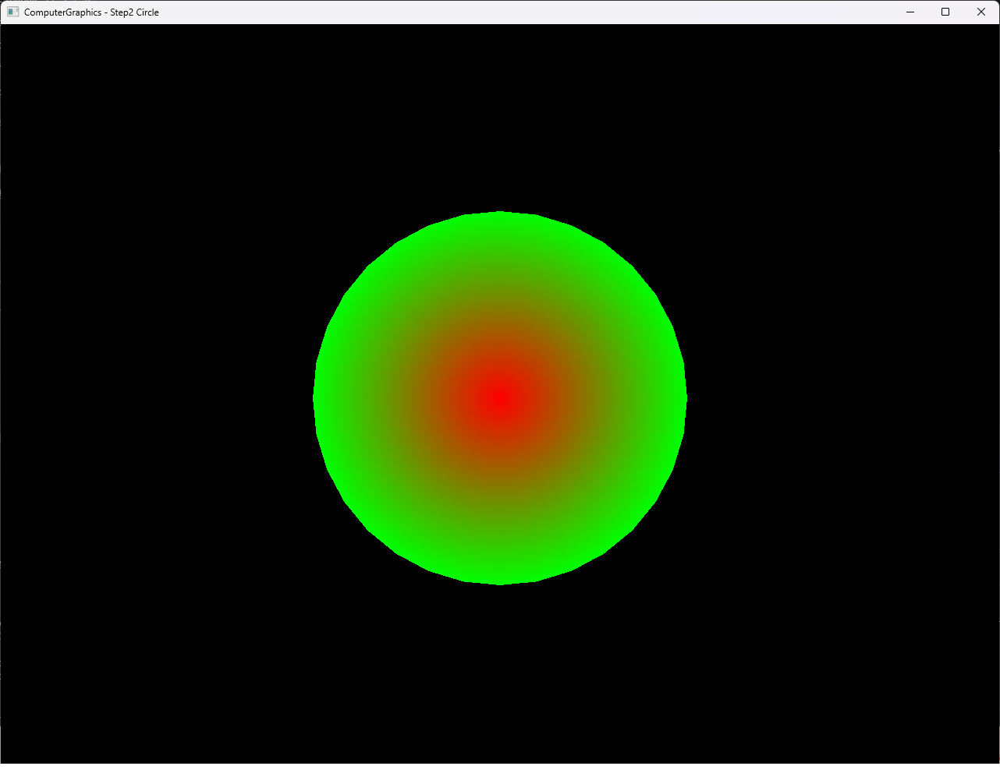

# Step2 Circle

## Overview

Step2는 Step1의 triangle rasterizer를 공유 CPU vertex/color 배열과 index 배열로 확장해 고정된 triangle fan을 구성한다. Step1A가 독립 `MyTriangle` 목록과 slider로 segment 변화를 보여주는 Personal Extension이라면, Step2는 position과 color를 한 번 저장하고 index 세 개로 triangle을 조립하는 정규 학습 단계다.

기본 triangle 수는 32다. Center 하나와 outer-ring vertex 32개를 96개 index로 연결해 polygonal circle을 구성한다.

## 실행 진입점

- Solution: `04_Rasterization_Step2_Circle.sln`
- Application entry: `main.cpp`
- 주요 source: `Rasterization.cpp`, `Example.cpp`
- Shader: `VertexShader.hlsl`, `PixelShader.hlsl`
- Working directory: 현재 example 폴더
- Application title: `ComputerGraphics - Step2 Circle`
- 기본값: 32 triangles

## Code Map

| 파일 | 역할 |
| --- | --- |
| `Rasterization.cpp` | CPU position/color/index 배열 구성과 indexed triangle rasterization |
| `Rasterization.h` | 공유 배열과 CPU rasterizer interface |
| `Example.cpp` | CPU buffer 초기화, dynamic texture update와 full-screen presentation |
| `VertexShader.hlsl` | full-screen quad position과 UV 전달 |
| `PixelShader.hlsl` | CPU 결과 texture sampling |
| `main.cpp` | Win32 application과 render loop 진입점 |

## 구현 요약

첫 원소에 red center를 저장하고 green outer-ring vertex 32개를 추가한다. 각 segment는 center, 다음 boundary와 현재 boundary를 가리키는 index 세 개로 구성하며 마지막 segment는 modulo 연산으로 첫 boundary에 연결한다. `Render()`는 index 배열을 세 개씩 순회하고 `DrawIndexedTriangle()`에서 position과 color를 조회해 raster 좌표 변환, bounding box, edge test와 barycentric color interpolation을 수행한다.

CPU에서 만든 RGBA32F framebuffer는 DirectX11 dynamic texture로 복사한다. DirectX11 vertex/index buffer는 circle geometry가 아니라 CPU 결과 texture를 표시하는 full-screen quad에 사용한다. 처리 순서와 의사코드는 [Step2 상세 Demo](../../Docs/03_Demos/Part2_Chapter04/02_Circle.md)에서 확인한다.

## Capture/Result

Red center에서 green boundary로 색이 연속적으로 보간되며 32개 outer-ring edge가 원에 가까운 silhouette를 만든다. 전체 application window와 표준 title을 포함한 screenshot을 사용한다.

## Verification

| 항목 | 결과 | 비고 |
| --- | --- | --- |
| Debug x64 build/run | 성공 | 2026-08-01 현재 확인, example 폴더를 working directory로 사용 |
| Release x64 build/run | 성공 | 2026-08-01 현재 확인, example 폴더를 working directory로 사용 |
| Application title | 확인 | `ComputerGraphics - Step2 Circle` |
| Capture/Result | 확보 | 32-triangle 전체 창 screenshot, 사용자 확인 완료 |

## Limitations

- 고정된 32-triangle polygonal approximation만 다루며 runtime segment 조작 UI를 포함하지 않는다.
- Circle geometry는 CPU 배열로 구성하며 GPU geometry pipeline의 indexed draw 예제가 아니다.
- Clipping, top-left fill rule, depth test와 perspective-correct interpolation을 포함하지 않는다.
- Dynamic texture upload는 mapped `RowPitch`를 별도로 처리하지 않는다.
- Shader와 runtime file 탐색은 example working directory에 의존한다.

## Related Docs

- [Triangle Rasterization Topic](../../Docs/01_Topics/Rasterization/TriangleRasterization.md)
- [Verification Index](../../Docs/02_Verification/Part2_Chapter04/verification-index.md)
- [Detailed Demo](../../Docs/03_Demos/Part2_Chapter04/02_Circle.md)
- [Demo Index](../../Docs/03_Demos/Part2_Chapter04/demo-index.md)
- [Chapter README](../README.md)
