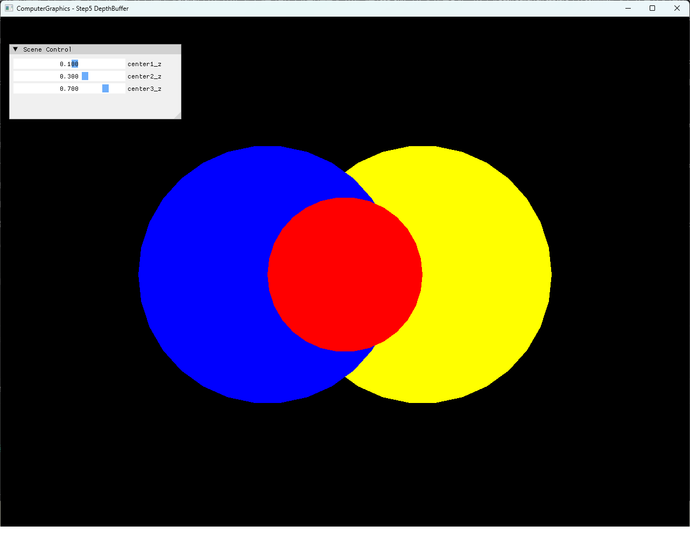
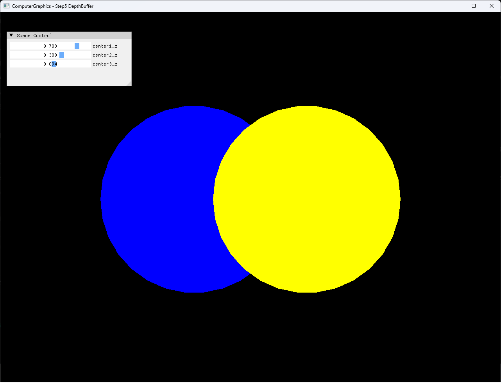

# Step5 DepthBuffer

## Overview

Step5는 Step4까지의 CPU triangle rasterization에 per-pixel depth buffer를 추가한다. 겹치는 red, blue와 yellow circle의 Z를 비교해 draw order가 아니라 camera에 더 가까운 fragment의 color를 남긴다.

세 circle의 Z는 Scene Control UI에서 조절한다. 일반적인 depth buffer의 역할과 비교 규칙은 [Depth Buffer Topic](../../Docs/01_Topics/Rasterization/DepthBuffer.md)으로 분리한다.

## 실행 진입점

- Solution: `04_Rasterization_Step5_DepthBuffer.sln`
- Application entry: `main.cpp`
- 주요 source: `Rasterization.cpp`, `Rasterization.h`, `Mesh.cpp`, `Example.cpp`
- Shader: `VertexShader.hlsl`, `PixelShader.hlsl`
- Working directory: 현재 example 폴더
- Application title: `ComputerGraphics - Step5 DepthBuffer`
- 기본 depth: red `0.1`, blue `0.3`, yellow `0.7`

## Code Map

| 파일 | 역할 |
| --- | --- |
| `Mesh.cpp` | 세 indexed circle fan의 position, index와 uniform color 구성 |
| `Rasterization.cpp` | Barycentric depth 보간, depth test·write와 CPU triangle rasterization |
| `Rasterization.h` | 세 circle, center와 per-pixel depth buffer 상태 |
| `Example.cpp` | CPU pixel buffer 갱신, dynamic texture upload와 full-screen presentation |
| `VertexShader.hlsl` | Full-screen quad position과 UV 전달 |
| `PixelShader.hlsl` | CPU 결과 texture sampling |
| `main.cpp` | Circle Z parameter UI와 Win32 render loop |

## 구현 요약

`Render()`는 frame마다 depth buffer를 `FLT_MAX`로 초기화한다. 각 triangle의 covered pixel에서 barycentric weight로 Z를 보간하고, Z가 `0` 이상이면서 기존 depth보다 작을 때만 depth와 color를 함께 갱신한다.

현재 circle mesh의 local Z는 모두 `0`이므로 각 circle의 fragment depth는 해당 `center.z`와 같다. 기본 상태는 red, blue, yellow 순으로 앞에서 뒤에 놓이며, 조정 상태는 yellow, blue, red 순으로 반전한다. 구현 선택과 시각 결과는 [Step5 상세 Demo](../../Docs/03_Demos/Part2_Chapter04/05_DepthBuffer.md)에서 확인한다.

## Capture/Result

기본과 depth 순서 반전 상태의 전체 창 screenshot을 확보했다. Selected local video는 두 상태 사이의 visibility 변화를 보여주며 기술 검수와 사용자 시각 검수를 완료했다.

## Verification

| 항목 | 결과 | 비고 |
| --- | --- | --- |
| Debug x64 build/run | 성공 | 2026-08-01 현재 확인, example 폴더를 working directory로 사용 |
| Release x64 build/run | 성공 | 2026-08-01 현재 확인, example 폴더를 working directory로 사용 |
| Application title | 확인 | `ComputerGraphics - Step5 DepthBuffer` |
| Depth ordering | 확인 | 기본 `0.1 / 0.3 / 0.7`, 반전 `0.7 / 0.3 / 0.1` |
| Screenshot | 확보 | 기본·반전 전체 창 capture 기술·사용자 시각 검수 완료 |
| Selected video | 확보 | H.264, 1282×992, CFR 30 FPS, audio 없음, 전체 decode와 사용자 시각 검수 완료 |

## Limitations

- Screen-space Z를 barycentric weight로 affine 보간하며 perspective-correct depth는 다루지 않는다.
- `depth >= 0`만 검사하고 명시적인 far range 또는 upper clipping은 적용하지 않는다.
- 동일 depth는 strict `<` 비교 때문에 먼저 기록된 fragment가 유지되어 draw order에 의존한다.
- Depth test는 CPU buffer에서 수행하며 DirectX11 depth-stencil state를 사용하지 않는다.
- Dynamic texture upload는 mapped `RowPitch`와 `Map()` 실패를 별도로 처리하지 않는다.
- Shader와 runtime file 탐색은 example working directory에 의존한다.

## Related Docs

- [Depth Buffer Topic](../../Docs/01_Topics/Rasterization/DepthBuffer.md)
- [Triangle Rasterization Topic](../../Docs/01_Topics/Rasterization/TriangleRasterization.md)
- [Verification Index](../../Docs/02_Verification/Part2_Chapter04/verification-index.md)
- [Detailed Demo](../../Docs/03_Demos/Part2_Chapter04/05_DepthBuffer.md)
- [Demo Index](../../Docs/03_Demos/Part2_Chapter04/demo-index.md)
- [Chapter README](../README.md)
