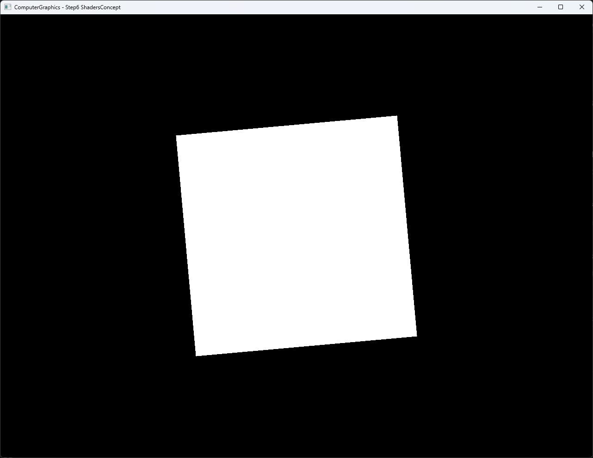

# Step6 ShadersConcept

## Overview

Step6는 CPU software rasterizer에 vertex stage와 pixel stage의 입출력 계약을 분리한다. `MyVertexShader()`는 mesh position에 scale, Z rotation과 translation을 적용하고 color와 UV를 다음 단계로 전달한다. Rasterizer는 vertex output을 보간해 `MyPixelShader()`의 입력을 구성한다.

이 C++ 함수들은 programmable shader stage를 학습하기 위한 CPU 모사다. DirectX11 HLSL은 CPU에서 만든 framebuffer texture를 full-screen quad로 표시하며 Step6의 학습 대상 transform과 color 계산을 수행하지 않는다. 일반적인 stage 책임은 [Shader Stage Topic](../../Docs/01_Topics/DirectX11Pipeline/ShaderStage.md)으로 분리한다.

## 실행 진입점

- Solution: `04_Rasterization_Step6_ShadersConcept.sln`
- Application entry: `main.cpp`
- 주요 source: `Rasterization.cpp`, `Rasterization.h`, `Mesh.cpp`, `Example.cpp`
- Presentation shader: `VertexShader.hlsl`, `PixelShader.hlsl`
- Working directory: 현재 example 폴더
- Application title: `ComputerGraphics - Step6 ShadersConcept`

## Code Map

| 파일 | 역할 |
| --- | --- |
| `Rasterization.cpp` | CPU vertex/pixel stage 계약, attribute 보간과 triangle rasterization |
| `Rasterization.h` | Mesh 목록과 post-vertex-stage attribute buffer |
| `Mesh.cpp` | Square position, index, color와 UV 구성 |
| `Example.cpp` | CPU framebuffer 갱신, dynamic texture upload와 full-screen presentation |
| `VertexShader.hlsl` | Presentation quad의 position과 UV 전달 |
| `PixelShader.hlsl` | CPU 결과 texture sampling |
| `main.cpp` | Win32 render loop와 application window |

## 구현 요약

`Render()`는 mesh transform을 전역 `Constants`에 복사한 뒤 원본 vertex마다 `MyVertexShader()`를 호출한다. 변환된 position, color와 UV를 분리된 buffer에 기록하고 triangle coverage를 계산한다. Covered pixel에서는 barycentric weight로 color, UV와 depth를 보간하고 depth test를 통과한 fragment를 `MyPixelShader()`에 전달한다.

현재 pixel stage는 보간된 color를 그대로 출력하고 UV는 사용하지 않는다. Square의 모든 vertex color가 white이므로 screenshot은 attribute color 차이보다 vertex stage transform과 매 frame rotation 결과를 보여준다. Rotation은 frame마다 `0.005` radian을 더해 짧은 검수 영상에서도 변화를 식별할 수 있게 한다. 세부 구현 흐름과 CPU/GPU 경계는 [Step6 상세 Demo](../../Docs/03_Demos/Part2_Chapter04/06_ShadersConcept.md)에서 확인한다.

## Capture/Result

회전이 식별되는 대각선 상태의 전체 창 screenshot과 자동 회전 selected local video를 확보했다. Screenshot과 video는 기술 검수와 사용자 시각 검수를 완료했다. Video는 local 검수 증거로 유지하고 tracked 문서에는 대표 screenshot만 둔다.

## Verification

| 항목 | 결과 | 비고 |
| --- | --- | --- |
| Debug x64 build/run | 성공 | 2026-08-01 현재 확인, example 폴더를 working directory로 사용 |
| Release x64 build/run | 성공 | 2026-08-01 현재 확인, example 폴더를 working directory로 사용 |
| Application title | 확인 | `ComputerGraphics - Step6 ShadersConcept` |
| Runtime shader load | 확인 | `VertexShader.hlsl`, `PixelShader.hlsl` runtime compile 성공 |
| Screenshot | 확보 | 1282×992 전체 창 capture, 기술·사용자 시각 검수 완료 |
| Selected video | 확보 | H.264, 1282×992, CFR 30 FPS, 7.8초, audio 없음, 전체 decode와 사용자 시각 검수 완료 |

## Limitations

- CPU shader 함수는 고정 C++ 함수이며 runtime shader binding system이 아니다.
- Transform `Constants`는 전역 mutable state로 mesh마다 덮어쓴다.
- UV는 vertex output과 rasterizer에서 보간하지만 `MyPixelShader()`가 사용하지 않는다.
- 모든 square vertex가 white라서 color interpolation 차이가 화면에서 드러나지 않는다.
- Screen-space attribute는 affine 보간하며 perspective-correct interpolation은 포함하지 않는다.
- Rotation은 delta time이 아니라 frame마다 고정 `0.005` radian을 더한다.
- Dynamic texture upload는 mapped `RowPitch`와 `Map()` 실패를 별도로 처리하지 않는다.
- Shader file 탐색은 example working directory에 의존한다.

## Related Docs

- [Shader Stage Topic](../../Docs/01_Topics/DirectX11Pipeline/ShaderStage.md)
- [Triangle Rasterization Topic](../../Docs/01_Topics/Rasterization/TriangleRasterization.md)
- [Verification Index](../../Docs/02_Verification/Part2_Chapter04/verification-index.md)
- [Detailed Demo](../../Docs/03_Demos/Part2_Chapter04/06_ShadersConcept.md)
- [Demo Index](../../Docs/03_Demos/Part2_Chapter04/demo-index.md)
- [Chapter README](../README.md)
