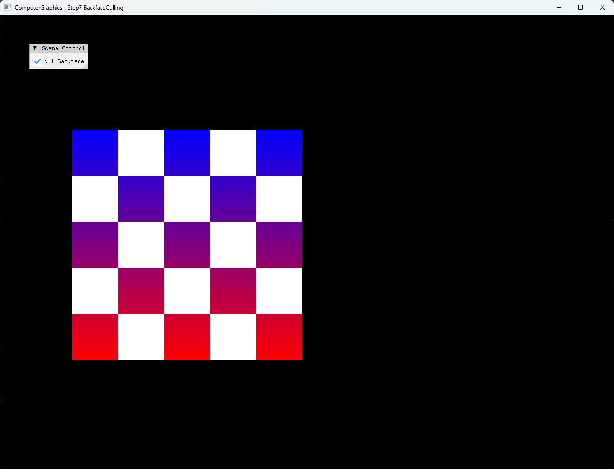

# Step7 BackfaceCulling

## Overview

Step7은 동일한 square topology 두 개를 좌우에 배치하고 오른쪽 square에 X축 180도 회전을 적용해 post-transform winding을 반전한다. CPU software rasterizer는 raster-space signed area로 front/back face를 분류하고 `cullBackface`가 활성화된 경우 back-facing triangle을 coverage 계산 전에 제외한다.

이 예제의 부호 규약은 `ProjectWorldToRaster()`의 Y축 반전을 포함한다. Raster 좌표로 변환한 뒤 `area > 0`인 triangle을 front-facing으로 취급하며 일반적인 winding과 culling 원리는 [Backface Culling Topic](../../Docs/01_Topics/Rasterization/BackfaceCulling.md)으로 분리한다.

## 실행 진입점

- Solution: `04_Rasterization_Step7_BackfaceCulling.sln`
- Application entry: `main.cpp`
- 주요 source: `Rasterization.cpp`, `Rasterization.h`, `Mesh.cpp`, `Example.cpp`
- Presentation shader: `VertexShader.hlsl`, `PixelShader.hlsl`
- Working directory: 현재 example 폴더
- Application title: `ComputerGraphics - Step7 BackfaceCulling`

## Code Map

| 파일 | 역할 |
| --- | --- |
| `Mesh.cpp` | 두 triangle로 구성한 공통 square topology와 UV 구성 |
| `Rasterization.cpp` | X축 transform, raster-space signed area, backface 조기 반환과 CPU rasterization |
| `Rasterization.h` | Mesh buffer, depth buffer와 runtime `cullBackface` 상태 |
| `Example.cpp` | CPU framebuffer 갱신, dynamic texture upload와 full-screen presentation |
| `main.cpp` | Win32 render loop와 ImGui culling checkbox |
| `VertexShader.hlsl` | Presentation quad의 position과 UV 전달 |
| `PixelShader.hlsl` | CPU framebuffer texture sampling |

## 구현 요약

두 square는 `{0, 1, 2, 0, 2, 3}` index를 공유한다. 왼쪽은 원본 orientation을 유지하고 오른쪽은 `rotationX = π`를 적용해 Y 방향과 post-transform winding을 반전한다. `ProjectWorldToRaster()`가 world Y-up을 raster Y-down으로 바꾼 뒤 `EdgeFunction(v0, v1, v2)`으로 signed area를 계산한다.

`area == 0.0f`인 degenerate triangle은 항상 제외한다. `cullBackface`가 활성화되면 `area <= 0.0f`도 coverage 이전에 반환한다. Culling을 끈 경우 signed area로 정규화한 barycentric weight가 반대 winding triangle의 내부에서도 양수가 되므로 두 square를 모두 rasterize한다. 구현 흐름과 On/Off 시각 차이는 [Step7 상세 Demo](../../Docs/03_Demos/Part2_Chapter04/07_BackfaceCulling.md)에서 설명한다.

## Capture/Result

Culling On과 Off 전체 창 screenshot, On → Off → On selected local video를 확보했다. Screenshot과 video는 기술 검수와 사용자 시각 검수를 완료했다. Video는 local 검수 증거로 유지하고 tracked 문서에는 On 대표 screenshot과 상세 Demo의 On/Off 비교를 둔다.

## Verification

| 항목 | 결과 | 비고 |
| --- | --- | --- |
| Debug x64 build/run | 성공 | 2026-08-01 현재 확인, example 폴더를 working directory로 사용 |
| Release x64 build/run | 성공 | 2026-08-01 현재 확인, example 폴더를 working directory로 사용 |
| Application title | 확인 | `ComputerGraphics - Step7 BackfaceCulling` |
| Runtime shader load | 확인 | `VertexShader.hlsl`, `PixelShader.hlsl` runtime compile 성공 |
| Culling On screenshot | 확보 | 1282×992 전체 창 capture, 기술·사용자 시각 검수 완료 |
| Culling Off screenshot | 확보 | 1282×992 전체 창 capture, 기술·사용자 시각 검수 완료 |
| Selected video | 확보 | H.264, 1282×992, CFR 30 FPS, 19.1초, audio 없음, 전체 decode와 사용자 시각 검수 완료 |

## Limitations

- Front-face 부호는 Y-down raster 변환을 포함한 현재 좌표계 convention에 결합돼 있다.
- `area == 0.0f` exact 비교는 거의 퇴화한 triangle을 epsilon으로 제거하지 않는다.
- X축 회전값은 근사한 `3.141592f`를 사용한다.
- Backface culling은 clipping 이전의 완전한 GPU pipeline 동작을 재현하지 않는다.
- Attribute와 depth는 screen space에서 affine 보간하며 perspective correction은 포함하지 않는다.
- Dynamic texture upload는 `Map()` 실패와 mapped `RowPitch` 차이를 별도로 처리하지 않는다.
- Shader file 탐색은 example working directory에 의존한다.

## Related Docs

- [Backface Culling Topic](../../Docs/01_Topics/Rasterization/BackfaceCulling.md)
- [Triangle Rasterization Topic](../../Docs/01_Topics/Rasterization/TriangleRasterization.md)
- [Shader Stage Topic](../../Docs/01_Topics/DirectX11Pipeline/ShaderStage.md)
- [Verification Index](../../Docs/02_Verification/Part2_Chapter04/verification-index.md)
- [Detailed Demo](../../Docs/03_Demos/Part2_Chapter04/07_BackfaceCulling.md)
- [Demo Index](../../Docs/03_Demos/Part2_Chapter04/demo-index.md)
- [Chapter README](../README.md)
