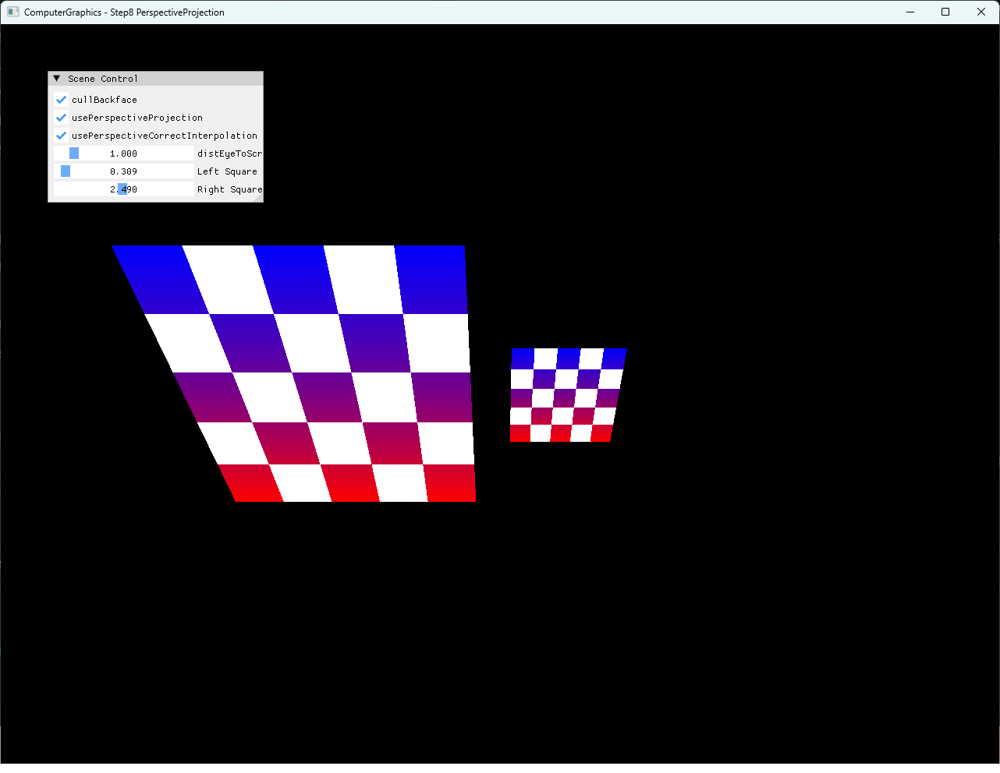

# Step8 PerspectiveProjection

## Overview

Step8은 Step7의 CPU software rasterizer에 depth 기반 perspective projection과 perspective-correct interpolation을 추가한다. 서로 다른 Z에 놓인 두 square로 원근에 따른 화면 크기 변화와 affine 보간의 왜곡, 보정된 attribute 보간 결과를 비교한다.

일반적인 perspective division과 보간 원리는 [Perspective Projection Topic](../../Docs/01_Topics/Rasterization/PerspectiveProjection.md)으로 분리한다. 이 예제가 사용하는 간소화된 수식과 시각 비교는 [Step8 상세 Demo](../../Docs/03_Demos/Part2_Chapter04/08_PerspectiveProjection.md)에서 설명한다.

## 실행 진입점

- Solution: `04_Rasterization_Step8_PerspectiveProjection.sln`
- Application entry: `main.cpp`
- 주요 source: `Rasterization.cpp`, `Rasterization.h`, `Mesh.cpp`, `Example.cpp`
- Presentation shader: `VertexShader.hlsl`, `PixelShader.hlsl`
- Working directory: 현재 example 폴더
- Application title: `ComputerGraphics - Step8 PerspectiveProjection`

## Code Map

| 파일 | 역할 |
| --- | --- |
| `Mesh.cpp` | 두 triangle로 구성한 square topology와 checker UV 구성 |
| `Rasterization.cpp` | CPU vertex transform, perspective projection, barycentric 보정과 depth test |
| `Rasterization.h` | Projection과 interpolation runtime 상태, eye-to-screen 거리와 mesh buffer |
| `Example.cpp` | CPU framebuffer 갱신, dynamic texture upload와 full-screen presentation |
| `main.cpp` | Win32 render loop와 projection, interpolation, Z 조정 ImGui UI |
| `VertexShader.hlsl` | Presentation quad의 position과 UV 전달 |
| `PixelShader.hlsl` | CPU framebuffer texture sampling |

## 구현 요약

두 square는 같은 topology와 UV를 사용하고 X축으로 -30도 회전한다. `ProjectWorldToRaster()`는 projection이 꺼진 경우 XY를 그대로 사용하고, 켜진 경우 `distEyeToScreen / (distEyeToScreen + z)`를 XY에 곱해 가까운 square는 크게, 먼 square는 작게 만든다.

Raster-space barycentric weight는 기본적으로 affine 보간에 사용한다. Perspective-correct interpolation이 활성화되면 각 weight를 vertex의 eye-relative Z로 나눈 뒤 합이 1이 되도록 다시 정규화하고, 그 weight로 depth, color와 UV를 보간한다. DirectX11 HLSL은 이 CPU 결과를 texture로 표시하는 presentation 경로만 담당한다.

## Capture/Result

동일한 Z 설정에서 orthographic, perspective와 affine interpolation, perspective-correct interpolation을 비교한다. 대표 이미지는 원근 크기 변화와 보정된 checker pattern을 함께 보여주는 최종 상태다.

## Verification

| 항목 | 결과 | 비고 |
| --- | --- | --- |
| Debug x64 build/run | 성공 | 2026-08-01 현재 확인, example 폴더를 working directory로 사용 |
| Release x64 build/run | 성공 | 2026-08-01 현재 확인, example 폴더를 working directory로 사용 |
| Application title | 확인 | `ComputerGraphics - Step8 PerspectiveProjection` |
| Runtime shader load | 확인 | `VertexShader.hlsl`, `PixelShader.hlsl` runtime compile 성공 |
| Orthographic screenshot | 확보 | 1282×992 전체 창 capture, 기술·사용자 시각 검수 완료 |
| Perspective affine screenshot | 확보 | 1282×992 전체 창 capture, 기술·사용자 시각 검수 완료 |
| Perspective-correct screenshot | 확보 | 1282×992 전체 창 capture, 기술·사용자 시각 검수 완료 |

## Limitations

- Projection은 matrix와 homogeneous clip space 대신 `dist / (dist + z)` 비율만 사용하는 간소화된 구현이다.
- Near/far clipping과 `distEyeToScreen + z`가 0 이하인 경우의 guard를 포함하지 않는다.
- Perspective-correct weight를 color와 UV뿐 아니라 depth 보간에도 함께 사용한다.
- Depth buffer 초기값 `10.0f`는 명시적인 far plane이 아니다.
- `eyePoint`는 선언돼 있지만 projection 계산에 사용하지 않는다.
- Dynamic texture upload는 `Map()` 실패와 mapped `RowPitch` 차이를 별도로 처리하지 않는다.
- Shader file 탐색은 example working directory에 의존한다.

## Related Docs

- [Perspective Projection Topic](../../Docs/01_Topics/Rasterization/PerspectiveProjection.md)
- [Backface Culling Topic](../../Docs/01_Topics/Rasterization/BackfaceCulling.md)
- [Verification Index](../../Docs/02_Verification/Part2_Chapter04/verification-index.md)
- [Detailed Demo](../../Docs/03_Demos/Part2_Chapter04/08_PerspectiveProjection.md)
- [Demo Index](../../Docs/03_Demos/Part2_Chapter04/demo-index.md)
- [Chapter README](../README.md)
