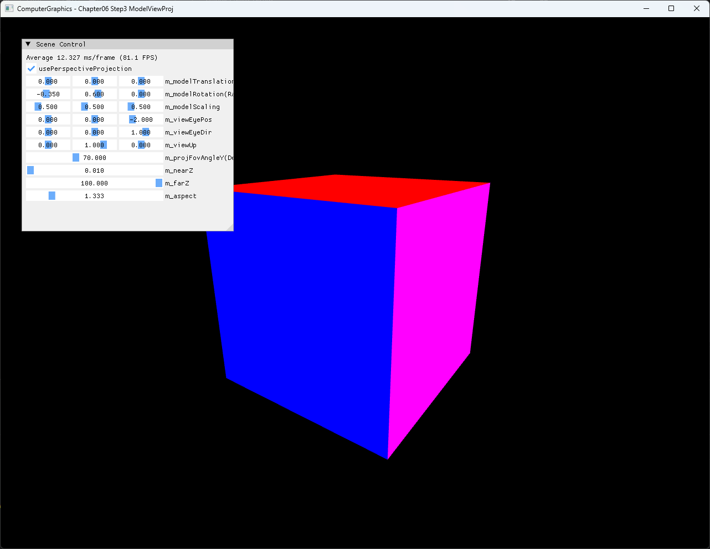

# Chapter06 Step3 ModelViewProj

이 예제는 Step2에서 연결한 D3D11 frame에 조작 가능한 Model·View·Projection matrix를 추가한다. ImGui parameter를 바꾸면 같은 indexed color cube의 object transform, camera 기준과 projection 방식이 매 frame 갱신된다.

## 실행 진입점

- Solution: `06_GraphicsPipeline_Step3_ModelViewProj.sln`
- Application entry: `main.cpp`
- 주요 source: `AppBase.cpp`, `ExampleApp.cpp`, `ExampleApp.h`
- Shader: `ColorVertexShader.hlsl`, `ColorPixelShader.hlsl`
- Runtime working directory: project 폴더
- Application title: `ComputerGraphics - Chapter06 Step3 ModelViewProj`

## Code Map

| 범위 | 책임 |
| --- | --- |
| [MVP parameter 기본값](ExampleApp.h#L48-L60) | Model transform, camera와 projection 초기값 보관 |
| [Model·View·Projection 갱신](ExampleApp.cpp#L172-L200) | UI parameter로 matrix를 구성하고 dynamic constant buffer 갱신 |
| [Vertex shader constant buffer](ColorVertexShader.hlsl#L1-L31) | `b0`의 Model·View·Projection을 position에 순서대로 적용 |
| [Pipeline binding과 draw](ExampleApp.cpp#L203-L241) | MVP constant buffer를 vertex shader에 연결하고 indexed cube draw |
| [Scene Control UI](ExampleApp.cpp#L244-L258) | Model·View·Projection parameter와 projection 방식 조작 |
| [Dynamic buffer update](AppBase.h#L100-L105) | `Map/Unmap`으로 현재 MVP data를 GPU buffer에 복사 |

## 구현 요약

Model matrix는 scale, Y·X·Z rotation과 translation을 합성한다. View matrix는 left-handed `XMMatrixLookToLH()`로 eye position, direction과 up vector를 해석한다. Projection matrix는 checkbox 상태에 따라 `XMMatrixPerspectiveFovLH()`와 `XMMatrixOrthographicOffCenterLH()` 중 하나를 선택한다.

CPU에서 구성한 matrix는 HLSL에서 사용할 layout에 맞춰 transpose한 뒤 dynamic constant buffer에 기록한다. Vertex shader는 local position에 Model, View, Projection을 차례로 적용한다. Step2의 device resource 초기화, cube geometry와 draw pipeline은 유지한다.

일반적인 affine transform과 합성 순서는 [Matrix And Affine Transformations](../../Docs/01_Topics/Rasterization/MatrixAndAffineTransformations.md), perspective와 orthographic projection 차이는 [Perspective Projection](../../Docs/01_Topics/Rasterization/PerspectiveProjection.md), 실제 구현 선택과 비교 결과는 [Step3 상세 Demo](../../Docs/03_Demos/Part2_Chapter05-08/06_ModelViewProj.md)로 위임한다.

## Build And Run

| 항목 | 결과 | 비고 |
| --- | --- | --- |
| Debug x64 build/run | 성공 | 2026-08-02 현재 확인, project 폴더 CWD, 정상 종료 |
| Release x64 build/run | 성공 | 2026-08-02 현재 확인, project 폴더 CWD, 정상 종료 |
| Model·View·Projection UI | 성공 | transform, camera, FOV·aspect와 projection 전환 반영 확인 |
| Capture/Result | 확보 | Perspective·Orthographic 전체 창 screenshot과 Model Y 회전 video 사용자 승인 완료 |

## Capture/Result

Perspective와 orthographic 비교는 동일한 Model rotation X `-0.35`, Y `0.60`, scale `0.5`와 기본 View를 사용한다. Projection 방식만 바꿔 perspective의 원근 축소와 orthographic의 일정한 크기를 구분한다.

Perspective·Orthographic screenshot 2장은 기술 검사와 사용자 시각 확인을 완료해 tracked capture로 승격한다. Model Y rotation video는 `0.000`에서 `0.785`까지 한 번의 연속 drag로 회전 변화를 보여주며, 기술 검사와 사용자 확인을 마친 selected local evidence로 유지한다.

## 구현 범위와 한계

- Step2의 window, device·context, swap chain, render target, depth resource와 indexed cube pipeline을 재사용한다.
- Model matrix 합성 순서는 SimpleMath row-vector convention에 맞춘 `Scale → RotateY → RotateX → RotateZ → Translate`이다.
- CPU matrix를 transpose해 HLSL constant buffer에 전달하므로 storage layout과 vector convention을 같은 개념으로 취급하지 않는다.
- View direction이 0에 가깝거나 up vector와 평행하면 유효한 camera basis를 만들 수 없다.
- `nearZ >= farZ`, FOV 180도 부근처럼 잘못된 projection 조합을 UI에서 차단하지 않는다.
- `farZ` 기본값은 `100`이지만 UI slider 최대값은 `10`이므로 해당 slider를 조작하면 기존 기본값을 그대로 복원하기 어렵다.
- Aspect는 window resize와 자동 동기화되지 않으며 Step8의 resize 지원 범위로 이어진다.
- Shader는 project 폴더 기준 상대 경로로 compile하므로 다른 working directory에서 실행하면 실패할 수 있다.
- Debug/Release x64만 현재 검증하며 Win32 configuration은 범위에서 제외한다.

## 관련 문서

- [Part2 Chapter05-08 README](../README.md)
- [이전 단계: Chapter06 Step2 InitializingD3D](../06_GraphicsPipeline_Step2_InitializingD3D/README.md)
- [다음 단계: Chapter06 Step4 Shaders](../06_GraphicsPipeline_Step4_Shaders/README.md)
- [Matrix And Affine Transformations Topic](../../Docs/01_Topics/Rasterization/MatrixAndAffineTransformations.md)
- [Perspective Projection Topic](../../Docs/01_Topics/Rasterization/PerspectiveProjection.md)
- [Step3 ModelViewProj 상세 Demo](../../Docs/03_Demos/Part2_Chapter05-08/06_ModelViewProj.md)
- [Verification Index](../../Docs/02_Verification/Part2_Chapter05-08/verification-index.md)
- [Demo Index](../../Docs/03_Demos/Part2_Chapter05-08/demo-index.md)
