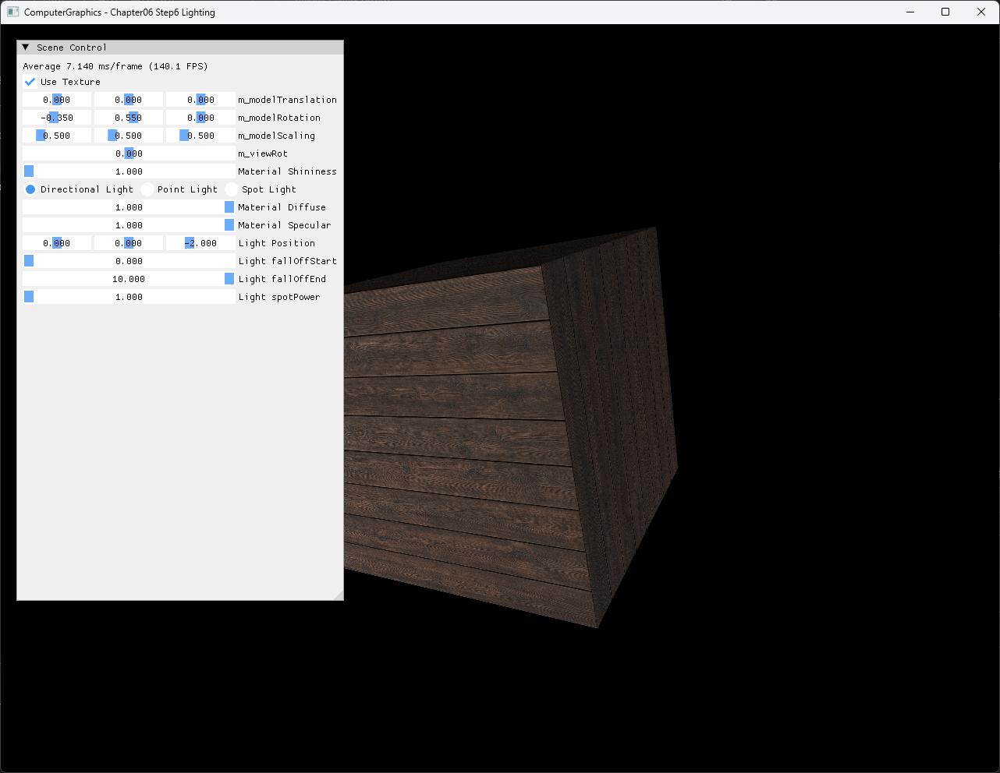
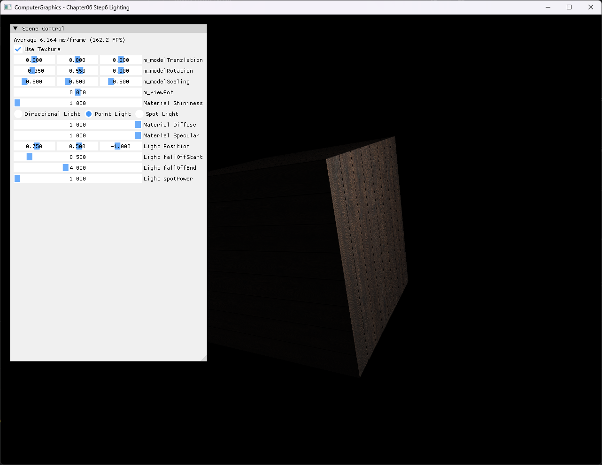
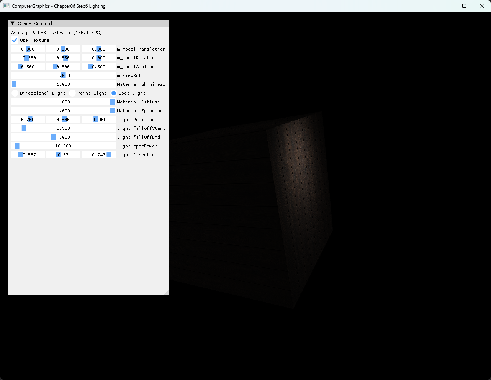

# Chapter06 Step6 Lighting

이 예제는 Step5A의 textured point-light shading을 Directional·Point·Spot Light 비교로 확장한다. 같은 box, texture, model·camera·material을 유지하고 Light type만 전환해 방향, 거리 감쇠와 cone factor가 GPU lighting 결과에 주는 차이를 확인한다.

## 실행 진입점

- Solution: `06_GraphicsPipeline_Step6_Lighting.sln`
- Application entry: `main.cpp`
- 주요 source: `AppBase.cpp`, `ExampleApp.cpp`, `ExampleApp.h`
- Shader: `BasicVertexShader.hlsl`, `BasicPixelShader.hlsl`, `Common.hlsli`
- Runtime input: `generated_dark_wood.png`
- Runtime working directory: project 폴더
- Application title: `ComputerGraphics - Chapter06 Step6 Lighting`

## Code Map

| 범위 | 책임 |
| --- | --- |
| [Box position·normal·UV](ExampleApp.cpp#L10-L114) | Face별 normal과 UV를 가진 indexed box 구성 |
| [Texture·buffer·shader 초기화](ExampleApp.cpp#L122-L192) | 검수한 목재 texture와 GPU resource를 만들고 실패를 호출자에게 전달 |
| [Transform·Light buffer 갱신](ExampleApp.cpp#L195-L250) | Model·normal·view·projection과 선택한 Light parameter를 constant buffer에 반영 |
| [Resource binding과 draw](ExampleApp.cpp#L253-L291) | Texture·sampler·constant buffer·shader를 연결하고 indexed box draw |
| [Light type과 parameter UI](ExampleApp.cpp#L294-L335) | Directional·Point·Spot 선택과 위치·감쇠·cone·방향 조정 |
| [Light 공통 계산](Common.hlsli#L24-L120) | Material·Light 계약, Blinn-Phong, 거리 감쇠와 세 Light type 계산 |
| [Light 누적과 texture 결합](BasicPixelShader.hlsl#L14-L36) | Ambient를 한 번 더하고 활성 Light 결과와 texture sample을 결합 |

## Step5A와의 차이

Step5A는 단일 point light의 위치 변화가 textured box에 주는 영향을 설명한다. Step6는 동일한 generated 목재 texture와 world-space normal 흐름을 유지하면서 세 Light type을 하나의 constant buffer 계약과 shader 경로에서 비교한다.

Directional Light는 위치와 거리 감쇠 없이 일정한 방향을 사용한다. Point Light는 fragment별 surface-to-light vector와 선형 거리 감쇠를 사용한다. Spot Light는 Point Light 계산에 Light 진행 방향과 `spotPower` 기반 cone factor를 추가한다. 일반 개념은 [Light Types](../../Docs/01_Topics/LightingAndShading/LightTypes.md), 구현 선택과 시각 비교는 [Step6 상세 Demo](../../Docs/03_Demos/Part2_Chapter05-08/06_Lighting.md)로 위임한다.

## 구현 요약

Box는 face마다 독립된 normal과 UV를 가진 24개 vertex로 구성한다. CPU는 Step5·Step5A에서 검수한 generated 목재 PNG의 동일 바이트 사본을 RGBA texture로 만들고 pixel shader의 `t0`과 sampler `s0`에 연결한다.

Vertex shader는 projected position, world position, inverse-transpose normal과 UV를 전달한다. Pixel shader는 ambient를 한 번만 적용한 뒤 활성화한 Directional·Point·Spot 함수의 diffuse·Blinn-Phong specular 결과를 더한다. Point와 Spot의 falloff range는 최소 `0.01`을 유지하며 shader도 0 거리와 0 denominator를 방어한다.

## Build And Run

| 항목 | 결과 | 비고 |
| --- | --- | --- |
| Debug x64 build/run | 성공 | 2026-08-02 현재 확인, project 폴더 CWD, 정상 종료 |
| Release x64 build/run | 성공 | 2026-08-02 현재 확인, project 폴더 CWD, 정상 종료 |
| Texture·Light 반영 | 성공 | Generated 목재 texture와 Directional·Point·Spot 전환 확인 |
| 실패 경로 | 성공 | 잘못된 CWD에서 texture load 실패를 보고하고 exit code `-1`로 종료 |
| Capture/Result | 확보 | Directional·Point·Spot 전체 창 screenshot, 사용자 승인 완료 |

## Capture/Result

Directional Light는 box의 같은 방향을 향하는 face에 위치와 무관한 넓은 조명을 만든다.

Point Light는 `position=(0.75, 0.5, -1)`, `fallOffStart=0.5`, `fallOffEnd=4.0`에서 가까운 오른쪽 face를 넓게 밝힌다.

Spot Light는 Point와 같은 위치·falloff를 유지하고 `direction=(-0.557, -0.371, 0.743)`, `spotPower=16`을 사용해 box 중심을 향하는 좁은 조명 영역을 만든다.

세 Light type은 이산 상태이며 같은 구도의 screenshot 3장으로 방향, 거리와 cone 차이를 설명할 수 있으므로 video는 제외한다.

## 구현 범위와 한계

- 한 번에 Light type 하나만 활성화한다.
- Directional·Point·Spot은 같은 diffuse·Blinn-Phong material 계산을 공유한다.
- Point·Spot은 학습용 선형 falloff를 사용하며 inverse-square attenuation을 구현하지 않는다.
- Spot은 inner·outer cone angle 대신 단일 `spotPower`를 사용한다.
- Texture color를 최종 lighting color 전체에 곱한다.
- Shadow, gamma correction, normal mapping과 physically based lighting은 포함하지 않는다.
- Runtime shader와 texture load는 project 폴더 CWD에 의존한다.
- Debug/Release x64만 현재 검증하며 Win32 configuration은 범위에서 제외한다.

## 관련 문서

- [Part2 Chapter05-08 README](../README.md)
- [이전 단계: Chapter06 Step5A Texturing LightingSelf](../06_GraphicsPipeline_Step5_Texturing_LightingSelf/README.md)
- [다음 단계: Chapter06 Step7 ResizingViewport](../06_GraphicsPipeline_Step7_ResizingViewport/README.md)
- [Light Types Topic](../../Docs/01_Topics/LightingAndShading/LightTypes.md)
- [Phong And Blinn-Phong Topic](../../Docs/01_Topics/LightingAndShading/PhongAndBlinnPhong.md)
- [Texture Sampling Topic](../../Docs/01_Topics/TexturingAndMapping/TextureSampling.md)
- [Step6 상세 Demo](../../Docs/03_Demos/Part2_Chapter05-08/06_Lighting.md)
- [Verification Index](../../Docs/02_Verification/Part2_Chapter05-08/verification-index.md)
- [Demo Index](../../Docs/03_Demos/Part2_Chapter05-08/demo-index.md)
