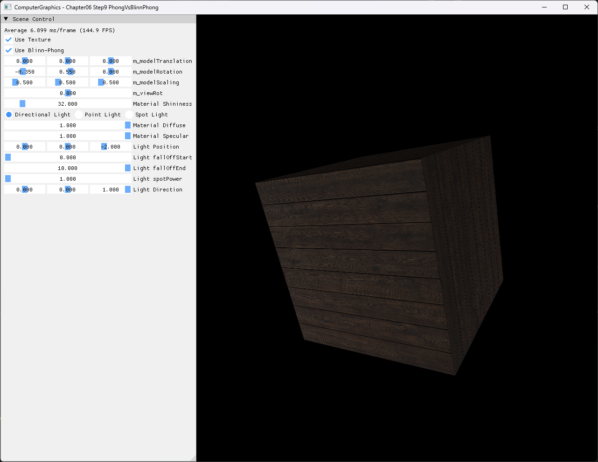

# Chapter06 Step9 PhongVsBlinnPhong

이 예제는 Step8의 resize-safe textured lighting scene을 유지하면서 specular reflection vector를 사용하는 Phong과 halfway vector를 사용하는 Blinn-Phong을 같은 scene·material·light 조건에서 전환해 비교한다.

## 실행 진입점

- Solution: `06_GraphicsPipeline_Step9_PhongVsBlinnPhong.sln`
- Application entry: `main.cpp`
- 주요 source: `AppBase.cpp`, `AppBase.h`, `ExampleApp.cpp`, `ExampleApp.h`
- Shader: `BasicVertexShader.hlsl`, `BasicPixelShader.hlsl`, `Common.hlsli`
- Runtime input: `generated_dark_wood.png`
- Runtime working directory: project 폴더
- Application title: `ComputerGraphics - Chapter06 Step9 PhongVsBlinnPhong`

## Code Map

| 범위 | 책임 |
| --- | --- |
| [비교 상태와 constant buffer](ExampleApp.h#L65-L74) | 32-bit flag로 CPU와 HLSL constant buffer layout 정렬 |
| [UI 선택과 GPU 전달](ExampleApp.cpp#L235-L240) | checkbox 상태를 매 frame 비교 flag로 변환 |
| [Phong·Blinn-Phong 분기](BasicPixelShader.hlsl#L16-L42) | 동일한 diffuse 입력 위에서 specular vector와 exponent만 선택 |
| [거리 감쇠와 light 평가](BasicPixelShader.hlsl#L44-L111) | Directional·Point·Spot 경로의 공통 comparison 함수 연결 |
| [Resize resource lifetime](AppBase.cpp#L485-L516) | Step8의 resize·minimize·restore 안정성 유지 |
| [단일 generated texture](ExampleApp.cpp#L122-L130) | 검수된 목재 texture 하나만 runtime input으로 사용 |

## Step8과의 차이

Step8은 window resize에 따른 resource lifetime과 viewport·projection 재연결을 완성한다. Step9은 그 기반을 유지하고 shading model 선택 flag와 두 specular 계산 경로를 추가한다.

두 경로는 같은 geometry, camera, texture, Directional Light, material diffuse·specular와 shininess UI 값을 사용한다. 비교 시 Blinn-Phong exponent는 highlight 폭을 실용적으로 맞추기 위해 UI shininess의 2배를 사용하며 Phong은 UI 값을 그대로 사용한다.

## 구현 요약

CPU는 ImGui checkbox를 별도 `bool`로 유지하고 GPU constant buffer에는 명시적인 32-bit flag를 기록한다. Pixel shader는 flag가 켜지면 `normalize(view + light)`의 halfway vector를, 꺼지면 `reflect(-light, normal)`의 reflection vector를 사용한다.

Halfway 합이 0에 가까운 경우에는 normalize를 생략해 NaN을 막는다. Ambient는 light 수와 무관하게 한 번만 더하고 Point·Spot 경로에는 0 거리와 falloff 분모 방어를 유지한다.

## Build And Run

| 항목 | 결과 | 비고 |
| --- | --- | --- |
| Debug x64 build/run | 성공 | 2026-08-02 현재 확인, project 폴더 CWD |
| Release x64 build/run | 성공 | 2026-08-02 현재 확인, project 폴더 CWD |
| Phong 전환 | 성공 | 동일 scene에서 checkbox 해제 후 reflection-vector 경로 확인 |
| Blinn-Phong 전환 | 성공 | 동일 scene에서 checkbox 선택 후 halfway-vector 경로 확인 |
| Resize·최소화·복원 | 성공 | Step8 자동 resize sequence 재검증 |
| Capture/Result | 확보 | shininess 32 비교 screenshot 2장 기술·시각 검수 완료 |

## Capture/Result

Example README에서는 기본 Blinn-Phong 상태 한 장만 대표 visual로 사용한다. 두 방식의 동일 조건 비교는 상세 Demo에서 나란히 확인한다.

## 구현 범위와 한계

- 고전적인 Phong과 Blinn-Phong specular 항만 비교한다.
- 물리 기반 BRDF, energy conservation, Fresnel과 gamma-correct lighting은 포함하지 않는다.
- 동일 UI shininess를 사용하지만 Blinn-Phong effective exponent는 2배이므로 수학적으로 같은 exponent 비교는 아니다.
- Runtime shader와 texture load는 project 폴더 CWD에 의존한다.
- Debug/Release x64만 현재 검증하며 Win32 configuration은 범위에서 제외한다.
- 정적 screenshot 두 장이 mode 차이를 설명하므로 video는 제외한다.

## 관련 문서

- [Part2 Chapter05-08 README](../README.md)
- [이전 단계: Chapter06 Step8 ResizingWindow](../06_GraphicsPipeline_Step8_ResizingWindow/README.md)
- 다음 단계: Chapter07 Step1 DrawingWireFrames 문서화 대기
- [Phong And Blinn-Phong Topic](../../Docs/01_Topics/LightingAndShading/PhongAndBlinnPhong.md)
- [Step9 상세 Demo](../../Docs/03_Demos/Part2_Chapter05-08/09_PhongVsBlinnPhong.md)
- [Verification Index](../../Docs/02_Verification/Part2_Chapter05-08/verification-index.md)
- [Demo Index](../../Docs/03_Demos/Part2_Chapter05-08/demo-index.md)
