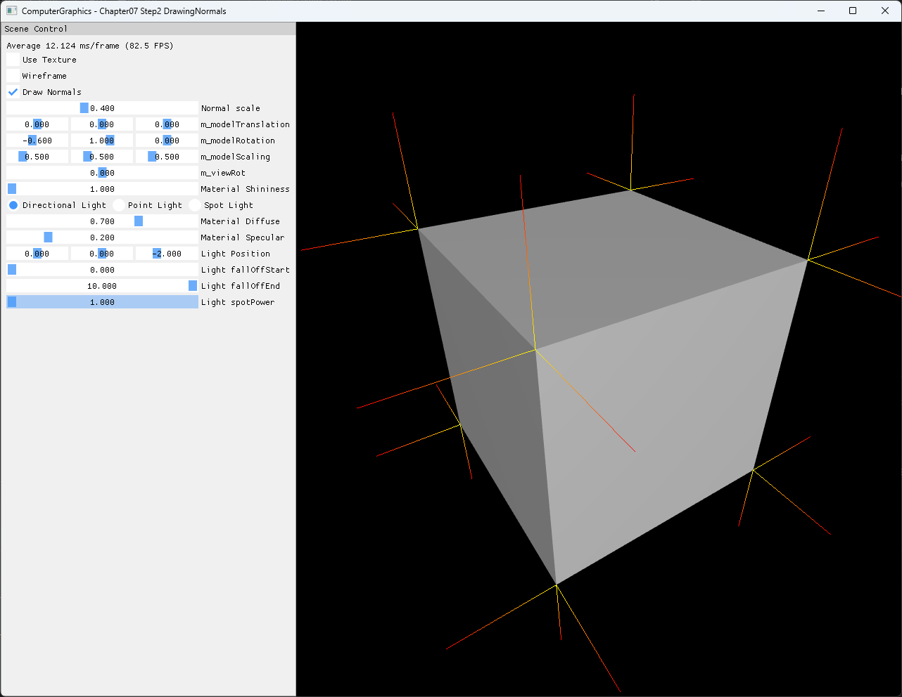

# Chapter07 Step2 DrawingNormals

Step1의 indexed box surface에 vertex normal 방향을 나타내는 별도 line geometry를 추가한다. Surface는 `TRIANGLELIST`, normal은 `LINELIST`로 그려 같은 mesh에서 topology와 draw 책임이 분리되는 과정을 확인한다.

## 실행 진입점

- Solution: `07_Modeling_Step2_DrawingNormals.sln`
- 주요 source: `GeometryGenerator.cpp`, `AppBase.cpp`, `ExampleApp.cpp`
- Shader: `BasicVertexShader.hlsl`, `BasicPixelShader.hlsl`, `NormalVertexShader.hlsl`, `NormalPixelShader.hlsl`
- Runtime input: `generated_dark_wood.png`
- Runtime working directory: project 폴더
- Application title: `ComputerGraphics - Chapter07 Step2 DrawingNormals`

## Code Map

| 파일 | 역할 |
| --- | --- |
| [ExampleApp.cpp](ExampleApp.cpp#L45-L57) | box surface vertex/index buffer 생성 |
| [ExampleApp.cpp](ExampleApp.cpp#L93-L143) | normal line vertex/index buffer와 shader 생성 |
| [NormalVertexShader.hlsl](NormalVertexShader.hlsl) | surface position에서 normal 방향 endpoint 계산 |
| [ExampleApp.cpp](ExampleApp.cpp#L271-L329) | surface와 normal의 topology 분리 draw |

## Capture/Result

비스듬한 box surface와 여러 면의 yellow-to-red normal line을 한 화면에 표시한다. `Draw Normals=On`, `Use Texture=Off`, `Wireframe=Off`를 기본 상태로 사용한다.

## Verification

| 항목 | 결과 | 비고 |
| --- | --- | --- |
| Debug x64 build/run | 성공 | 2026-08-02 현재 확인, Shader Model 5.0 |
| Release x64 build/run | 성공 | 2026-08-02 현재 확인, project 폴더 CWD |
| Resize | 성공 | wide·compact·minimize/restore 후 정상 frame과 clean exit |
| Capture/Result | 확보 | 전체 창 PNG 1282×992, 기술·시각 검수 완료 |
| Video | 제외 | 정적 screenshot 한 장으로 normal 방향과 분포 확인 가능 |

## Limitations

- Box는 face별 vertex를 분리하므로 모서리에서 normal이 공유되지 않는다.
- Normal line은 진단용 geometry이며 조명 계산 결과 자체를 나타내지 않는다.
- Normal의 시작점과 방향은 vertex normal을 사용하며 face normal 비교는 Step7 책임이다.
- Normal scale은 시각 판독을 위한 UI 값이며 mesh geometry를 변경하지 않는다.

## Related Docs

- [Vertex And Face Normals](../../Docs/01_Topics/ModelingAndGeometry/VertexAndFaceNormals.md)
- [Verification](../../Docs/02_Verification/Part2_Chapter05-08/verification-index.md)
- [상세 Demo](../../Docs/03_Demos/Part2_Chapter05-08/07_02_DrawingNormals.md)
- [이전 단계: Chapter07 Step1](../07_Modeling_Step1_DrawingWireFrames/README.md)
- 다음 단계: `07_Modeling_Step3_Grid`
