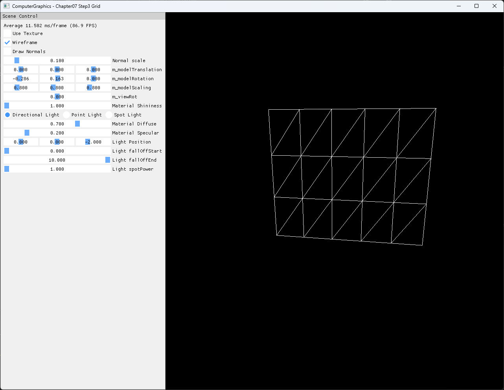

# Chapter07 Step3 Grid

가로·세로 분할 수를 기준으로 XY plane의 vertex, normal, UV와 triangle index를 절차적으로 생성한다. Step2의 고정 box geometry에서 벗어나 입력 파라미터로 mesh topology를 구성하고 같은 surface·normal draw 경로에 연결하는 과정을 확인한다.

## 실행 진입점

- Solution: `07_Modeling_Step3_Grid.sln`
- 주요 source: `GeometryGenerator.cpp`, `AppBase.cpp`, `ExampleApp.cpp`
- Shader: `BasicVertexShader.hlsl`, `BasicPixelShader.hlsl`, `NormalVertexShader.hlsl`, `NormalPixelShader.hlsl`
- Runtime input: `generated_dark_wood.png`
- Runtime working directory: project 폴더
- Application title: `ComputerGraphics - Chapter07 Step3 Grid`

## Code Map

| 파일 | 역할 |
| --- | --- |
| [GeometryGenerator.cpp](GeometryGenerator.cpp#L202-L249) | Grid 간격과 position·normal·UV vertex 생성 |
| [GeometryGenerator.cpp](GeometryGenerator.cpp#L254-L277) | Cell별 triangle index와 winding 구성 |
| [ExampleApp.cpp](ExampleApp.cpp#L48-L57) | 5×3 Grid 생성과 GPU buffer 연결 |
| [ExampleApp.cpp](ExampleApp.cpp#L241-L302) | Viewport, surface와 optional normal draw |

## Capture/Result

5×3 cells와 각 cell을 나누는 대각선을 wireframe으로 표시한다. `Wireframe=On`, `Use Texture=Off`, `Draw Normals=Off`를 기본 상태로 사용해 생성된 topology를 직접 읽는다.

## Verification

| 항목 | 결과 | 비고 |
| --- | --- | --- |
| Debug x64 build/run | 성공 | 2026-08-02 현재 확인, Shader Model 5.0 |
| Release x64 build/run | 성공 | 2026-08-02 현재 확인, project 폴더 CWD |
| Resize | 성공 | wide·compact·minimize/restore 후 정상 frame과 clean exit |
| Capture/Result | 확보 | 전체 창 PNG 1282×992, 기술·시각 검수 완료 |
| Video | 제외 | 정적 screenshot 한 장으로 cell 분할과 triangle topology 확인 가능 |

## Limitations

- Grid는 XY plane의 `z=1`에 생성하며 일반적인 XZ ground grid와 좌표 배치가 다르다.
- 분할 수는 실행 중 UI로 바꾸지 않고 `MakeGrid()` 호출 인자로 고정한다.
- Index는 `uint16_t`를 사용하므로 매우 큰 분할 수에는 별도 범위 검사가 필요하다.
- Step3는 평면 Grid만 다루며 곡면 primitive 생성은 Step4 이후 책임이다.

## Related Docs

- [Procedural Primitive Generation](../../Docs/01_Topics/ModelingAndGeometry/ProceduralPrimitiveGeneration.md)
- [Verification](../../Docs/02_Verification/Part2_Chapter05-08/verification-index.md)
- [상세 Demo](../../Docs/03_Demos/Part2_Chapter05-08/07_03_Grid.md)
- [이전 단계: Chapter07 Step2](../07_Modeling_Step2_DrawingNormals/README.md)
- 다음 단계: `07_Modeling_Step4_Cylinder`
