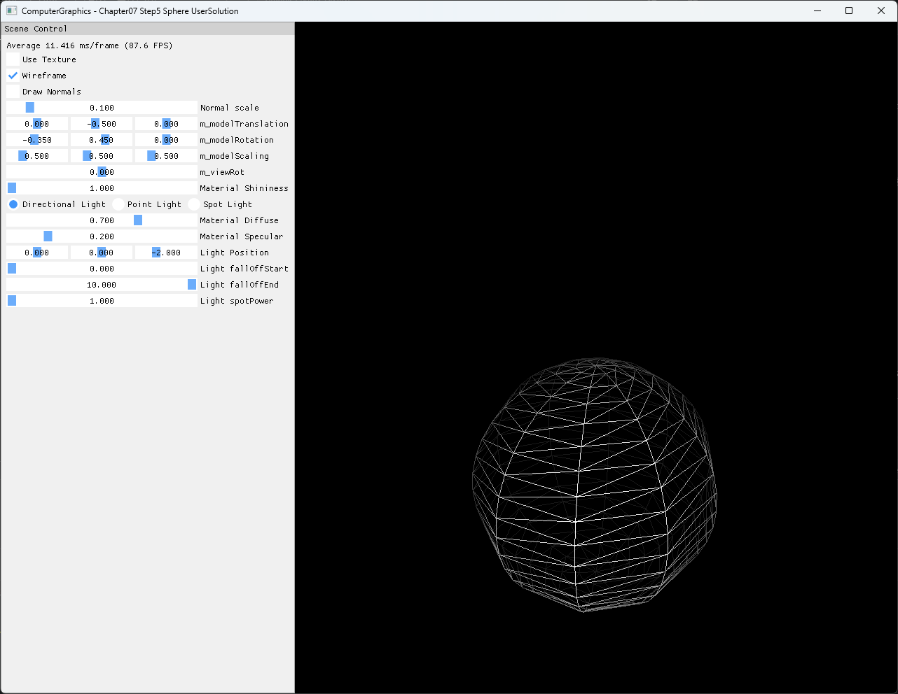

# Chapter07 Step5 Sphere UserSolution

위·아래 반구를 별도로 생성하고 equator에서 결합해 sphere mesh를 만드는 사용자 구현이다. 각 반구의 pole band를 triangle fan 형태로 마감해 일반 quad 분할에서 생길 수 있는 면적 0 pole triangle을 피한다.

## 실행 진입점

- Solution: `07_Modeling_Step5_Sphere.sln`
- 주요 source: `GeometryGenerator.cpp`, `AppBase.cpp`, `ExampleApp.cpp`
- Shader: `BasicVertexShader.hlsl`, `BasicPixelShader.hlsl`, `NormalVertexShader.hlsl`, `NormalPixelShader.hlsl`
- Runtime input: `generated_dark_wood.png`
- Runtime working directory: project 폴더
- Application title: `ComputerGraphics - Chapter07 Step5 Sphere UserSolution`

## Code Map

| 파일 | 역할 |
| --- | --- |
| [GeometryGenerator.cpp](GeometryGenerator.cpp#L262-L339) | 위쪽 반구의 ring·pole vertex와 UV 생성 |
| [GeometryGenerator.cpp](GeometryGenerator.cpp#L342-L371) | 위쪽 반구의 body·pole triangle 구성 |
| [GeometryGenerator.cpp](GeometryGenerator.cpp#L377-L468) | 아래쪽 반구 생성과 half offset 기반 index 구성 |
| [ExampleApp.cpp](ExampleApp.cpp#L42-L52) | Sphere 생성 결과와 GPU buffer 연결 |
| [ExampleApp.cpp](ExampleApp.cpp#L225-L281) | Surface와 optional normal draw |

## Capture/Result

`Wireframe=On`, `Use Texture=Off`, `Draw Normals=Off` 상태에서 두 반구의 latitude ring, longitude slice, equator 결합과 pole fan을 확인한다.

## Verification

| 항목 | 결과 | 비고 |
| --- | --- | --- |
| Debug x64 build/run | 성공 | 2026-08-02 현재 확인, Shader Model 5.0 |
| Release x64 build/run | 성공 | 2026-08-02 현재 확인, project 폴더 CWD |
| Resize | 성공 | wide·compact·minimize/restore와 기본 크기 복원 |
| Capture/Result | 확보 | 전체 창 PNG 1282×992, 기술·시각 검수 완료 |
| Video | 제외 | 정적 wireframe 한 장으로 반구·equator·pole topology 판독 가능 |

## 구현 범위와 한계

- 현재 호출은 radius 1.0, hemisphere당 10 stacks와 10 slices를 사용한다.
- 위·아래 반구는 equator ring을 각각 보유하므로 같은 위치의 vertex가 중복된다.
- Pole 위치 vertex도 slice별로 중복하지만 pole band는 한 triangle씩 연결해 degenerate triangle을 만들지 않는다.
- 아래쪽 반구의 U 좌표는 `1.5`에서 `0.5` 범위를 사용하고 wrap sampler에 의존한다.
- 380개 triangle의 winding을 radial direction과 수치 비교한 결과 모두 outward이며 inward·degenerate triangle은 없다. 현재 rasterizer는 culling을 사용하지 않는다.
- 0 이하의 분할 수와 `uint16_t` 범위를 넘는 큰 입력에 대한 guard는 범위 밖이다.

## Related Docs

- [Procedural Primitive Generation](../../Docs/01_Topics/ModelingAndGeometry/ProceduralPrimitiveGeneration.md)
- [Vertex And Face Normals](../../Docs/01_Topics/ModelingAndGeometry/VertexAndFaceNormals.md)
- [Verification](../../Docs/02_Verification/Part2_Chapter05-08/verification-index.md)
- [상세 Demo](../../Docs/03_Demos/Part2_Chapter05-08/07_05_Sphere.md)
- [이전 단계: Chapter07 Step4](../07_Modeling_Step4_Cylinder/README.md)
- [다음 단계: Chapter07 Step6 Subdivision](../07_Modeling_Step6_Subdivision/README.md)
