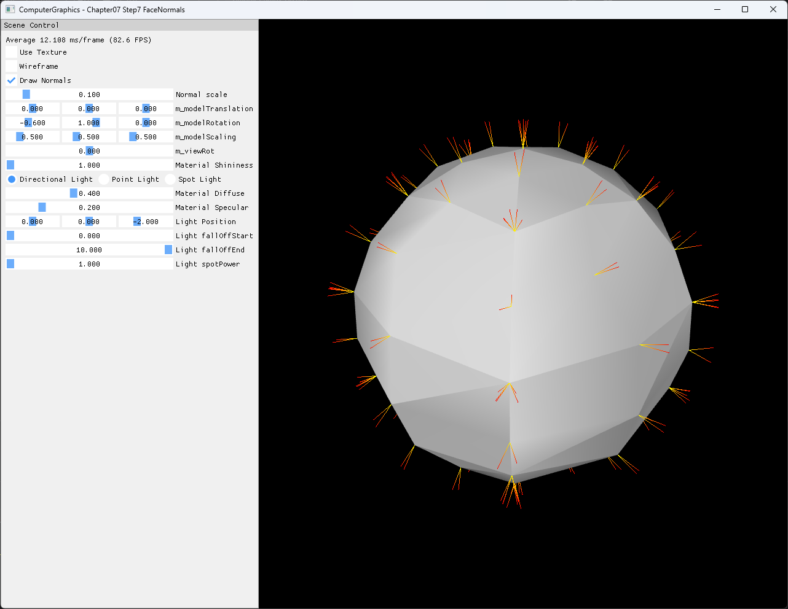

# Chapter07 Step7 FaceNormals

Triangle-soup mesh의 winding으로 face normal을 계산하고, 각 triangle corner에서 같은 face normal 방향의 diagnostic line을 그리는 예제다. Step6의 세분화 개념을 사용하지만 subdivision은 한 번만 적용해 normal 분포를 읽을 수 있는 200-triangle surface로 유지한다.

## 실행 진입점

- Solution: `07_Modeling_Step7_FaceNormals.sln`
- 주요 source: `GeometryGenerator.cpp`, `AppBase.cpp`, `ExampleApp.cpp`
- Shader: `BasicVertexShader.hlsl`, `BasicPixelShader.hlsl`, `NormalVertexShader.hlsl`, `NormalPixelShader.hlsl`
- Runtime input: `generated_dark_wood.png`
- Runtime working directory: project 폴더
- Application title: `ComputerGraphics - Chapter07 Step7 FaceNormals`

## Code Map

| 파일 | 역할 |
| --- | --- |
| [GeometryGenerator.cpp](GeometryGenerator.cpp#L415-L490) | 1회 subdivision과 triangle별 face normal 할당 |
| [ExampleApp.cpp](ExampleApp.cpp#L37-L104) | 200-triangle surface와 corner 기반 normal line buffer 생성 |
| [ExampleApp.cpp](ExampleApp.cpp#L219-L267) | Surface `TRIANGLELIST`와 normal `LINELIST` draw 분리 |
| [NormalVertexShader.hlsl](NormalVertexShader.hlsl#L22-L43) | Inverse-transpose normal transform과 line endpoint 이동 |
| [AppBase.cpp](AppBase.cpp#L531-L556) | Resize dependent resource 재생성 |

## Capture/Result

`Draw Normals=On`, `Use Texture=Off`, `Wireframe=Off`, `Normal scale=0.1` 상태에서 solid surface와 yellow-to-red normal line을 함께 확인한다.

## Verification

| 항목 | 결과 | 비고 |
| --- | --- | --- |
| Debug x64 build/run | 성공 | 2026-08-02 현재 확인, Shader Model 5.0 |
| Release x64 build/run | 성공 | 2026-08-02 현재 확인, project 폴더 CWD |
| Winding | 성공 | Step7 non-degenerate 160개 outward, inward 0개 |
| Resize | 성공 | Wide·compact resize, minimize/restore와 기본 크기 복원 |
| Capture/Result | 확보 | 전체 창 PNG 1282×992, 기술·시각 검수 완료 |
| Video | 제외 | 정지 이미지에서 face normal 방향과 UI 상태 판독 가능 |

## 구현 범위와 한계

- Step7은 Step6의 2-pass mesh를 직접 이어받지 않고 같은 50-triangle seed에 subdivision을 한 번 적용한다.
- 결과는 600 triangle-local vertices와 200 triangles이며 child triangle마다 세 vertex가 같은 face normal을 가진다.
- Diagnostic geometry는 face center당 line 하나가 아니라 각 triangle corner에서 같은 방향의 line 세 개를 만든다.
- Winding과 `(v1-v0) × (v2-v0)`을 수치 검사한 결과 면적이 있는 160개 triangle은 모두 outward다.
- Pole band의 40개 degenerate triangles는 zero-length cross product를 가지며 화면에서는 길이 0 line으로 남는다. 비정상적으로 긴 line이나 NaN 투영은 관찰되지 않았다.
- Degenerate triangle 제거, shared vertex normal과 face-center line 표현은 범위 밖이다.
- 다음 Step8은 radial vertex normal을 복원하고 spherical UV mapping을 다룬다.

## Related Docs

- [Vertex And Face Normals](../../Docs/01_Topics/ModelingAndGeometry/VertexAndFaceNormals.md)
- [Procedural Primitive Generation](../../Docs/01_Topics/ModelingAndGeometry/ProceduralPrimitiveGeneration.md)
- [Verification](../../Docs/02_Verification/Part2_Chapter05-08/verification-index.md)
- [상세 Demo](../../Docs/03_Demos/Part2_Chapter05-08/07_07_FaceNormals.md)
- [이전 단계: Chapter07 Step6 Subdivision](../07_Modeling_Step6_Subdivision/README.md)
- [다음 단계: Chapter07 Step8 SphereMapping UserSolution](../07_Modeling_Step8_SphereMapping_UserSolution/README.md)
