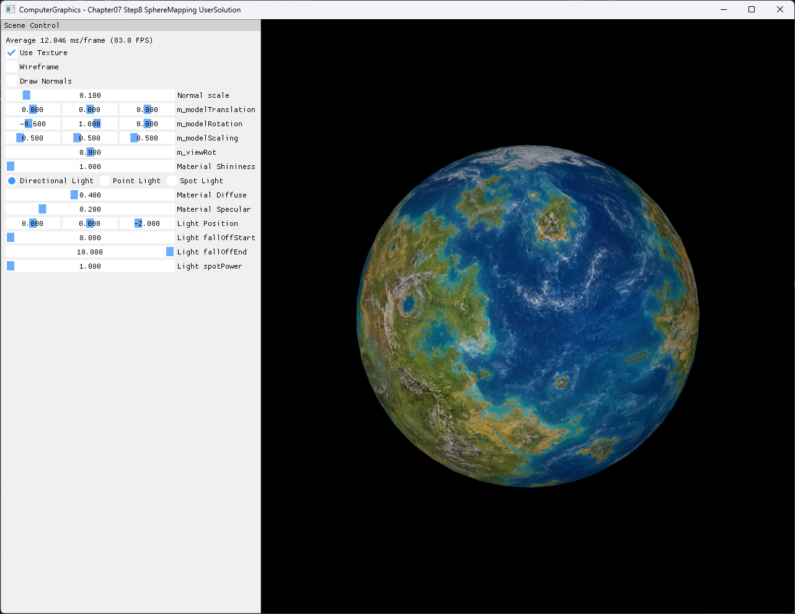

# Chapter07 Step8 SphereMapping UserSolution

Icosahedron seed를 반복 세분화해 sphere surface로 투영하고, 위치에서 spherical UV를 계산해 2D texture를 구면에 연결하는 사용자 구현 예제다. Triangle-local vertex 복제로 seam을 보정하며 Step7의 face normal에서 radial smooth normal로 전환한다.

## 실행 진입점

- Solution: `07_Modeling_Step8_SphereMapping.sln`
- 주요 source: `GeometryGenerator.cpp`, `AppBase.cpp`, `ExampleApp.cpp`
- Shader: `BasicVertexShader.hlsl`, `BasicPixelShader.hlsl`, `NormalVertexShader.hlsl`, `NormalPixelShader.hlsl`
- Runtime input: `generated_fictional_planet_equirectangular.png`
- Runtime working directory: project 폴더
- Application title: `ComputerGraphics - Chapter07 Step8 SphereMapping UserSolution`

## Code Map

| 파일 | 역할 |
| --- | --- |
| [GeometryGenerator.cpp](GeometryGenerator.cpp#L333-L366) | 12 vertex·20 triangle icosahedron seed 생성 |
| [GeometryGenerator.cpp](GeometryGenerator.cpp#L416-L445) | Sphere projection, radial normal과 spherical UV 계산 |
| [GeometryGenerator.cpp](GeometryGenerator.cpp#L448-L530) | Triangle-local U seam 보정과 vertex 복제 |
| [GeometryGenerator.cpp](GeometryGenerator.cpp#L532-L572) | Triangle 4분할과 sphere surface 재투영 |
| [ExampleApp.cpp](ExampleApp.cpp#L20-L54) | Generated texture load와 3회 subdivision |
| [ExampleApp.cpp](ExampleApp.cpp#L237-L287) | Textured surface와 선택 normal line draw 분리 |
| [AppBase.cpp](AppBase.cpp#L530-L555) | Resize dependent resource 재생성 |

## Capture/Result

`Use Texture=On`, `Draw Normals=Off`, `Wireframe=Off` 상태에서 비대칭 대륙·해양과 극지 패턴이 sphere surface에 연결되는지 확인한다.

## Verification

| 항목 | 결과 | 비고 |
| --- | --- | --- |
| Debug x64 build/run | 성공 | 2026-08-03 현재 확인, Shader Model 5.0 |
| Release x64 build/run | 성공 | 2026-08-03 현재 확인, project 폴더 CWD |
| Geometry | 성공 | 20→80→320→1,280 triangles, 최종 3,840 triangle-local vertices |
| UV seam | 성공 | U span이 0.5를 넘는 triangle에서 outlier vertex를 U=0 또는 1로 복제 |
| Capture/Result | 확보 | 1282×992 전체 창 PNG 기술·시각 검수 완료 |
| Video | 제외 예정 | 1~2개 정지 이미지에서 seam·pole·landmark를 판독할 수 있는지 최종 확인 |

## 구현 범위와 한계

- Step8은 Step7의 latitude·longitude sphere를 이어받지 않고 icosahedron seed에서 시작하는 별도 사용자 구현이다.
- 세 번의 subdivision으로 triangle 수를 20에서 1,280으로 늘리며 각 단계에서 midpoint를 radius 1.5 sphere surface로 투영한다.
- Normal은 각 projected position의 정규화 방향을 사용하므로 triangle-local face normal이 아니라 radial smooth normal이다.
- U는 `atan2(z, x)`, V는 `acos(y / radius)`로 계산한다.
- Seam triangle은 공유 vertex를 유지하지 않고 outlier vertex를 복제해 U를 0 또는 1로 옮긴다.
- Pole 전용 U 평균 보정은 구현하지 않는다. Pole에서 복제된 vertex와 wrap sampling 결과는 진단 texture와 capture로 확인한다.
- Triangle-soup 중복 제거, tangent space, mipmap 생성과 anisotropic filtering은 범위 밖이다.
- `ReferenceSolution`은 비공개 비교 근거로만 유지하며 이 문서의 구현 정본으로 사용하지 않는다.
- 다음 Step9은 file 기반 model loading을 다룬다.

## Related Docs

- [Spherical Texture Mapping](../../Docs/01_Topics/TexturingAndMapping/SphericalTextureMapping.md)
- [Texture Sampling](../../Docs/01_Topics/TexturingAndMapping/TextureSampling.md)
- [Procedural Primitive Generation](../../Docs/01_Topics/ModelingAndGeometry/ProceduralPrimitiveGeneration.md)
- [Verification](../../Docs/02_Verification/Part2_Chapter05-08/verification-index.md)
- [상세 Demo](../../Docs/03_Demos/Part2_Chapter05-08/07_08_SphereMappingUserSolution.md)
- [이전 단계: Chapter07 Step7 FaceNormals](../07_Modeling_Step7_FaceNormals/README.md)
- [다음 단계: Chapter07 Step9 ModelFiles](../07_Modeling_Step9_ModelFiles/README.md)
