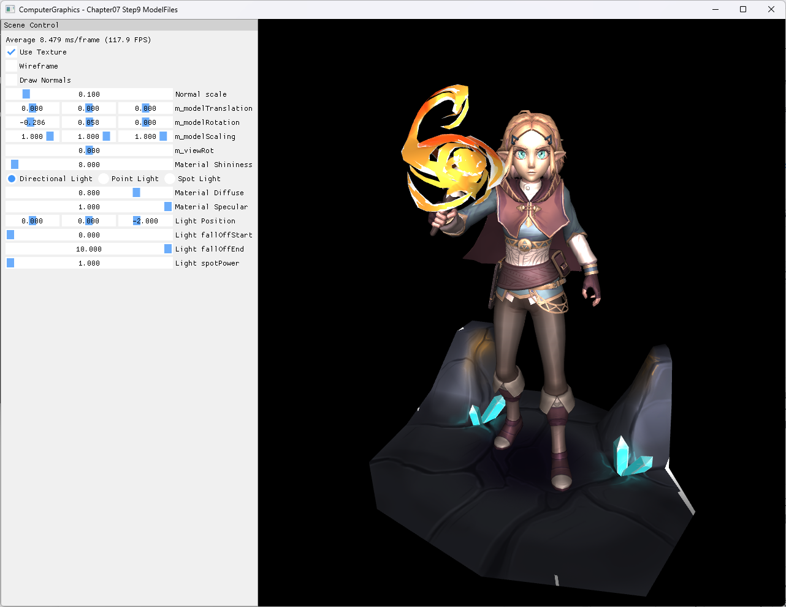

# Chapter07 Step9 ModelFiles

## 목적

Assimp로 FBX scene을 읽고 node 계층의 transform을 누적해 여러 submesh를 DirectX11 vertex/index buffer와 texture resource로 변환한다.

## 구현 요약

- `ModelLoader`가 Assimp scene과 root node를 검증한 뒤 node tree를 재귀 순회한다.
- 각 node transform을 부모 transform과 합성하고 mesh vertex에 적용한다.
- 각 submesh는 독립 vertex/index buffer와 diffuse texture SRV를 유지한다.
- surface는 `TRIANGLELIST`, 선택적인 normal 진단선은 `LINELIST`로 그린다.
- model load 실패나 빈 mesh 결과는 GPU resource 생성 전에 중단한다.

일반적인 scene graph와 model import 개념은 [Model File Import](../../Docs/01_Topics/ModelingAndGeometry/ModelFileImport.md)로 위임한다.

## Build And Run

| 항목 | 결과 | 비고 |
| --- | --- | --- |
| Debug x64 build/run | 성공 | project 폴더 CWD |
| Release x64 build/run | 성공 | project 폴더 CWD |
| Resize | 성공 | minimize/restore와 backbuffer 재생성 경로 확인 |
| Capture | 확보 | textured Zelda model과 UI 상태 확인 |

## Capture/Result

## 핵심 코드

- [FBX 입력과 submesh resource 구성](ExampleApp.cpp#L47-L87)
- [Assimp scene 검증과 node 순회](ModelLoader.cpp#L69-L182)
- [Vertex, index와 material texture 변환](ModelLoader.cpp#L187-L256)
- [Submesh별 texture binding과 draw](ExampleApp.cpp#L282-L300)
- [Resize dependent resource 재생성](AppBase.cpp#L572-L610)

## 범위와 한계

- 현재 예제는 F3D gallery에서 받은 Zelda FBX bundle을 실행 입력으로 사용한다.
- Bundle의 공개 재배포 권리 근거가 충분하지 않아 Publication은 `검토 필요`로 둔다.
- Animation, skeletal skinning, PBR material과 scene 단위 최적화는 범위 밖이다.
- Video는 정적 model import 결과에 새로운 구현 정보를 추가하지 않아 제외한다.

## 관련 문서

- [상세 Demo](../../Docs/03_Demos/Part2_Chapter05-08/07_09_ModelFiles.md)
- [Model File Import](../../Docs/01_Topics/ModelingAndGeometry/ModelFileImport.md)
- [Verification](../../Docs/02_Verification/Part2_Chapter05-08/verification-index.md)
- [이전 단계: Step8 SphereMapping](../07_Modeling_Step8_SphereMapping/README.md)
- [다음 단계: Chapter08 Step1 RimLighting](../08_ShaderToys_Step1_RimLighting/README.md)
