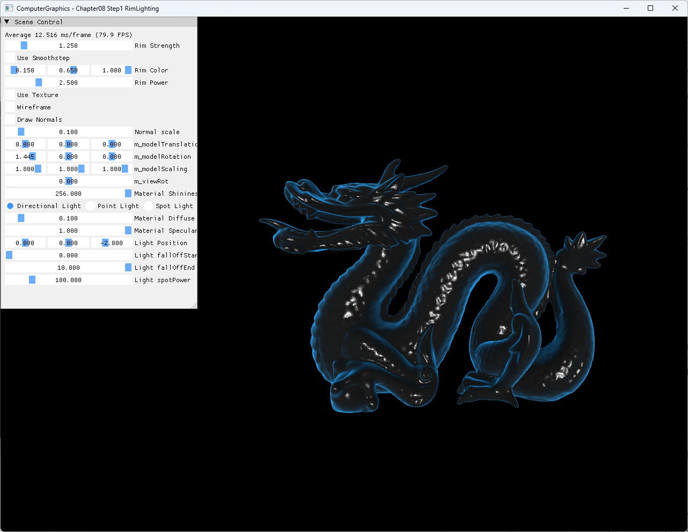

# Chapter08 Step1 RimLighting

## 목적

Surface normal과 eye direction의 각도 차이를 사용해 silhouette 주변에 rim color를 더한다.

## 구현 요약

- Stanford Dragon mesh를 불러와 world normal과 eye direction을 pixel shader에 전달한다.
- `1 - saturate(dot(N, V))`로 edge에 가까울수록 커지는 rim base를 만든다.
- Power 방식과 smoothstep 방식을 UI에서 전환하고 color·power·strength를 조절한다.
- Rim은 기본 lighting 결과에 가산하며 texture 사용 여부와 독립적으로 계산한다.
- 기본값은 파란 rim이 명확히 보이는 결정적 상태로 둔다.

일반적인 rim 효과는 [Rim Lighting](../../Docs/01_Topics/LightingAndShading/RimLighting.md)으로 위임한다.

## Build And Run

| 항목 | 결과 | 비고 |
| --- | --- | --- |
| Debug x64 build/run | 성공 | Clean/Rebuild와 Assimp runtime DLL copy 확인 |
| Release x64 build/run | 성공 | project 폴더 CWD |
| Resize | 성공 | minimize/restore와 backbuffer 재생성 경로 확인 |
| Capture | 확보 | Dragon silhouette과 파란 rim 확인 |

## Capture/Result

## 핵심 코드

- [Dragon model 입력과 mesh resource 구성](ExampleApp.cpp#L28-L75)
- [Rim base와 shaping 방식](BasicPixelShader.hlsl#L59-L68)
- [Rim parameter UI](ExampleApp.cpp#L289-L299)
- [Resize dependent resource 재생성](AppBase.cpp#L525-L552)

## 범위와 한계

- Rim은 물리 기반 Fresnel 반사가 아니라 silhouette 강조를 위한 stylized lighting이다.
- Stanford Dragon asset의 공개 재배포 권리 근거가 충분하지 않아 Publication은 `검토 필요`로 둔다.
- Video는 정적 silhouette과 UI 상태가 한 frame에서 명확해 제외한다.

## 관련 문서

- [상세 Demo](../../Docs/03_Demos/Part2_Chapter05-08/08_01_RimLighting.md)
- [Rim Lighting](../../Docs/01_Topics/LightingAndShading/RimLighting.md)
- [Verification](../../Docs/02_Verification/Part2_Chapter05-08/verification-index.md)
- [이전 단계: Chapter07 Step9 ModelFiles](../07_Modeling_Step9_ModelFiles/README.md)
- 다음 단계: Chapter08 Step2 Cubemapping
