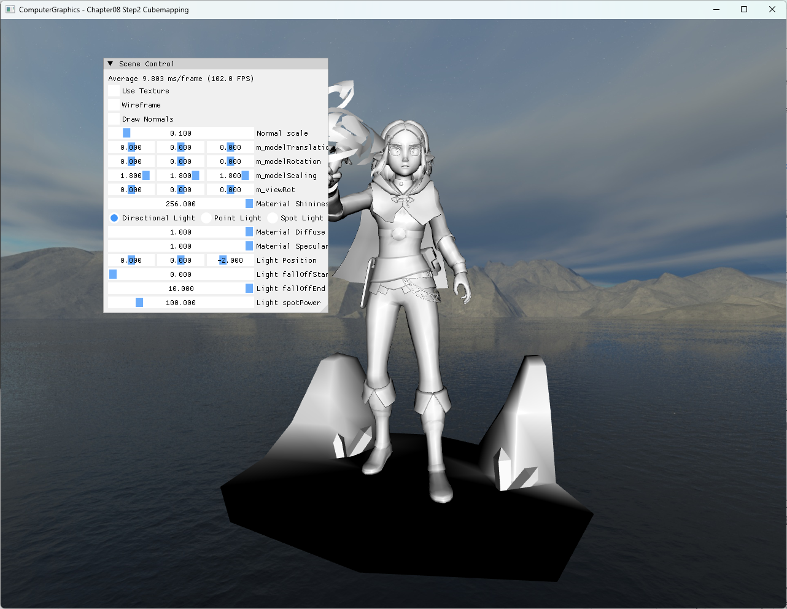

# Chapter08 Step2 Cubemapping

## 목적

6면을 하나의 `TextureCube`로 묶고 camera 주변의 skybox를 방향 벡터로 sampling한다.

## 구현 요약

- DirectXTK로 DDS cubemap을 읽고 texture-cube SRV를 생성한다.
- Box index 순서를 뒤집어 camera가 내부 면을 보도록 구성한다.
- Skybox view에서는 camera translation을 제거하고 rotation만 유지한다.
- Pixel shader는 cube의 world 방향으로 `TextureCube.Sample`을 호출한다.
- Zelda mesh는 동일 scene의 전경 물체로 그려 skybox와 일반 mesh 경로를 구분한다.

일반적인 cubemap 개념은 [Cubemap And Environment Mapping](../../Docs/01_Topics/TexturingAndMapping/CubemapAndEnvironmentMapping.md)으로 위임한다.

## Build And Run

| 항목 | 결과 | 비고 |
| --- | --- | --- |
| Debug x64 build/run | 성공 | Clean/Rebuild와 Assimp·DirectXTK runtime DLL 확인 |
| Release x64 build/run | 성공 | project 폴더 CWD |
| Resize | 성공 | minimize/restore와 backbuffer 재생성 확인 |
| Capture | 확보 | skybox와 Zelda 전경 mesh 확인 |

## Capture/Result

## 핵심 코드

- [DDS cubemap load와 내부 면 cube 구성](ExampleApp.cpp#L29-L70)
- [Translation을 제거한 skybox view](ExampleApp.cpp#L336-L342)
- [Cubemap binding과 skybox draw](ExampleApp.cpp#L374-L393)
- [방향 벡터 기반 TextureCube sampling](CubeMappingPixelShader.hlsl#L3-L9)

## 범위와 한계

- Zelda FBX bundle과 skybox DDS의 공개 재배포 권리 근거가 충분하지 않아 Publication은 `검토 필요`로 둔다.
- Cubemap 반사·굴절은 다음 EnvironmentMapping 단계에서 다룬다.
- 정적 screenshot으로 cube 방향 sampling과 scene 구성이 명확해 video는 제외한다.

## 관련 문서

- [상세 Demo](../../Docs/03_Demos/Part2_Chapter05-08/08_02_Cubemapping.md)
- [Cubemap And Environment Mapping](../../Docs/01_Topics/TexturingAndMapping/CubemapAndEnvironmentMapping.md)
- [Verification](../../Docs/02_Verification/Part2_Chapter05-08/verification-index.md)
- [이전 단계: Chapter08 Step1 RimLighting](../08_ShaderToys_Step1_RimLighting/README.md)
- 다음 단계: Chapter08 Step3 EnvironmentMapping
