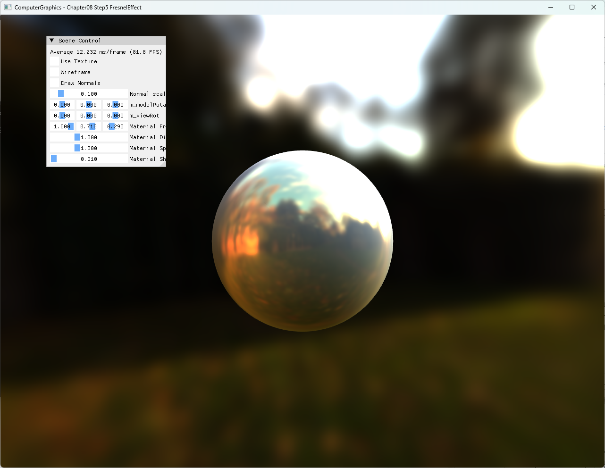

# Chapter08 Step5 FresnelEffect

## 예제 목적

Step4의 diffuse/specular image based lighting에 Schlick Fresnel factor를 추가해 view angle에 따라 environment reflection 비율이 달라지는 결과를 확인한다.

## 구현 요약

- Stonewall diffuse/specular cubemap을 environment lighting 입력으로 사용한다.
- `N·V`로부터 Schlick Fresnel factor를 계산한다.
- Specular environment sample에 Fresnel factor를 곱한다.
- `Material FresnelR0` UI로 material별 기본 반사율을 조절한다.
- CPU가 scene과 constant buffer를 구성하고 HLSL이 IBL과 Fresnel shading을 수행한다.

## 핵심 코드

- [Schlick Fresnel factor 계산](BasicPixelShader.hlsl#L28-L42)
- [Diffuse·specular cubemap과 Fresnel 결합](BasicPixelShader.hlsl#L77-L88)
- [Stonewall cubemap 초기화](ExampleApp.cpp#L18-L42)
- [FresnelR0 UI 조절](ExampleApp.cpp#L407-L409)

## Build And Run

| 항목 | 결과 | 비고 |
| --- | --- | --- |
| Debug x64 build/run | 성공 | Clean/Rebuild, project 폴더 CWD |
| Release x64 build/run | 성공 | Clean/Rebuild, project 폴더 CWD |
| Resize·minimize/restore | 성공 | viewport·depth resource 정상 |
| Capture | 확보 | 1282×992 전체 창 screenshot |

## Capture/Result

Stonewall environment가 sphere에 반사되고 `fresnelR0`가 angle-dependent specular contribution의 기준값으로 사용된다.

## 구현 범위와 한계

- Schlick approximation을 사용한다.
- Roughness 기반 prefiltered mip LOD와 split-sum BRDF는 구현하지 않는다.
- Active Stonewall cubemap과 `ojwD8.jpg`의 공개 권리 근거는 별도 Publication 검토 대상으로 둔다.
- Assimp runtime 오류창은 사용자가 수동으로 닫은 뒤 Clean/Rebuild와 정상 실행을 재확인했다.

## 관련 문서

- [상세 Demo](../../Docs/03_Demos/Part2_Chapter05-08/08_05_FresnelEffect.md)
- [Fresnel Reflectance](../../Docs/01_Topics/LightingAndShading/FresnelReflectance.md)
- [Image Based Lighting](../../Docs/01_Topics/LightingAndShading/ImageBasedLighting.md)
- [Verification](../../Docs/02_Verification/Part2_Chapter05-08/verification-index.md)
- [이전 단계: Chapter08 Step4 ImageBasedLighting](../08_ShaderToys_Step4_ImageBasedLighting/README.md)
- [다음 단계: Chapter08 Step6 BloomEffect](../08_ShaderToys_Step6_BloomEffect/README.md)
