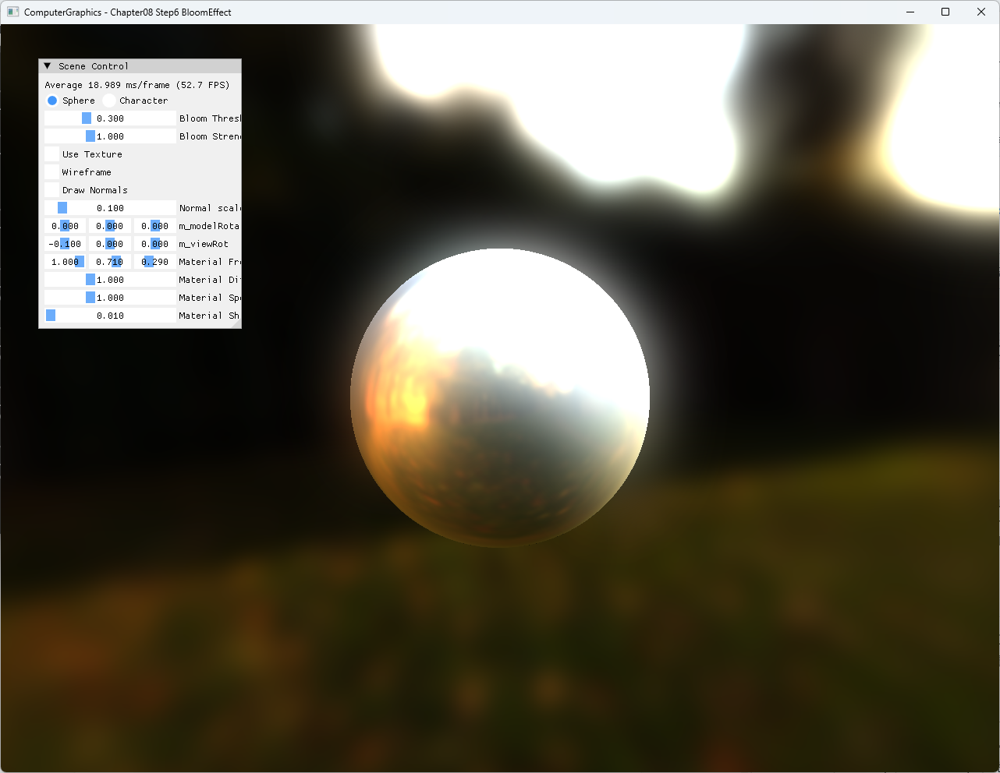

# Chapter08 Step6 BloomEffect

## 예제 목적

Step5의 environment-lit scene을 GPU post-processing texture chain으로 전달하고 bright-pass, 반복 downsample·blur, 원본 합성을 수행해 bloom 결과를 만든다.

## 구현 요약

- Back buffer 결과를 shader-readable texture로 복사한다.
- Threshold pass가 밝은 영역만 분리한다.
- 해상도를 단계적으로 줄이며 horizontal·vertical blur를 적용한다.
- Blur 결과에 strength를 곱해 원본과 합성한다.
- Window resize 후 swap-chain과 post-process filter chain을 함께 재생성한다.

## 핵심 코드

- [Back buffer 복사와 filter chain 실행](ExampleApp.cpp#L153-L160)
- [Threshold·downsample·blur filter 구성](ExampleApp.cpp#L168-L241)
- [Bloom과 원본 합성](ExampleApp.cpp#L255-L258)
- [Resize 후 filter chain 재생성](ExampleApp.cpp#L262-L265)
- [Bloom parameter UI](ExampleApp.cpp#L283-L284)

## Build And Run

| 항목 | 결과 | 비고 |
| --- | --- | --- |
| Debug x64 build/run | 성공 | Clean/Rebuild, project 폴더 CWD |
| Release x64 build/run | 성공 | Clean/Rebuild, project 폴더 CWD |
| Resize·minimize/restore | 성공 | post-process resources 재생성 |
| Capture | 확보 | 1282×992 전체 창 screenshot |

## Capture/Result

밝은 Stonewall environment와 sphere highlight가 threshold·blur chain을 거쳐 주변으로 퍼진다.

## 구현 범위와 한계

- 고정 최대 5단계 sampling chain을 사용하고 작은 window에서는 유효 크기로 제한한다.
- Blur kernel은 분리형 5-tap 방식이다.
- HDR tone mapping이나 exposure 제어는 포함하지 않는다.
- Stonewall cubemap, `ojwD8.jpg`와 Zelda bundle의 공개 권리 근거는 별도 Publication 검토 대상으로 둔다.

## 관련 문서

- [상세 Demo](../../Docs/03_Demos/Part2_Chapter05-08/08_06_BloomEffect.md)
- [Post Processing And Bloom](../../Docs/01_Topics/DirectX11Pipeline/PostProcessingAndBloom.md)
- [Verification](../../Docs/02_Verification/Part2_Chapter05-08/verification-index.md)
- [이전 단계: Chapter08 Step5 FresnelEffect](../08_ShaderToys_Step5_FresnelEffect/README.md)
- 다음 단계: Chapter08 Step7 Shadertoy
