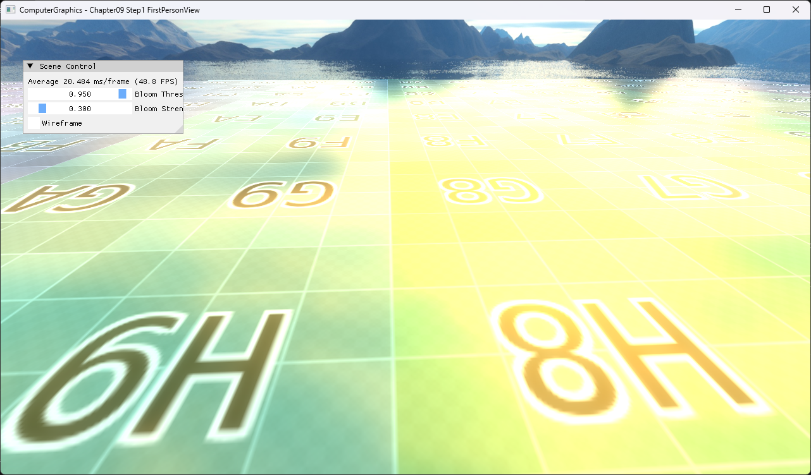

# Chapter09 Step1 FirstPersonView

절대 cursor 위치와 WASD 입력을 camera orientation과 translation에 반영한다. Chapter09 상호작용 흐름의 camera 기준선을 만든다.

## 실행 진입점

- Solution: `09_UserInteraction_Step1_FirstPersonView.sln`
- 주요 source: `AppBase.cpp`, `Camera.cpp`, `ExampleApp.cpp`
- Runtime working directory: project 폴더
- Application title: `ComputerGraphics - Chapter09 Step1 FirstPersonView`

## Code Map

| 파일 | 역할 |
| --- | --- |
| [AppBase.cpp](AppBase.cpp#L136-L155) | cursor 좌표를 NDC로 변환하고 camera에 전달 |
| [Camera.cpp](Camera.cpp#L26-L55) | cursor NDC에서 yaw·pitch와 view basis 갱신 |
| [ExampleApp.cpp](ExampleApp.cpp#L52-L67) | WASD 상태와 frame delta 기반 camera 이동 |

## Capture/Result

## Verification

| 항목 | 결과 | 비고 |
| --- | --- | --- |
| Debug x64 build/run | 성공 | 2026-08-03 현재 확인 |
| Release x64 build/run | 성공 | project 폴더 CWD |
| Capture/Result | 완료 | 전체 창 1282×752 PNG |

## Limitations

- 상대 mouse delta가 아니라 cursor의 절대 NDC 위치가 orientation을 결정한다.
- Pointer lock과 raw input은 구현하지 않는다.
- Scene texture와 cubemap은 공개 권리 근거 확인이 필요하다.

## Related Docs

- [Camera Interaction](../../Docs/01_Topics/AnimationAndPhysics/CameraInteraction.md)
- [Verification](../../Docs/02_Verification/Part3_Chapter09/verification-index.md)
- [상세 Demo](../../Docs/03_Demos/Part3_Chapter09/09_01_FirstPersonView.md)
- [다음 단계](../09_UserInteraction_Step2_MousePicking/README.md)
