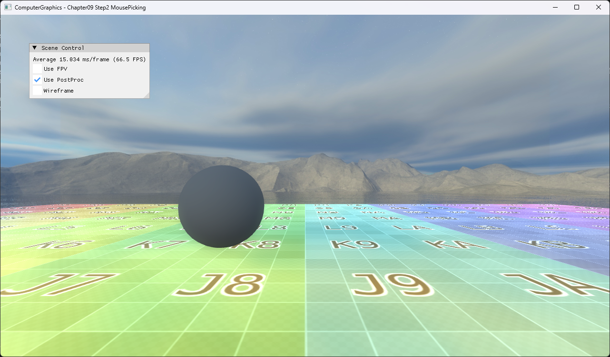

# Chapter09 Step2 MousePicking

Object ID color를 별도 render target에 기록하고 cursor의 한 pixel을 staging texture로 읽어 hover object를 식별한다.

## 실행 진입점

- Solution: `09_UserInteraction_Step2_MousePicking.sln`
- 주요 source: `AppBase.cpp`, `ExampleApp.cpp`, `BasicPixelShader.hlsl`
- Runtime working directory: project 폴더
- Application title: `ComputerGraphics - Chapter09 Step2 MousePicking`

## Code Map

| 파일 | 역할 |
| --- | --- |
| [AppBase.cpp](AppBase.cpp#L136-L161) | ID render target와 1×1 staging texture 구성 |
| [AppBase.cpp](AppBase.cpp#L163-L189) | cursor pixel resolve·copy·map readback |
| [ExampleApp.cpp](ExampleApp.cpp#L209-L250) | ID color와 object highlight 상태 연결 |

## Capture/Result

## Verification

| 항목 | 결과 | 비고 |
| --- | --- | --- |
| Debug x64 build/run | 성공 | HLSL 출력 초기화 warning 관찰 |
| Release x64 build/run | 성공 | project 폴더 CWD |
| Capture/Result | 완료 | 기본 scene 전체 창 PNG |

## Limitations

- 매 frame GPU readback을 수행해 동기화 비용이 있다.
- MSAA edge resolve와 exact color 비교는 경계 pixel에서 선택을 놓칠 수 있다.
- Scene asset의 공개 권리 근거 확인이 필요하다.

## Related Docs

- [Picking And Screen Ray](../../Docs/01_Topics/AnimationAndPhysics/PickingAndScreenRay.md)
- [Verification](../../Docs/02_Verification/Part3_Chapter09/verification-index.md)
- [상세 Demo](../../Docs/03_Demos/Part3_Chapter09/09_02_MousePicking.md)
- [이전 단계](../09_UserInteraction_Step1_FirstPersonView/README.md)
