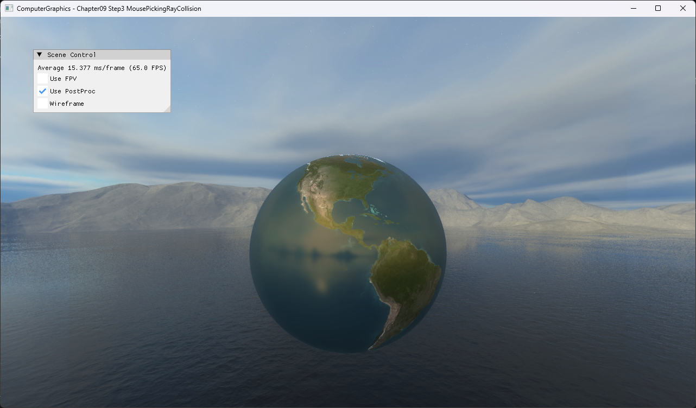

# Chapter09 Step3 MousePickingRayCollision

Cursor near/far NDC를 world space로 역변환해 CPU picking ray를 만들고 bounding sphere와 교차한다. Step2의 GPU ID picking과 비교할 수 있는 별도 접근이다.

## 실행 진입점

- Solution: `09_UserInteraction_Step3_MousePickingRayCollision.sln`
- 주요 source: `AppBase.cpp`, `ExampleApp.cpp`
- Runtime working directory: project 폴더
- Application title: `ComputerGraphics - Chapter09 Step3 MousePickingRayCollision`

## Code Map

| 파일 | 역할 |
| --- | --- |
| [AppBase.cpp](AppBase.cpp#L141-L158) | cursor client 좌표를 NDC로 변환 |
| [AppBase.cpp](AppBase.cpp#L248-L257) | press·release와 capture 상실 시 입력 상태 복구 |
| [ExampleApp.cpp](ExampleApp.cpp#L110-L142) | inverse view-projection과 world ray 구성 |
| [ExampleApp.cpp](ExampleApp.cpp#L141-L166) | bounding sphere 교차와 hit marker 갱신 |

## Capture/Result

Press, sphere 안쪽 marker 이동과 release sequence는 [상세 Demo](../../Docs/03_Demos/Part3_Chapter09/09_03_MousePickingRayCollision.md)와 selected local video로 확인한다.

## Verification

| 항목 | 결과 | 비고 |
| --- | --- | --- |
| Debug x64 build/run | 성공 | CPU ray collision 경로 확인 |
| Release x64 build/run | 성공 | project 폴더 CWD |
| Capture/Result | 완료 | release·press 전체 창 PNG, lifecycle selected local video |

## Limitations

- 실제 triangle이 아니라 bounding sphere 근사 교차를 사용한다.
- Press 중에도 cursor ray가 sphere를 벗어나면 marker가 사라진다.
- `_Solution` 기반 구현이며 사용자 고유 구현으로 주장하지 않는다.
- Earth texture와 cubemap 원본은 비공개 runtime dependency로 유지하고 직접 실행 visual만 공개한다.

## Related Docs

- [Picking And Screen Ray](../../Docs/01_Topics/AnimationAndPhysics/PickingAndScreenRay.md)
- [Verification](../../Docs/02_Verification/Part3_Chapter09/verification-index.md)
- [상세 Demo](../../Docs/03_Demos/Part3_Chapter09/09_03_MousePickingRayCollision.md)
- [이전 단계](../09_UserInteraction_Step2_MousePicking/README.md)
- [다음 단계](../09_UserInteraction_Step4_QuaternianRotation/README.md)
