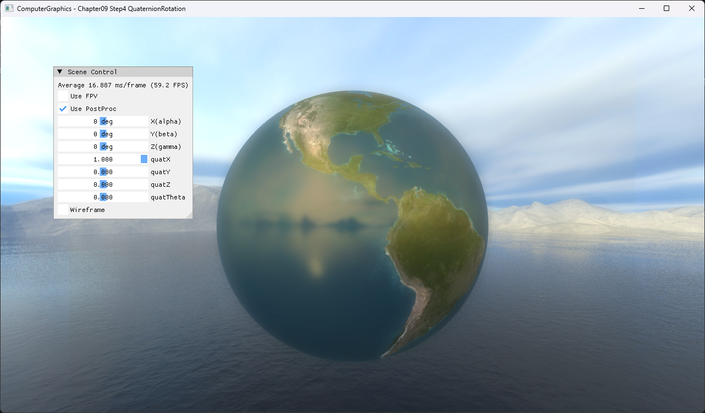

# Chapter09 Step4 QuaternionRotation

UI의 axis-angle 값을 quaternion으로 변환하고 model rotation matrix에 적용한다. Raw directory의 `Quaternian` spelling은 경로 안정성을 위해 유지한다.

## 실행 진입점

- Solution: `09_UserInteraction_Step4_QuaternianRotation.sln`
- 주요 source: `ExampleApp.cpp`, `AppBase.cpp`
- Runtime working directory: project 폴더
- Application title: `ComputerGraphics - Chapter09 Step4 QuaternionRotation`

## Code Map

| 파일 | 역할 |
| --- | --- |
| [ExampleApp.cpp](ExampleApp.cpp#L107-L131) | axis normalization과 quaternion 구성 |
| [ExampleApp.cpp](ExampleApp.cpp#L127-L132) | quaternion을 model rotation matrix로 변환 |
| [ExampleApp.cpp](ExampleApp.cpp#L337-L360) | axis와 angle UI |

## Capture/Result

`quatX`, `quatY`, `quatZ` 축별 `quatTheta` 변화는 15초 selected local video 세 개로 확인한다.

## Verification

| 항목 | 결과 | 비고 |
| --- | --- | --- |
| Debug x64 build/run | 성공 | zero axis fallback 포함 |
| Release x64 build/run | 성공 | project 폴더 CWD |
| Capture/Result | 완료 | axis-angle UI PNG, X·Y·Z 축별 selected local video |

## Limitations

- Euler angle UI는 표시되지만 model rotation에는 사용하지 않는다.
- Quaternion interpolation과 angular velocity는 다루지 않는다.
- Earth texture와 cubemap 원본은 비공개 runtime dependency로 유지하고 직접 실행 visual만 공개한다.

## Related Docs

- [Quaternion And Virtual Trackball](../../Docs/01_Topics/AnimationAndPhysics/QuaternionAndVirtualTrackball.md)
- [Verification](../../Docs/02_Verification/Part3_Chapter09/verification-index.md)
- [상세 Demo](../../Docs/03_Demos/Part3_Chapter09/09_04_QuaternionRotation.md)
- [이전 단계](../09_UserInteraction_Step3_MousePickingRayCollision/README.md)
- [다음 단계](../09_UserInteraction_Step5_VirtualTrackball/README.md)
