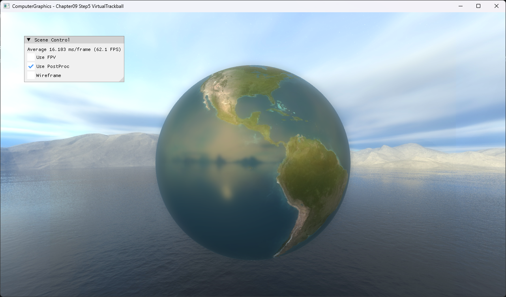

# Chapter09 Step5 VirtualTrackball

Drag 첫 frame의 sphere hit vector를 기준값으로 초기화하고, 이후 매 frame의 직전·현재 hit vector 사이 quaternion을 model rotation에 누적한다.

## 실행 진입점

- Solution: `09_UserInteraction_Step5_VirtualTrackball.sln`
- 주요 source: `ExampleApp.cpp`, `AppBase.cpp`
- Runtime working directory: project 폴더
- Application title: `ComputerGraphics - Chapter09 Step5 VirtualTrackball`

## Code Map

| 파일 | 역할 |
| --- | --- |
| [ExampleApp.cpp](ExampleApp.cpp#L120-L142) | cursor ray와 sphere hit point 계산 |
| [ExampleApp.cpp](ExampleApp.cpp#L149-L177) | 직전·현재 drag vector와 `FromToRotation` 계산 |
| [ExampleApp.cpp](ExampleApp.cpp#L183-L194) | 누적 model rotation 합성 |

## Capture/Result

Sphere 안쪽 drag에 따른 누적 회전은 selected local video로 확인한다.

## Verification

| 항목 | 결과 | 비고 |
| --- | --- | --- |
| Debug x64 build/run | 성공 | drag capture·release 경로 확인 |
| Release x64 build/run | 성공 | project 폴더 CWD |
| Capture/Result | 완료 | 전체 창 PNG, trackball selected local video |

## Limitations

- Cursor ray가 sphere silhouette을 벗어나면 연속 rotation을 갱신하지 않는다.
- Inertia, axis constraint와 화면 전체 arcball projection은 구현하지 않는다.
- Earth texture와 cubemap은 공개 권리 근거 확인이 필요하다.

## Related Docs

- [Quaternion And Virtual Trackball](../../Docs/01_Topics/AnimationAndPhysics/QuaternionAndVirtualTrackball.md)
- [Verification](../../Docs/02_Verification/Part3_Chapter09/verification-index.md)
- [상세 Demo](../../Docs/03_Demos/Part3_Chapter09/09_05_VirtualTrackball.md)
- [이전 단계](../09_UserInteraction_Step4_QuaternianRotation/README.md)
- [다음 단계](../09_UserInteraction_Step6_MouseDragMove/README.md)
