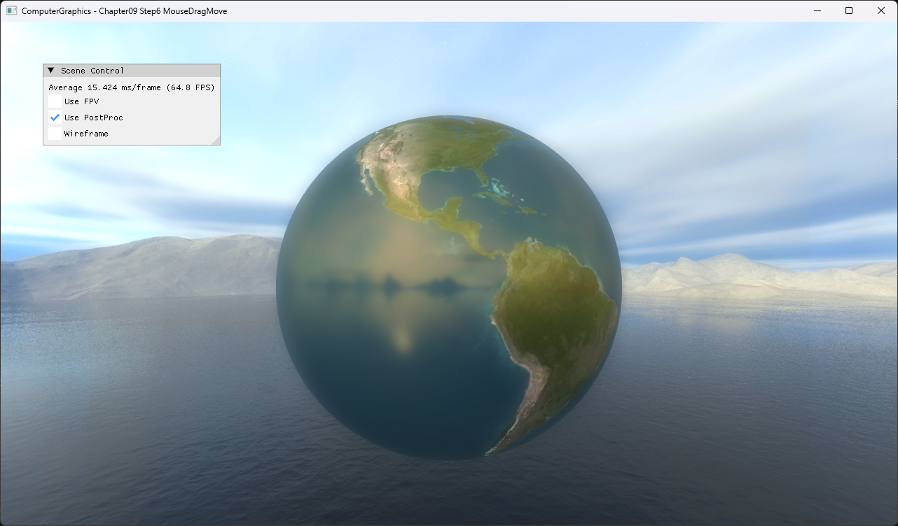

# Chapter09 Step6 MouseDragMove

Drag 시작점의 near/far ray depth 비율을 보존하고 현재 cursor ray의 같은 비율 지점을 구해 object translation을 갱신한다.

## 실행 진입점

- Solution: `09_UserInteraction_Step6_MouseDragMove.sln`
- 주요 source: `ExampleApp.cpp`, `AppBase.cpp`
- Runtime working directory: project 폴더
- Application title: `ComputerGraphics - Chapter09 Step6 MouseDragMove`

## Code Map

| 파일 | 역할 |
| --- | --- |
| [ExampleApp.cpp](ExampleApp.cpp#L121-L148) | cursor ray와 sphere hit 계산 |
| [ExampleApp.cpp](ExampleApp.cpp#L152-L178) | drag depth ratio와 world delta 계산 |
| [ExampleApp.cpp](ExampleApp.cpp#L176-L183) | model translation과 bounding sphere center 동기화 |

## Capture/Result

오른쪽 이동 뒤 위쪽으로 이어지는 world-space translation은 selected local video로 확인한다.

## Verification

| 항목 | 결과 | 비고 |
| --- | --- | --- |
| Debug x64 build/run | 성공 | drag capture·release 경로 확인 |
| Release x64 build/run | 성공 | project 폴더 CWD |
| Capture/Result | 완료 | 전체 창 PNG, drag-move selected local video |

## Limitations

- 현재 ray가 이동 중인 sphere와 교차하지 않으면 drag 갱신이 중단된다.
- 화면 평면, 축 또는 ground constraint는 구현하지 않는다.
- Earth texture와 cubemap은 공개 권리 근거 확인이 필요하다.

## Related Docs

- [Picking And Screen Ray](../../Docs/01_Topics/AnimationAndPhysics/PickingAndScreenRay.md)
- [Verification](../../Docs/02_Verification/Part3_Chapter09/verification-index.md)
- [상세 Demo](../../Docs/03_Demos/Part3_Chapter09/09_06_MouseDragMove.md)
- [이전 단계](../09_UserInteraction_Step5_VirtualTrackball/README.md)
