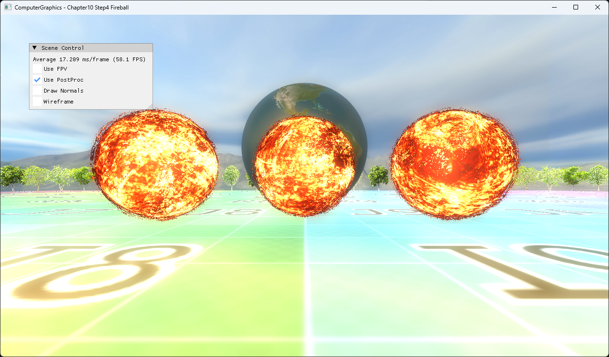

# Chapter10 Step4 Fireball

## Overview

Billboard quad의 pixel shader에서 time 기반 procedural fireball을 계산한다. 같은 geometry 경로를 유지하면서 primitive별 time offset으로 세 fireball의 animation phase를 분리한다.

## 실행 진입점

- Solution: `10_GeometryPipeline_Step4_Fireball.sln`
- Application entry: `main.cpp`
- 주요 source: `ExampleApp.cpp`, `BillboardPoints.cpp`
- Shader: `BillboardPointsGeometryShader.hlsl`, `FireballPixelShader.hlsl`

## Code Map

| 파일 | 역할 |
| --- | --- |
| [ExampleApp.cpp](ExampleApp.cpp#L26-L52) | billboard와 fireball instance 구성 |
| [ExampleApp.cpp](ExampleApp.cpp#L276-L284) | frame time 누적 |
| [BillboardPointsGeometryShader.hlsl](BillboardPointsGeometryShader.hlsl#L30-L92) | camera-facing quad와 primitive ID 전달 |
| [FireballPixelShader.hlsl](FireballPixelShader.hlsl#L29-L110) | procedural fireball shading과 phase offset |

## Capture/Result

세 quad가 procedural sphere처럼 보이며 primitive마다 서로 다른 surface phase를 가진다.

## Verification

| 항목 | 결과 | 비고 |
| --- | --- | --- |
| Debug x64 build/run | 성공 | 2026-08-04 현재 확인 |
| Release x64 build/run | 성공 | project 폴더 CWD |
| Capture/Result | 완료 | 전체 창 1282×752 PNG |

## Limitations

- Geometry는 sphere가 아니라 camera-facing quad다.
- 연속 animation은 local video 후보로만 판단하며 tracked Demo는 정지 결과를 유지한다.

## Related Docs

- [Geometry Shader And Billboards](../../Docs/01_Topics/ModelingAndGeometry/GeometryShaderAndBillboards.md)
- [Shadertoy Runtime Inputs](../../Docs/01_Topics/DirectX11Pipeline/ShadertoyRuntimeInputs.md)
- [Verification](../../Docs/02_Verification/Part3_Chapter10-13/verification-index.md)
- [상세 Demo](../../Docs/03_Demos/Part3_Chapter10-13/10_04_Fireball.md)
- [이전 단계](../10_GeometryPipeline_Step3_NormalLines/README.md)
- [다음 단계](../10_GeometryPipeline_Step5_Tessellation/README.md)
