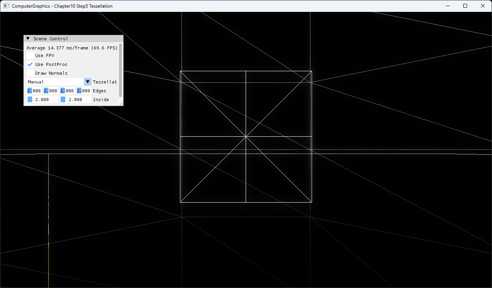
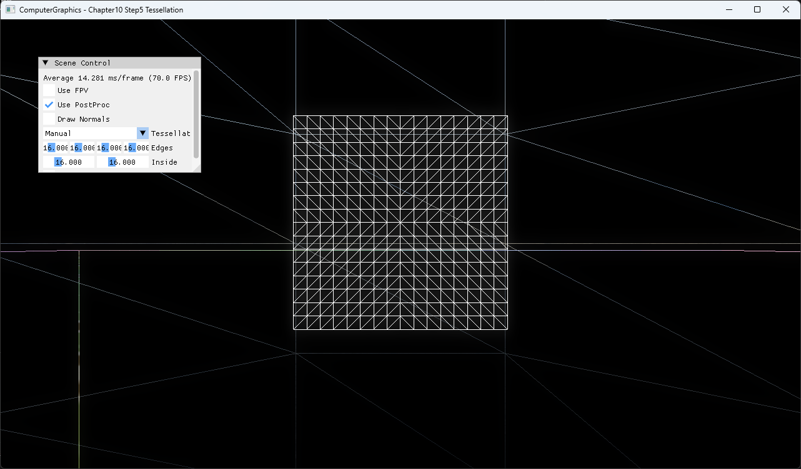

# Chapter10 Step5 Tessellation

## Overview

Quad patch를 hull shader, tessellator와 domain shader로 분할한다. Manual mode는 UI factor를 직접 사용하며 Distance Adaptive mode는 camera distance로 같은 factor를 계산하는 사용자 확장이다.

## 실행 진입점

- Solution: `10_GeometryPipeline_Step5_Tessellation.sln`
- Application entry: `main.cpp`
- 주요 source: `ExampleApp.cpp`, `TessellatedQuad.cpp`
- Shader: `TessellatedQuadVS.hlsl`, `TessellatedQuadHS.hlsl`, `TessellatedQuadDS.hlsl`, `TessellatedQuadPS.hlsl`

## Code Map

| 파일 | 역할 |
| --- | --- |
| [TessellatedQuad.cpp](TessellatedQuad.cpp#L5-L66) | patch buffer와 tessellation stage binding |
| [TessellatedQuadHS.hlsl](TessellatedQuadHS.hlsl#L33-L76) | Manual·Distance Adaptive factor 선택 |
| [TessellatedQuadDS.hlsl](TessellatedQuadDS.hlsl#L32-L55) | domain position 보간과 transform |
| [ExampleApp.cpp](ExampleApp.cpp#L476-L505) | 두 mode의 UI 분리 |

## Capture/Result

Manual edge·inside factor 8이 quad의 wireframe subdivision으로 직접 나타난다.

Manual factor 2는 낮은 polygon density를 보여준다.

Manual factor 16은 같은 quad patch가 더 촘촘하게 세분되는 상태를 보여준다.

## Verification

| 항목 | 결과 | 비고 |
| --- | --- | --- |
| Debug x64 build/run | 성공 | 2026-08-04 현재 확인 |
| Release x64 build/run | 성공 | project 폴더 CWD |
| Capture/Result | 완료 | Manual factor 8 기본, factor 2/16 비교, Wireframe On |

## Limitations

- Distance Adaptive는 screen-space error가 아니라 patch center 거리만 사용한다.
- Integer partitioning으로 factor 변화가 계단식으로 보일 수 있다.

## Related Docs

- [Tessellation Pipeline](../../Docs/01_Topics/ModelingAndGeometry/TessellationPipeline.md)
- [Verification](../../Docs/02_Verification/Part3_Chapter10-13/verification-index.md)
- [상세 Demo](../../Docs/03_Demos/Part3_Chapter10-13/10_05_Tessellation.md)
- [이전 단계](../10_GeometryPipeline_Step4_Fireball/README.md)
